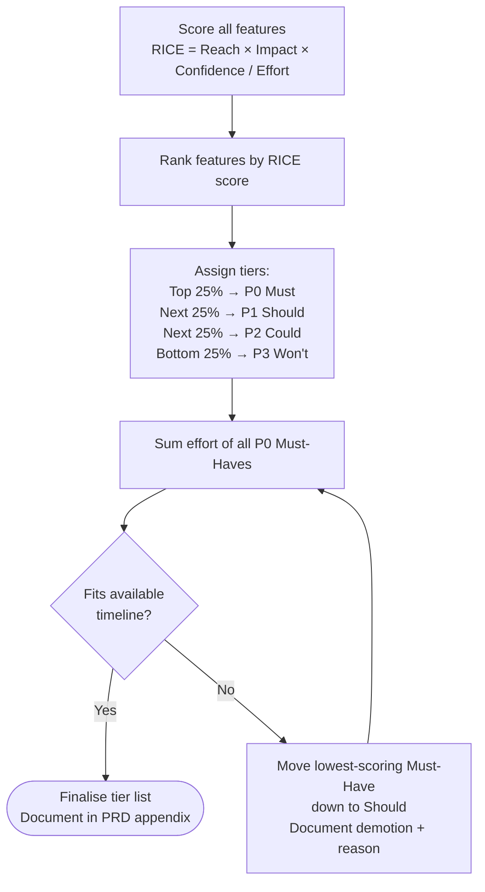
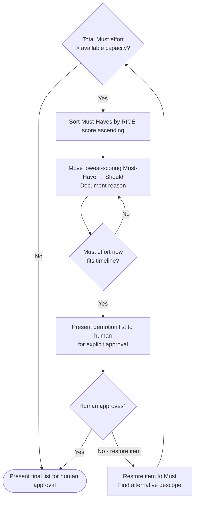
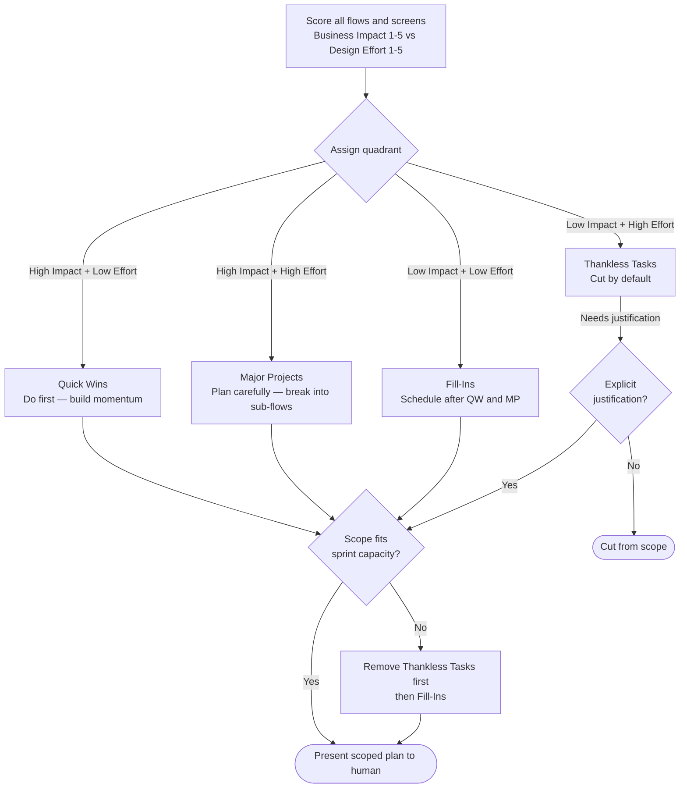
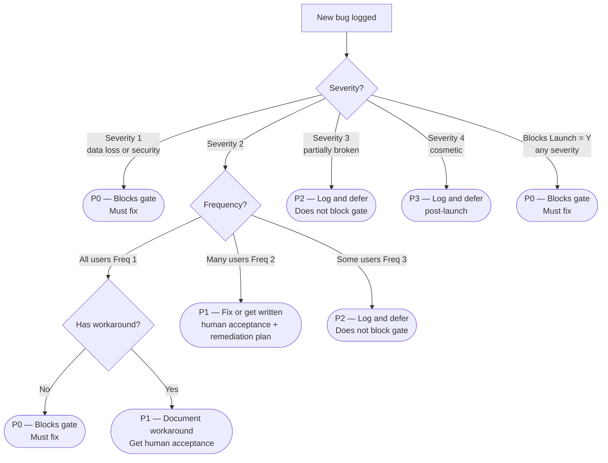
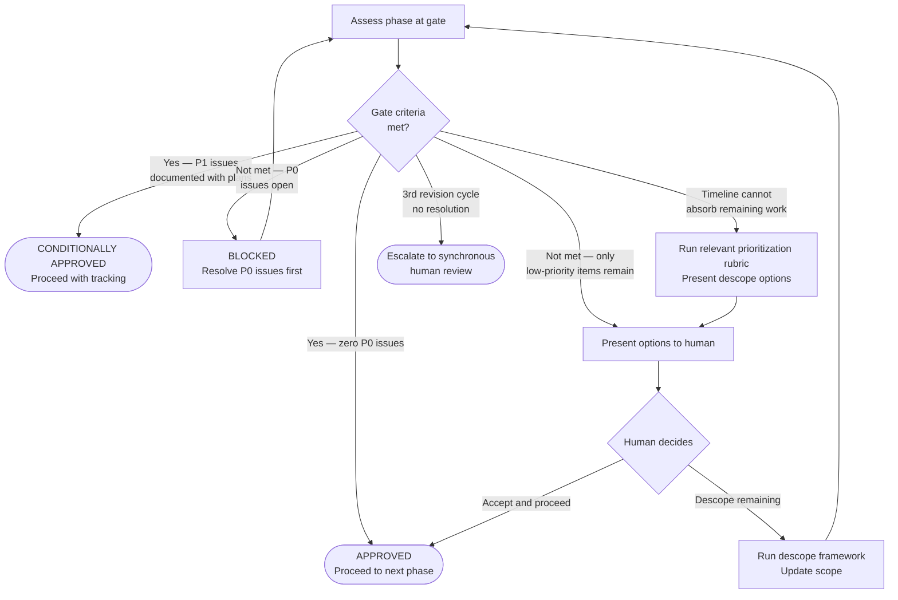

# PM Prioritization Rubric — Reference

Shared prioritization frameworks used across the PDLC. Referenced by phases 01, 02, 04, and 05. The orchestrator uses these to arbitrate scope and timeline decisions at every gate.

**Where each rubric is applied:**

| Phase | Rubric | Decision |
|-------|--------|----------|
| 01 Product Discovery | RICE Score + MoSCoW Overlay | Which features enter the PRD and at which priority tier |
| 02 Product Design | Impact/Effort 2×2 Matrix | Which flows and screens are designed first |
| 04 Frontend Development | Sprint Scoring Matrix | What gets built in which order each sprint |
| 05 QA Testing | Defect Triage Matrix | Which bugs must be fixed before the gate |
| 00 Orchestrator | Phase Priority Assessment | Whether to proceed, descope, or pause a phase |

---

## 1. RICE Score

**Used in:** 01-product-discovery (PRD feature prioritization)

**Formula:**
```
RICE Score = (Reach × Impact × Confidence%) / Effort
```

**Factor definitions:**

| Factor | Description | Scale |
|--------|-------------|-------|
| Reach | How many users are affected per time period | Estimated user count |
| Impact | How significantly does this improve the user experience | 0.25 (minimal) / 0.5 (low) / 1 (medium) / 2 (high) / 3 (massive) |
| Confidence | How confident are we in the Reach and Impact estimates | 100% (high) / 80% (medium) / 50% (low) |
| Effort | Total person-weeks required across all disciplines | Weeks |

**Scoring table template:**

| Feature | Reach | Impact | Confidence | Effort (wks) | RICE Score | Tier |
|---------|-------|--------|------------|--------------|------------|------|
| [Feature A] | | | % | | | |
| [Feature B] | | | % | | | |
| [Feature C] | | | % | | | |

**Tier assignment after scoring:**

| Tier | Threshold | Action |
|------|-----------|--------|
| Must (P0) | Top 25% of scores OR score > [team-set threshold] | Include in PRD Must-Have |
| Should (P1) | Next 25% | Include in PRD Should-Have |
| Could (P2) | Next 25% | Include if capacity allows |
| Won't (P3) | Bottom 25% | Defer or cut |

**Forcing function:** After tier assignment, sum the effort of all Must-Haves. If the total exceeds the available timeline, move the lowest-scoring Must-Haves to Should. Repeat until Must-Have effort fits the timeline. Document every demotion with its RICE score and reason.



---

## 2. MoSCoW + Effort Overlay

**Used in:** 01-product-discovery (PRD requirements validation)

After applying RICE scoring, validate MoSCoW using effort:

### Step 1: Classify with MoSCoW

| Tier | Definition |
|------|-----------|
| **Must** | Non-negotiable. The product cannot launch without this. |
| **Should** | High value and expected. Include if time permits. |
| **Could** | Nice to have. Include only if Must + Should are complete. |
| **Won't** | Explicitly deferred. Document why — do not ignore. |

### Step 2: Apply effort overlay

For each Must-Have item, add an effort estimate:

| Requirement ID | Description | MoSCoW | Effort | Fits Timeline? |
|---------------|-------------|--------|--------|----------------|
| FR-001 | | Must | [X wks] | ✓ / ✗ |
| FR-002 | | Must | [X wks] | ✓ / ✗ |

### Step 3: Resolve timeline conflicts

If total Must effort > available capacity:
1. Sort Must-Haves by RICE score ascending
2. Move the lowest-scoring Must-Haves to Should, one at a time
3. Stop when Must effort fits the timeline
4. Present the demotion list to the human for explicit approval

**Rule:** Never reduce Must-Have quality to make a deadline. Either descope or extend the timeline — the choice belongs to the human.



---

## 3. Impact / Effort 2×2 Matrix

**Used in:** 02-product-design (design scope sequencing)

### Quadrant definitions

```
              LOW EFFORT                HIGH EFFORT
              ─────────────────────────────────────
HIGH IMPACT │  QUICK WINS (do first) │ MAJOR PROJECTS (plan carefully)
            │                         │
LOW IMPACT  │  FILL-INS (schedule)    │ THANKLESS TASKS (cut or defer)
              ─────────────────────────────────────
```

### Scoring table template

| Flow / Screen | Business Impact (1–5) | Design Effort (1–5) | Quadrant | Sequence |
|--------------|----------------------|---------------------|----------|---------|
| [Flow A] | | | | |
| [Flow B] | | | | |

### Sequencing rule

1. **Quick Wins first** — high impact, low effort — these build momentum and validate the design system
2. **Major Projects second** — high impact, high effort — plan carefully, break into sub-flows
3. **Fill-Ins third** — only when Quick Wins and Major Projects are complete
4. **Thankless Tasks** — cut from current scope by default; require explicit justification to include

**Forcing function:** If scope exceeds the sprint capacity, remove Thankless Tasks first, then Fill-Ins. Present the trimmed scope to the human before proceeding.



---

## 4. Sprint Scoring Matrix

**Used in:** 04-frontend-development (task prioritization within sprints)

### Scoring formula

```
Sprint Score = (Business Value × 2) + (Risk if Delayed × 1.5) + (Dependencies Blocked × 1)
```

### Factor definitions

| Factor | Description | Scale |
|--------|-------------|-------|
| Business Value | Direct user or business impact of this task | 1 (minimal) – 5 (critical) |
| Risk if Delayed | Technical or product risk of deferring this task | 1 (low risk) – 5 (blocks everything) |
| Dependencies Blocked | Number of other tasks that cannot start until this is done | Count (0–n) |

### Scoring table template

| Task | Business Value (1–5) | Risk if Delayed (1–5) | Deps Blocked (count) | Sprint Score | Order |
|------|---------------------|-----------------------|----------------------|--------------|-------|
| [Task A] | | | | | |
| [Task B] | | | | | |

### Sequencing rules

1. Architecture and token setup are always sequenced first — everything depends on them (override scoring)
2. Atoms before molecules before organisms — dependency order within components
3. Within the same dependency tier: highest sprint score ships first
4. Never start a lower-priority task while a higher-priority task is blocked waiting for human input
5. Re-run the matrix at the start of each sprint or after any `scope-change` or `timeline-change` intervention

### Sprint capacity guard

After ranking, sum the effort of the top-N tasks to fit the sprint capacity. If total effort exceeds capacity:
- Move the lowest-scored tasks out of the sprint
- Document them as "Deferred to next sprint" in the gate summary
- Present the adjusted sprint plan to the human at the gate

---

## 5. Defect Triage Matrix

**Used in:** 05-qa-testing (bug prioritization before launch gate)

### Triage table template

| Bug ID | Description | Severity (1–4) | Frequency (1–3) | Has Workaround | Blocks Launch | Priority |
|--------|-------------|----------------|-----------------|----------------|---------------|---------|
| BUG-001 | | | | Y/N | Y/N | |

### Factor definitions

| Factor | Scale |
|--------|-------|
| Severity | 1 = Data loss/security breach · 2 = Core feature unusable · 3 = Feature degraded · 4 = Cosmetic |
| Frequency | 1 = All users · 2 = Many users · 3 = Some users |
| Has Workaround | Y = user can work around it · N = completely blocked |
| Blocks Launch | Y = this MUST be fixed to go live · N = can ship with it |

### Priority assignment rules

| Condition | Priority | Gate rule |
|-----------|----------|-----------|
| Severity 1 | P0 | Must fix — blocks gate regardless of other factors |
| Severity 2 + Frequency 1 + No Workaround | P0 | Must fix — blocks gate |
| Blocks Launch = Y | P0 | Must fix — blocks gate |
| Severity 2 + Frequency 2 | P1 | Must fix OR get explicit human acceptance with remediation plan |
| Severity 2 + Has Workaround | P1 | Document workaround, get human acceptance |
| Severity 3 | P2 | Log, document, defer — does not block gate |
| Severity 4 (cosmetic) | P3 | Log, defer to post-launch — does not block gate |

**Gate rule:** Zero P0 defects may be open when presenting the QA gate. P1 defects require explicit written human acceptance and a remediation timeline.



---

## 6. Phase-Level Priority Assessment

**Used in:** 00-product-workflow (orchestrator-level decision making at gates)

When assessing whether to proceed, pause, or descope a phase:

| Signal | Recommendation |
|--------|---------------|
| All gate criteria met, zero P0 issues | APPROVED — proceed |
| Gate criteria met, P1 issues documented with plans | CONDITIONALLY APPROVED — proceed with tracking |
| Gate criteria not met, but only low-priority items remain | Human decision required — present options |
| Gate criteria not met, P0 issues open | BLOCKED — must resolve before proceeding |
| Timeline cannot absorb remaining work | Present descope options using relevant rubric |
| Persistent disagreement after 3 revision cycles | Escalate to synchronous human review |



### Descope decision framework

When timeline pressure forces a descope conversation, present using this format:

```
SCOPE TRADE-OFF ANALYSIS

Current shortfall: [X weeks over capacity]

Option A — Descope [Feature/Flow] (RICE: [score])
  What you lose: [user impact]
  Timeline recovered: [X weeks]
  Recommended: [Yes/No + reason]

Option B — Descope [Feature/Flow] (RICE: [score])
  What you lose: [user impact]
  Timeline recovered: [X weeks]
  Recommended: [Yes/No + reason]

Option C — Extend timeline by [X weeks]
  What you gain: [full original scope]
  Cost: [timeline / resource impact]

Please select one option before work continues.
```
