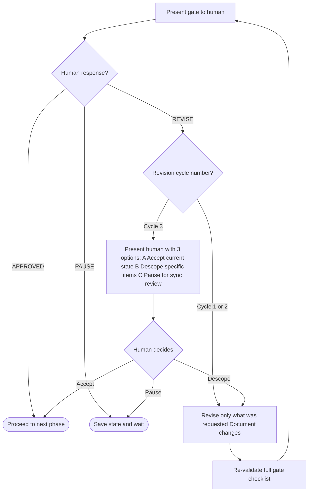
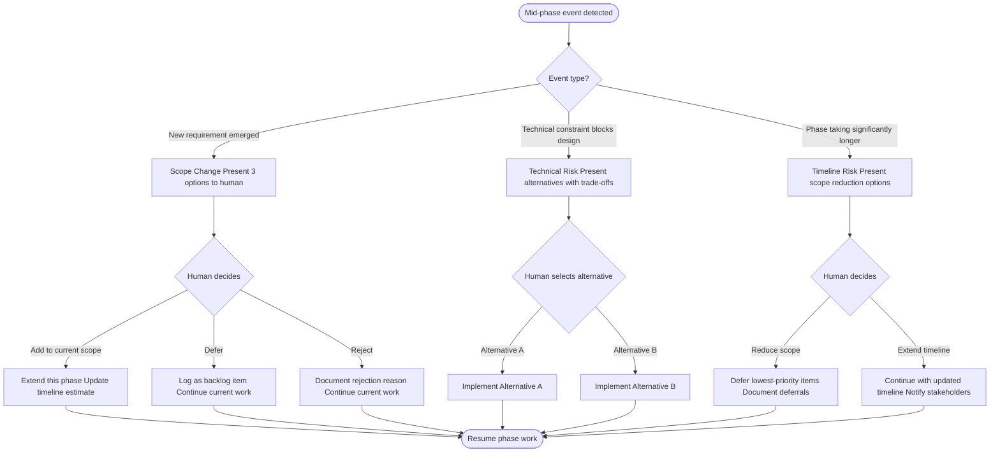

# Workflow Stages — Detailed Reference

## Gate Criteria by Phase

Each gate has **No-Go** criteria (hard stop if any fails) and **Quality** criteria (should pass but can proceed with documented exceptions). The agent must verify all No-Go items before presenting the handoff package.

Every gate presentation uses the **Handoff Package** format (see [handoff-package-template.md](handoff-package-template.md)).

---

### Gate 1: Discovery → Product Design

**No-Go (hard stop if any fails):**
- PRD exists with FR-IDs for all P0 requirements
- Problem statement is a single clear sentence
- At least 2 personas with identified primary persona
- Success metrics defined and measurable
- Handoff package produced with Coverage table tracing all P0 FR-IDs

**Quality (should pass — proceed with documented exceptions):**
- At least 3 P0 user stories in PRD
- Current state journey map completed for primary persona
- At least 3 competitors analyzed
- All assumptions labelled and logged in handoff Assumptions table

**Common revision requests:**
- "The PRD requirements aren't specific enough" → Make each FR testable and measurable
- "The personas feel generic" → Add specific behaviors and a representative quote
- "We don't know who our primary user is" → Revisit research synthesis, ask for user access
- "Success metrics aren't measurable" → Add baseline, target, and measurement method

---

### Gate 2: Product Design → Frontend Design + Backend Design

Gate 2 approval triggers the **Release Mode Check-in** (see [SKILL.md](SKILL.md) → Release Mode Check-in). After the human selects Full Production or MVP (and confirms MVP scope if MVP), both Phase 3 (Frontend Design) and Phase 3a (Backend Design) begin in parallel.

**No-Go (hard stop if any fails):**
- User flow (UF-ID) exists for every P0 user story, with `Covers: FR-xxx` header
- Wireframes (WF-ID) exist for every screen in P0 flows, with `Covers: FR-xxx` header
- All screens have loading, empty, and error states specified
- Accessibility notes (focus order, ARIA flags) on every screen
- Handoff package produced with Coverage table tracing FR → UF → WF

**Quality (should pass — proceed with documented exceptions):**
- IA document covers all P0 and P1 screens
- Interaction specification covers all P0 components
- Prototype brief completed (if applicable)
- No dead ends — every error state has a recovery path

**Common revision requests:**
- "Flows have dead ends" → Ensure every error state has a recovery path
- "Missing edge cases" → Specify empty states and error states for all data-dependent screens
- "IA doesn't match the PRD scope" → Audit IA against all P0/P1 user stories
- "Wireframes are too vague" → Add component annotations and interaction notes

---

### Gate 3: Frontend Design → Frontend Development

**Scope note:** When Release Mode = MVP, "P0" means MVP-tagged FR-IDs only. When Full Production, P0 = full PRD P0.

**No-Go (hard stop if any fails):**
- All design tokens defined (color, typography, spacing, radius, shadow)
- Component BOM complete — every P0 (or MVP) component mapped to code library
- All P0 (or MVP) screens at high fidelity (Route A) OR screen specs complete (Route B)
- All text/background combinations pass WCAG 4.5:1
- Handoff package produced with Coverage table and Component BOM

**Quality (should pass — proceed with documented exceptions):**
- All interactive components have all states designed (default, hover, focus, active, disabled)
- **MVP mode:** Components may have 4 states (default, hover, focus, error) — document exception
- Route A: Figma Handoff Manifest complete with tolerances table
- Route B: Screen specs with responsive behavior tables
- Token-to-CSS mapping documented

**Common revision requests:**
- "Tokens are inconsistent" → Audit all components for raw values and replace with tokens
- "Missing component states" → Add hover, focus, disabled for [specific component]
- "Contrast fails on [screen]" → Identify failing pairs, adjust color tokens
- "No mobile designs" → Design mobile breakpoint for all P0 screens
- "BOM maps to wrong library component" → Verify component capabilities match design

---

### Gate 3a: Backend Design → Backend Implementation

**Scope note:** When Release Mode = MVP, scope = MVP FR-IDs only.

**No-Go (hard stop if any fails):**
- OpenAPI spec exists and is valid
- Every endpoint traceable to FR-ID
- Schema design complete (tables, columns, indexes, migration plan)
- Auth & permission model defined
- Handoff package produced with Coverage table

**Quality (should pass — proceed with documented exceptions):**
- Request/response examples in OpenAPI
- Error format documented and consistent
- Pagination defined for all list endpoints
- Integration points (webhooks, third-party) specified
- **MVP mode:** Pagination may be deferred for non-critical lists; integration points = core only (auth if required)

**Common revision requests:**
- "Endpoints not traceable to PRD" → Add Covers: FR-xxx to endpoint inventory
- "Schema doesn't match data dictionary" → Align schema with data dictionary entities
- "Missing error responses" → Add error format for all endpoints
- "No pagination on list" → Define pagination strategy

---

### Gate 4: Frontend Development → Integration

Gate 4 approval enables Phase 4b Integration to begin **when Gate 4a is also approved**. Phase 4b requires both Frontend and Backend implementations.

**Scope note:** When Release Mode = MVP, scope = MVP screens and components only.

**No-Go (hard stop if any fails):**
- Zero TypeScript errors (`tsc --noEmit`)
- Zero ESLint errors
- All P0 screens implemented with loading, empty, and error states
- First Article Inspection passed for first screen (documented)
- Handoff package produced with Coverage table and test coverage matrix

**Quality (should pass — proceed with documented exceptions):**
- Lighthouse audit run (scores documented)
- axe DevTools run with zero critical violations
- API error handling tested manually
- Test coverage matrix maps all P0 (or MVP) FR-IDs to planned E2E tests
- **MVP mode:** Light audit; defer heavy performance optimization

**Common revision requests:**
- "Performance is poor" → Address specific Lighthouse recommendations
- "Accessibility violations found" → Fix listed axe violations
- "Missing error states" → Implement error UI for [specific screens]
- "TypeScript errors" → Fix all before proceeding
- "FAI deviations not documented" → Document all deviations with rationale

---

### Gate 4a: Backend Implementation → Integration

Gate 4a approval enables Phase 4b Integration to begin **when Gate 4 is also approved**. Phase 4b requires both Frontend and Backend implementations.

**Scope note:** When Release Mode = MVP, scope = MVP endpoints only.

**No-Go (hard stop if any fails):**
- All P0 endpoints implemented and match OpenAPI spec
- Schema migrations executed successfully
- Auth and permission checks applied to protected endpoints
- Input validation on all mutation endpoints
- Structured error responses match Backend Design format
- Handoff package produced with API test results

**Quality (should pass — proceed with documented exceptions):**
- Unit tests for services
- Integration tests for API endpoints
- No N+1 queries (verified)
- Contract tests or manual verification
- **MVP mode:** Core integration + contract tests sufficient

**Common revision requests:**
- "API doesn't match OpenAPI spec" → Align implementation with spec
- "Missing validation" → Add validation to mutation endpoints
- "N+1 queries detected" → Use batch loading or joins
- "Error format inconsistent" → Standardize error responses

---

### Gate 4b: Integration → QA Testing

**Scope note:** When Release Mode = MVP, scope = MVP endpoints only; third-party = auth only if required.

**No-Go (hard stop if any fails):**
- Contract verification passed for all P0 endpoints
- API client integrated in frontend (typed, error handling)
- Auth flow works (login, token, protected routes)
- E2E data flow verified for P0 flows (create, read, update, delete)
- Third-party integrations configured per PRD (if applicable)
- Handoff package produced with integration audit

**Quality (should pass — proceed with documented exceptions):**
- No frontend/backend contract mismatches
- Error handling aligned between frontend and backend
- Webhooks verified (if applicable)

**Common revision requests:**
- "Contract mismatch" → Fix backend or frontend to align with spec
- "Auth flow broken" → Fix token handling or redirect
- "Third-party not configured" → Complete auth/payment/webhook setup

---

### Gate 5: QA → Deployment

**Scope note:** When Release Mode = MVP, scope = MVP critical paths only. No-Go criteria remain strict.

**No-Go (hard stop if any fails):**
- All P0 E2E tests passing
- Zero critical accessibility violations (axe automated)
- Zero P0 defects open
- No critical npm audit vulnerabilities
- Handoff package produced with complete test coverage matrix

**Quality (should pass — proceed with documented exceptions):**
- Unit test coverage ≥ 80% for utils and hooks (**MVP mode:** ≥ 60% with documented exception)
- LCP < 2.5s, INP < 200ms, CLS < 0.1 (**MVP mode:** relaxed — document)
- P1 defects documented with explicit acceptance and remediation plan
- **MVP mode:** Visual regression optional/deferred; security = critical items only

**Common revision requests:**
- "E2E tests are flaky" → Stabilize specific tests before re-presenting
- "Coverage is below target" → Add tests for uncovered utility/hook files
- "Performance still failing" → Address specific metrics
- "Security issue found" → Fix before proceeding (no exceptions for Critical)

---

### Gate 6: Deployment → Documentation (Post-Launch Sign-off)

**No-Go (hard stop if any fails):**
- 24 hours of stable operation
- Error rate < 0.1%
- No P1/Critical alerts in monitoring

**Quality (should pass — proceed with documented exceptions):**
- Core Web Vitals in "Good" range in production
- Stakeholders notified and accepted

**Common revision requests:**
- "Error rate too high" → Rollback, diagnose, fix, redeploy
- "Performance degraded in production" → Investigate CDN/hosting config differences

---

### MVP Evolution Path (After Gate 6, when MVP launched)

When the product was built as MVP and Gate 6 is signed off, present the **MVP Evolution Check-in** (see [SKILL.md](SKILL.md) → MVP Evolution Check-in):

- **EVOLVE TO FULL PRODUCTION:** Run technical debt audit per [mvp-evolution-guide.md](mvp-evolution-guide.md), then re-enter Phase 3 with `Release Mode: Full Production` and scope = MVP + Post-MVP FR-IDs.
- **STAY ON MVP / PAUSE:** Proceed to Phase 8 (Documentation).

---

### Gate 7: Documentation → Product Complete

**No-Go (hard stop if any fails):**
- Artifact index exists and lists all artifacts from Phases 1–6
- User documentation exists (Quick Start + at least one Feature Guide)
- Ops runbook is product-specific and includes rollback steps
- Stakeholder package exists and is signed off
- docs/README.md or equivalent provides single entry point

**Quality (should pass — proceed with documented exceptions):**
- FAQ has at least 5 entries
- All docs have a "Last updated" date
- No orphan docs — all linked from entry point

**Common revision requests:**
- "Artifact index is incomplete" → Add missing artifacts with resolvable paths
- "User docs are too technical" → Apply writing guide; simplify language
- "Ops runbook missing product-specific steps" → Adapt from 06-deployment/ops-runbook.md

---

## Revision Loop Rules

1. **Targeted revisions only** — revise only what was specifically requested, not the entire phase
2. **Maximum 3 revision rounds** per gate. On the 3rd, escalate to the human for a decision on how to proceed
3. **Document what changed** — each revision cycle should note what was changed and why
4. **Re-validate against checklist** — after revising, re-verify the full gate checklist before re-presenting
5. **Don't regress** — ensure revisions don't break previously approved elements



### Revision Tracking Format

```
REVISION CYCLE [N] — Phase [X] Gate
Changes made:
- [Change 1]: [What was done and why]
- [Change 2]: [What was done and why]

Checklist re-verification:
- [Item]: [Status — Pass / Still failing → action taken]
```

---

## Phase Overlap Guidance

When a team is moving fast, some phase overlap is acceptable. Rules:

| Overlap | Allowed? | Condition |
|---------|----------|-----------|
| Backend Design (3a) in parallel with Frontend Design (3) | YES | Both start after Gate 2 and Release Mode check-in (MVP scoping if MVP) |
| Backend Implementation (4a) in parallel with Frontend Development (4) | YES | Both start after respective design gates |
| Design system tokens (Phase 3) while flows still being refined (Phase 2) | YES | Only tokens, not screen designs |
| Begin component dev (Phase 4) while component designs being finalized (Phase 3) | YES | Only for atoms approved at gate |
| Write unit tests (Phase 5) during development (Phase 4) | YES | Always encouraged |
| Begin Integration (4b) before Gate 4 or Gate 4a approved | NO | Requires BOTH gates approved |
| Staging deploy (Phase 6 prep) during QA (Phase 5) | YES | Required for E2E tests |
| Production deploy before QA gate approved | NO | Never |

---

## Human Decision Points Beyond Gates

These situations require a human decision even mid-phase:



### Scope Change
If new requirements emerge during a phase:
> A scope change has been identified: [description]. This was not in the original PRD. Options:
> 1. Add to current scope (extend this phase)
> 2. Defer to a future phase (log as a backlog item)
> 3. Reject (not in product vision)
> Please decide before continuing.

### Technical Risk
If a technical constraint blocks the designed approach:
> A technical constraint has been encountered: [description]. The designed approach [X] is not feasible because [reason]. Proposed alternatives:
> 1. [Alternative A] — trade-offs: [...]
> 2. [Alternative B] — trade-offs: [...]
> Please decide before continuing.

### Resource / Timeline Risk
If the work is taking significantly longer than expected:
> Timeline risk: Phase [N] is estimated to take [X] more time than originally planned. Reason: [description]. Options:
> 1. Reduce scope for this phase: [what could be deferred]
> 2. Continue with extended timeline
> Please decide before continuing.

---

## Artifact Inventory by Phase

### Phase 1 — Product Discovery
- `stakeholder-brief.md`
- `problem-statement.md`
- `research-synthesis.md`
- `competitive-analysis.md`
- `persona-[name].md` (one per persona)
- `journey-map-[persona].md`
- `prd.md` (with FR-IDs and US-IDs)
- **Handoff Package 1** (Discovery → Product Design)

### Phase 2 — Product Design
- `ia-document.md`
- `user-flows.md` (with UF-IDs and `Covers: FR-xxx` headers)
- `wireframe-specs.md` (with WF-IDs and `Covers: FR-xxx` headers)
- `interaction-spec.md`
- `prototype-brief.md`
- **Handoff Package 2** (Product Design → Frontend Design)

### Phase 3 — Frontend Design
- `design-tokens.md` (or exported token file)
- Route A: Figma file URL + `figma-handoff-manifest.md` (with Component BOM)
- Route B: `component-bom.md` + `screen-specs.md` (from agent-direct-spec.md templates)
- **Handoff Package 3** (Frontend Design → Frontend Development)

### Phase 3a — Backend Design
- `endpoint-inventory.md`
- `openapi-spec.yaml` (or equivalent)
- `schema-design.md` (tables, columns, indexes, migration plan)
- `auth-permission-model.md`
- `integration-points-spec.md` (webhooks, third-party)
- **Handoff Package 3a** (Backend Design → Backend Implementation)

### Phase 4 — Frontend Development
- Git repository with working application
- `architecture.md` (documented decisions)
- First Article Inspection report (deviations documented)
- Lighthouse audit report
- `test-coverage-matrix.md` (FR-IDs → planned E2E tests)
- **Handoff Package 4** (Frontend Development → Integration)

### Phase 4a — Backend Implementation
- Git repository with backend code
- Migration files (executed)
- API endpoints, services, repositories
- API test suite
- **Handoff Package 4a** (Backend Implementation → Integration)

### Phase 4b — Integration
- Contract verification report
- API client integration (in frontend)
- Third-party config (auth, payments, webhooks as applicable)
- E2E data flow verification
- **Handoff Package 4b** (Integration → QA Testing)

### Phase 5 — QA Testing
- Test files in repository
- `test-coverage-matrix.md` (updated with passing/failing status)
- Coverage report
- Accessibility audit report
- Performance audit report
- Security review report
- **Handoff Package 5** (QA → Deployment)

### Phase 6 — Deployment
- CI/CD pipeline configuration
- Production URL
- Monitoring dashboard URL
- Release notes
- Signed launch checklist
- **Handoff Package 6** (Deployment → Documentation)

### Phase 7 — Documentation
- `artifact-index.md` (or `docs/artifact-index.md`)
- `docs/user-guide/quick-start.md`
- `docs/user-guide/features.md`
- `docs/user-guide/faq.md`
- `docs/ops/ops-runbook.md` (product-specific)
- `docs/ops/environment-reference.md`
- `docs/ops/monitoring.md`
- `docs/stakeholder-package.md`
- `docs/README.md` (entry point)
- **Handoff Package 7** (Documentation → Product Complete)
