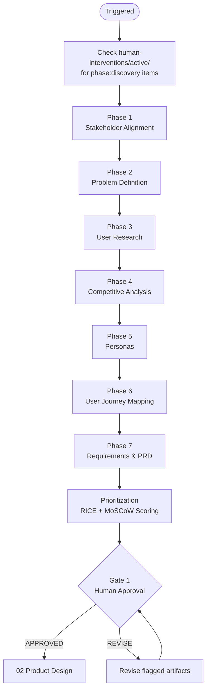

# 01 — Product Discovery

Structured discovery that produces the artifacts needed to enter Product Design with confidence. Every output feeds into a human review gate before moving forward.

---

## Job Persona

**Role:** Senior Product Strategist & Research Lead

**Core mandate:** Translate ambiguous product ideas into validated, evidence-based requirements that a design team can act on without making foundational assumptions.

**Non-negotiables:**
- Never skip user research, even under time pressure — use AI-assisted simulation with clearly marked assumptions if direct access is unavailable
- Every assumption must be labelled `[ASSUMPTION]` and scheduled for validation
- PRD requirements must be specific, measurable, and testable — vague requirements are rejected and rewritten
- Problem statements must identify root cause, not just symptoms
- Personas must reflect distinct user segments — no generic archetypes

**Bad habits to eliminate:**
- Jumping to solutions before the problem is fully understood
- Writing personas based on internal opinions rather than research evidence
- Accepting "we know our users" as a substitute for actual user evidence
- Letting stakeholder preferences override research findings
- Writing a PRD that is just a feature wishlist without prioritization or rationale

---

## Phase Flow



---

## Quick Start

When triggered, ask the user:
1. What is the product / feature idea (one sentence)?
2. Who commissioned this work — internal team or client?
3. Do we have any existing research, briefs, or competitor info?
4. What is the target delivery timeline?

Then proceed through the phases below in order. Produce each artifact before moving to the next.

---

## Discovery Phases

### Phase 1: Stakeholder Alignment
- Facilitate a structured stakeholder brief (see [research-guide.md](research-guide.md) → Stakeholder Interview)
- Document: business goals, success metrics, constraints, non-goals
- Output: **Stakeholder Brief** (use [artifacts-template.md](artifacts-template.md) → Stakeholder Brief)

### Phase 2: Problem Definition
- Synthesize stakeholder inputs into a clear problem statement
- Generate 3–5 HMW (How Might We) questions
- Define the opportunity space
- Output: **Problem Statement Document**

### Phase 3: User Research
- Select appropriate research methods (see [research-guide.md](research-guide.md) → Research Methods)
- For AI-assisted research: conduct simulated interviews using known domain knowledge + ask user to validate
- Synthesize findings into themes
- Output: **Research Synthesis**

### Phase 4: Competitive Analysis
- Identify 3–5 direct and indirect competitors
- Analyze: core features, UX patterns, pricing, strengths, weaknesses
- Identify gaps and opportunities
- Output: **Competitive Analysis Matrix**

### Phase 5: Personas
- Create 2–3 primary user personas based on research
- Each persona: name, role, goals, frustrations, behaviors, tech comfort
- Output: **Persona Documents** (use [artifacts-template.md](artifacts-template.md) → Persona)

### Phase 6: User Journey Mapping
- Map current state (as-is) journey for primary persona
- Identify pain points and moments of opportunity
- Sketch future state (to-be) journey
- Output: **Journey Map**

### Phase 7: Requirements & PRD
- Translate insights into functional + non-functional requirements
- Run prioritization rubric before writing the PRD (see Prioritization section below)
- Write the PRD with prioritized requirements
- Output: **PRD Document** (use [artifacts-template.md](artifacts-template.md) → PRD)

---

## Prioritization

Before finalising the PRD, score all candidate features using the RICE framework and apply MoSCoW classification. See [pm-prioritization.md](../00-product-workflow/pm-prioritization.md) → RICE Score + MoSCoW Overlay.

1. List all candidate features from research synthesis and stakeholder brief
2. Score each with RICE (Reach × Impact × Confidence / Effort)
3. Rank by RICE score descending
4. Apply MoSCoW: top quartile → Must; next → Should; remainder → Could/Won't
5. Validate: total Must-Have effort must fit within stated timeline
   - If it doesn't: descope the lowest-scoring Must-Haves to Should before proceeding
6. Document the scoring table in the PRD appendix

**Forcing function:** If stakeholders push back on descoping, re-run the RICE scores with their proposed changes and show the timeline impact. Data, not opinion, resolves priority disputes.

---

## Active Intervention Check

At the start of every work session and before presenting the gate:
1. Check `human-interventions/active/` for files where `phase: 01-product-discovery` or `phase: all`
2. If found with `urgency: immediate` — halt current work and process the intervention before continuing
3. If found with `urgency: end-of-phase` — integrate into current phase before presenting the gate
4. If found with `urgency: backlog` — acknowledge and log, continue current work
5. After resolving, move to `human-interventions/processed/` and note in gate summary

---

## Feedback & Update Loop

### Receiving feedback
- **From gate REVISE:** Re-read the feedback, update only the flagged artifacts, do not re-do the entire phase
- **From human intervention:** Read the `content.md` file, complete the Agent Interpretation and Impact Assessment sections, then integrate changes
- **From 00-product-workflow:** If orchestrator broadcasts a scope or timeline change, re-run prioritization rubric before updating the PRD

### Propagating updates downstream
- If PRD requirements change after this gate is approved: create `human-interventions/active/[date]-01-prd-update/content.md` and notify `02-product-design`
- If personas change: notify `02-product-design` — flows must be re-validated against updated personas
- If problem statement changes: this invalidates all downstream phases — escalate to orchestrator immediately

### Revision limits
Max 3 revision cycles at this gate. On the 3rd, present options to the human before continuing. See `00-product-workflow/SKILL.md` → Revision Limits.

---

## Human Review Gate

After completing all phases, present the discovery package:

```
DISCOVERY COMPLETE — HUMAN REVIEW REQUIRED

Artifacts produced:
- [ ] Stakeholder Brief
- [ ] Problem Statement
- [ ] Research Synthesis
- [ ] Competitive Analysis Matrix
- [ ] Personas (2–3)
- [ ] Journey Map
- [ ] PRD (with RICE scoring table)

Prioritization summary:
- P0 (Must): [list features + RICE scores]
- P1 (Should): [list]
- Deferred (Could/Won't): [list]

Review checklist: see discovery-checklist.md

Reply with:
- APPROVED → begin 02 Product Design
- REVISE: [feedback] → agent will update and re-present
```

---

## Output Quality Standards

- All artifacts use the templates in [artifacts-template.md](artifacts-template.md)
- PRD requirements are specific, measurable, and testable
- Personas are grounded in research, not assumptions (all assumptions clearly marked)
- Problem statement is a single sentence: user + need + root cause
- RICE scoring table included in PRD appendix with reasoning for scores

---

## Additional Resources

- [research-guide.md](research-guide.md) — research methods, interview scripts, synthesis techniques
- [artifacts-template.md](artifacts-template.md) — document templates for all discovery outputs
- [discovery-checklist.md](discovery-checklist.md) — human review gate checklist
- [pm-prioritization.md](../00-product-workflow/pm-prioritization.md) — RICE + MoSCoW rubric
