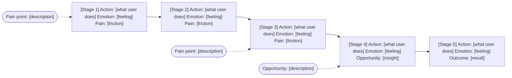

# Discovery Artifact Templates

Use these templates when producing discovery outputs. Replace all `[PLACEHOLDER]` values.

---

## Stakeholder Brief

```markdown
# Stakeholder Brief — [Product/Feature Name]
**Date:** [Date]
**Stakeholders:** [Names/Roles]

## Business Problem
[One paragraph describing the business problem being solved]

## Target Users
[Who are we building this for? Primary and secondary segments]

## Success Metrics
| Metric | Current Baseline | Target | Timeframe |
|--------|-----------------|--------|-----------|
| [metric] | [value] | [value] | [date] |

## Constraints
- Technical: [constraints]
- Budget: [constraints]
- Timeline: [constraints]
- Regulatory: [constraints]

## Non-Goals (explicitly out of scope)
- [item]
- [item]

## Open Questions
- [question]
- [question]
```

---

## Problem Statement

```markdown
# Problem Statement — [Product/Feature Name]

## One-Sentence Problem Statement
[User type] who [context] struggle to [task/goal] because [root cause], which results in [impact].

## Problem Context
[2–3 sentences expanding on the problem space]

## Why This Matters Now
[What changed, what's the urgency, what's the opportunity?]

## HMW Questions
1. How might we [opportunity 1]?
2. How might we [opportunity 2]?
3. How might we [opportunity 3]?
4. How might we [opportunity 4]?
5. How might we [opportunity 5]?

## Success Looks Like
[What observable change in user behavior or business outcome indicates we've solved the problem?]
```

---

## Persona

```markdown
# Persona — [Persona Name]
**Segment:** [Primary / Secondary]

## Profile
- **Name:** [Fictional name]
- **Age:** [Range]
- **Role/Occupation:** [Role]
- **Location:** [Geographic context]
- **Tech Comfort:** [Low / Medium / High]

## Bio
[2–3 sentences describing their day-to-day context relevant to the product]

## Goals
1. [Primary goal]
2. [Secondary goal]
3. [Tertiary goal]

## Frustrations
1. [Frustration 1]
2. [Frustration 2]
3. [Frustration 3]

## Behaviors
- [Behavior 1 — how they currently solve the problem]
- [Behavior 2 — tool/workaround they use]
- [Behavior 3 — frequency/context of use]

## Motivations
[What drives them? What does success look like from their perspective?]

## Quote
> "[Direct quote or representative sentiment]"

---
*[ASSUMPTION: list any assumptions not validated by direct research]*
```

---

## Journey Map

```markdown
# Journey Map — [Persona Name] / [Scenario]
**Journey Type:** Current State (As-Is) / Future State (To-Be)

## Scenario
[Describe the task/goal the user is trying to accomplish]

## Stage Flow



## Stages Table

| Stage | [Stage 1] | [Stage 2] | [Stage 3] | [Stage 4] | [Stage 5] |
|-------|-----------|-----------|-----------|-----------|-----------|
| **Actions** | | | | | |
| **Thoughts** | | | | | |
| **Emotions** | 😤 | 😕 | 😐 | 🙂 | 😊 |
| **Pain Points** | | | | | |
| **Opportunities** | | | | | |

## Key Insights
1. [Insight 1 — where is the most friction?]
2. [Insight 2 — where is the biggest opportunity?]
3. [Insight 3 — what's the most critical moment?]
```

---

## Research Synthesis

```markdown
# Research Synthesis — [Product/Feature Name]
**Research Methods Used:** [list]
**Participants:** [n participants, segments]
**Date:** [Date range]

## Key Themes

### Theme 1: [Name]
**Insight:** [What does this mean for users?]
**Evidence:**
- "[Quote 1]" — [Participant type]
- "[Quote 2]" — [Participant type]
**Frequency:** [X of Y participants mentioned this]

### Theme 2: [Name]
[Repeat structure]

### Theme 3: [Name]
[Repeat structure]

## Mental Models
[How do users currently think about this problem space?]

## Surprising Findings
[What did you learn that contradicted assumptions?]

## Validated Assumptions
- [Assumption] → Confirmed / Contradicted / Nuanced

## Recommended Next Steps
1. [Action based on research]
2. [Action based on research]
```

---

## Competitive Analysis Matrix

```markdown
# Competitive Analysis — [Product/Feature Name]
**Date:** [Date]

## Competitors Analyzed
- Direct: [Competitor A, B, C]
- Indirect: [Competitor D, E]

## Feature Comparison

| Feature | Our Product | [Comp A] | [Comp B] | [Comp C] |
|---------|-------------|----------|----------|----------|
| [Feature 1] | Planned | ✅ | ✅ | ❌ |
| [Feature 2] | Planned | ✅ | ❌ | ✅ |
| [Feature 3] | Planned | ❌ | ❌ | ❌ |

## UX Quality Assessment
| Competitor | Score (1–5) | Notes |
|------------|-------------|-------|
| [Comp A] | [score] | [notes] |

## Pricing Models
| Competitor | Model | Price Range | Notes |
|------------|-------|-------------|-------|
| [Comp A] | [Freemium/SaaS/etc] | $[X]–$[Y] | |

## Differentiation Opportunities
1. [Gap 1 — no competitor addresses this well]
2. [Gap 2]
3. [Gap 3]

## Strategic Recommendation
[One paragraph: given competitive landscape, where should we focus to win?]
```

---

## PDLC Selection Record

```markdown
# PDLC Selection Record — [Product/Feature Name]
**Date:** [Date]
**Selected Framework:** [Double Diamond / Dual-Track Agile / Lean Startup / Design Thinking / JTBD-Led / Stage-Gate]

## Selection Rationale
| Criterion | Assessment | Notes |
|-----------|------------|-------|
| Product type | [Net-new / Feature / Platform] | |
| User knowledge | [Unknown / Partial / Validated] | |
| Team capacity | [Low / Medium / High] | |
| Risk tolerance | [Low / Medium / High] | |
| Regulatory requirements | [Yes / No] | |
| Timeline | [Compressed / Standard / Extended] | |

## Why This Framework
[2–3 sentences: why this framework fits the team, product type, and risk profile]

## Phase Scope Adjustments
| Phase | Status | Adjustment |
|-------|--------|------------|
| Phase 0: PDLC Selection | Complete | — |
| Phase 1: Stakeholder Alignment | [Full / Compressed / Skip] | [Reason if adjusted] |
| Phase 2: Problem Definition | [Full / Compressed / Skip] | |
| Phase 3: User Research + JTBD | [Full / Compressed / Skip] | |
| Phase 4: Competitive Analysis | [Full / Compressed / Skip] | |
| Phase 4b: Strategic Positioning | [Full / Compressed / Skip] | |
| Phase 5: Personas | [Full / Compressed / Skip] | |
| Phase 5b: Data Dictionary | [Triggered / Not applicable] | |
| Phase 6: Journey Mapping | [Full / Compressed / Skip] | |
| Phase 7: PRD | [Full / Compressed / Skip] | |

## Stage-Gate Map
| Gate | Entry Criteria | Approver |
|------|----------------|----------|
| Discovery start | [Criteria confirmed above] | [Name/Role] |
| Discovery complete | All checklist items passed | [Name/Role] |
| Design start | APPROVED by reviewer | [Name/Role] |

## Risks of Selected Approach
- [Risk 1 — e.g. "Compressed timeline means assumptions are not validated with users"]
- [Risk 2]
```

---

## Blue Ocean Strategy Canvas

```markdown
# Blue Ocean Strategy Canvas — [Product/Feature Name]
**Date:** [Date]

## ERRC Grid (4 Actions Framework)

### Eliminate
Factors the industry competes on that provide no real value to users and should be removed:
- [Factor 1] — Rationale: [why eliminate]
- [Factor 2] — Rationale:

### Reduce
Factors that exist in excess of what users actually need:
- [Factor A] → Reduce from [current level] to [target level] — Rationale:
- [Factor B] → Reduce from [current level] to [target level]

### Raise
Factors that should be elevated well above the current industry standard:
- [Factor C] → Raise from [current level] to [target level] — Rationale:
- [Factor D] → Raise from [current level] to [target level]

### Create
New factors no competitor currently offers:
- [Factor X] — Description: [what it is and why it creates new value]
- [Factor Y] — Description:

---

## Strategy Canvas

| Competitive Factor | [Comp A] | [Comp B] | [Comp C] | Our Product |
|--------------------|----------|----------|----------|-------------|
| [Factor 1] | [1–5] | [1–5] | [1–5] | [1–5] |
| [Factor 2] | | | | |
| [Factor 3] | | | | |
| [Factor 4] (raised) | | | | |
| [Factor 5] (new) | n/a | n/a | n/a | [1–5] |

*Scoring: 1 = low offering level, 5 = high offering level*

## Value Curve Narrative
[2–3 sentences: describe where our value curve diverges from competitors and why that divergence is meaningful to the target user]

## Three Tiers of Non-Customers
| Tier | Description | Size Estimate | Key Insight |
|------|-------------|---------------|-------------|
| Tier 1 (Soon-to-be) | [Who they are] | [Rough size] | [What would convert them] |
| Tier 2 (Refusing) | [Who they are] | [Rough size] | [Why they refuse; what they use instead] |
| Tier 3 (Unexplored) | [Who they are] | [Rough size] | [What job repositioning would serve] |

## Value Innovation Statement
[Complete the sentence:] Our product creates value innovation by [eliminating/reducing X] while simultaneously [raising/creating Y], making competition irrelevant for [target user].
```

---

## Value Proposition Canvas

```markdown
# Value Proposition Canvas — [Product/Feature Name]
**Date:** [Date]
**Persona:** [Primary persona name]

---

## Customer Profile

### Jobs (Tasks / Goals / Problems)
List in order of priority:
1. **[Job 1]** — Type: Functional / Emotional / Social — Priority: High / Medium / Low
2. **[Job 2]** — Type: — Priority:
3. **[Job 3]** — Type: — Priority:

### Pains (Obstacles / Risks / Frustrations)
Rate intensity: Extreme / Moderate / Slight
1. **[Pain 1]** — Intensity: Extreme — Description: [what specifically causes pain]
2. **[Pain 2]** — Intensity: Moderate —
3. **[Pain 3]** — Intensity: Slight —

### Gains (Desired Outcomes / Benefits)
Rate importance: Required / Expected / Desired / Unexpected
1. **[Gain 1]** — Importance: Required — Description: [what success looks like]
2. **[Gain 2]** — Importance: Expected —
3. **[Gain 3]** — Importance: Desired —

---

## Value Map

### Products / Services
- [Feature/Service 1]
- [Feature/Service 2]
- [Feature/Service 3]

### Pain Relievers
| Pain Relieved | How |
|---------------|-----|
| [Pain 1] | [How our product relieves it] |
| [Pain 2] | |

### Gain Creators
| Gain Created | How |
|--------------|-----|
| [Gain 1] | [How our product creates this gain] |
| [Gain 2] | |

---

## Fit Assessment
- Extreme pains addressed: [X] of [Y] → [%]
- Required gains addressed: [X] of [Y] → [%]
- **Fit Score:** [%] — [Problem-Solution Fit: <70% needs work / ≥70% acceptable / ≥85% strong fit]

## Gaps (Pains or gains not yet addressed)
- [Gap 1 — pain or gain not addressed by current value map]
- [Gap 2]
```

---

## JTBD Opportunity Map

```markdown
# JTBD Opportunity Map — [Product/Feature Name]
**Date:** [Date]
**Primary Functional Job:** [e.g. "Minimise time to prepare a client contract for signature"]

## Job Map Stages

| Stage | Sub-Job / Desired Outcome | Importance (1–10) | Satisfaction (1–10) | Opportunity Score | Priority |
|-------|--------------------------|-------------------|---------------------|-------------------|----------|
| 1. Define | [Desired outcome statement] | | | | |
| 2. Locate | | | | | |
| 3. Prepare | | | | | |
| 4. Confirm | | | | | |
| 5. Execute | | | | | |
| 6. Monitor | | | | | |
| 7. Modify | | | | | |
| 8. Conclude | | | | | |

*Opportunity Score = Importance + max(Importance − Satisfaction, 0)*
*> 15 = Highly underserved | 10–15 = Moderately underserved | < 10 = Adequately served*

## Top Opportunities (Score > 10)
1. **[Stage X — Outcome Y]** — Score: [N] — Implication: [what product should do]
2. **[Stage X — Outcome Y]** — Score: [N]
3.

## Emotional and Social Jobs
| Job | Type | Current Solution | Opportunity |
|-----|------|-----------------|-------------|
| [Emotional job 1] | Emotional | [What users do today] | [How product could address] |
| [Social job 1] | Social | | |

## Key Switch Moments
[What triggered users to look for a new solution? What was the "last straw"?]
- [Switch moment 1 — from interviews]
- [Switch moment 2]

## Job Statements
Ranked by opportunity score:
1. [Direction verb] + [object] + [contextual clarifier] — Score: [N]
2.
3.
```

---

## Kano Analysis Table

```markdown
# Kano Analysis — [Product/Feature Name]
**Date:** [Date]
**Features analyzed:** [N]

## Classification Results

| Feature | Functional Response | Dysfunctional Response | Classification | Priority Implication |
|---------|--------------------|-----------------------|----------------|---------------------|
| [Feature 1] | [Like/Expect/Neutral/Tolerate/Dislike] | [Like/Expect/Neutral/Tolerate/Dislike] | Basic | Must have — do not over-invest |
| [Feature 2] | | | Performance | Invest proportionally |
| [Feature 3] | | | Excitement | High ROI differentiator |
| [Feature 4] | | | Indifferent | Deprioritise |
| [Feature 5] | | | Reverse | Make optional or remove |

## Summary by Category

### Basic (Must-be) Features
These are threshold requirements. Absence causes dissatisfaction; presence is taken for granted.
- [Feature list]

### Performance (Linear) Features
More investment = more satisfaction. Compete here where the market demands it.
- [Feature list]

### Excitement (Delighter) Features
Unexpected value creators. Prioritise 1–2 for launch as differentiators.
- [Feature list]

### Indifferent Features
Do not build unless zero incremental cost.
- [Feature list]

### Reverse Features
Avoid or make optional.
- [Feature list]

## Recommended Build Order (First Release)
1. All Basic features (minimum threshold)
2. [Top 2–3 Performance features by competitive importance]
3. [1–2 Excitement features as differentiators]

## Future Excitement → Basic Watch List
[Features currently Excitement that may become Basic as market matures — monitor competitors]
- [Feature] — Timeline estimate: [when likely to become table stakes]
```

---

## PRD (Product Requirements Document)

```markdown
# PRD — [Product/Feature Name]
**Version:** 1.0
**Status:** Draft / In Review / Approved
**Author:** [Name]
**Date:** [Date]
**Stakeholders:** [Names]

## Executive Summary
[3–5 sentences: what are we building, for whom, and why now?]

## Problem Statement
[From Problem Statement artifact]

## Goals and Non-Goals
### Goals
- [Goal 1 — measurable]
- [Goal 2 — measurable]

### Non-Goals
- [Explicitly out of scope]

## Target Users
[Reference personas by name, e.g., "Primary: [Persona A] (see personas doc)"]

## User Stories

Every user story must reference the FR-IDs it satisfies. This enables traceability from requirements → flows → wireframes → implementation → tests across all downstream phases.

### Must Have (P0)
- **US-001** (FR-001): As a [user type], I want to [action] so that [outcome]
- **US-002** (FR-002, FR-003): As a [user type], I want to [action] so that [outcome]

### Should Have (P1)
- **US-003** (FR-004): As a [user type], I want to [action] so that [outcome]

### Could Have (P2)
- **US-004** (FR-005): As a [user type], I want to [action] so that [outcome]

### Won't Have (Out of Scope)
- [Explicitly deferred feature — include FR-ID if it was previously scoped]

## Functional Requirements

Every functional requirement must have a unique FR-ID. These IDs are referenced by user stories above and traced through all downstream phases (flows, wireframes, designs, implementation, tests). Never reuse or renumber FR-IDs after initial assignment.

### [Feature Area 1]
| ID | Requirement | Priority | User Story | Notes |
|----|-------------|----------|------------|-------|
| FR-001 | [Specific, testable requirement] | P0 | US-001 | |
| FR-002 | [Specific, testable requirement] | P0 | US-002 | |

### [Feature Area 2]
[Repeat table]

## Non-Functional Requirements
| ID | Requirement | Target | Priority |
|----|-------------|--------|----------|
| NFR-001 | Page load time | < 2s (P95) | P0 |
| NFR-002 | Accessibility | WCAG 2.1 AA | P0 |
| NFR-003 | Uptime | 99.9% | P1 |

## Success Metrics
| Metric | Baseline | Target | Measurement Method |
|--------|----------|--------|--------------------|
| [Primary KPI] | [current] | [target] | [how measured] |

## Dependencies
- [Dependency 1 — team/system/API]
- [Dependency 2]

## Risks & Mitigations
| Risk | Likelihood | Impact | Mitigation |
|------|------------|--------|------------|
| [Risk] | H/M/L | H/M/L | [mitigation] |

## Open Questions
- [ ] [Question — owner — due date]

## Appendix
- Link to research synthesis
- Link to competitive analysis
- Link to personas

## Downstream Use (02-product-design)
- Each P0 user story (US-xxx) will become one or more user flows in Phase 02 — ensure stories are atomic and testable
- FR-IDs must be unique and stable; Phase 02 will reference them in flow headers (`Covers: FR-001, FR-002`)
- Primary persona must be clearly named; Phase 02 uses it for the flow `Persona` field
- Non-functional requirements (NFR-IDs) inform accessibility and performance planning in wireframes
- Success metrics feed into Phase 05 test acceptance criteria
```
