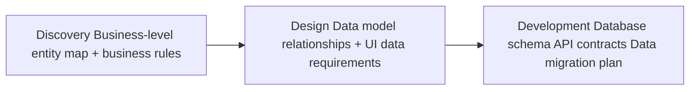
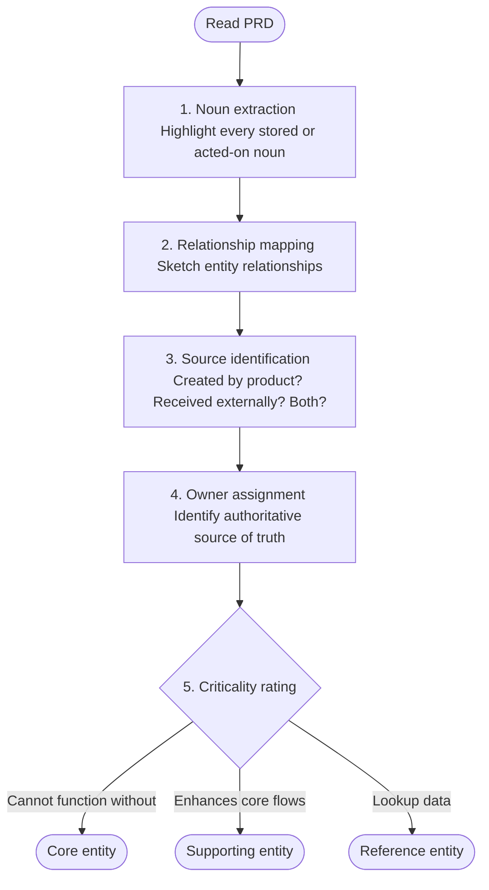

# Data Dictionary — Product Discovery Reference

A discovery-phase data dictionary defines the key data entities, their attributes, business rules, and ownership before engineering begins. It is a living document that starts in discovery and matures through design and development.

---

## What It Is

A data dictionary in the product discovery context is **not** a database schema. It is a business-level inventory of the information the product creates, consumes, transforms, or exposes — described in terms that both product and engineering stakeholders can read and agree on.

It answers:
- What are the core "things" (entities) this product deals with?
- What properties does each entity have, and what are the rules around them?
- Where does data come from, who owns it, and who can change it?
- What are the constraints, regulations, or business rules that govern it?

---

## When to Define It

Trigger the data dictionary phase (Phase 5b) when any of the following conditions are true:

| Trigger | Examples |
|---|---|
| **Complex data model** | Product manages more than 5 distinct entity types with relationships |
| **Regulated domain** | Healthcare (HIPAA), finance (PCI/SOX), education (FERPA), government |
| **Multi-system integration** | Product pulls from or pushes to 2+ external systems or APIs |
| **Multi-sided / marketplace** | Platform with buyers, sellers, and platform-managed entities |
| **Data portability requirement** | Users can export or transfer their data |
| **Shared data ownership** | Multiple teams or orgs own different parts of the data |
| **Audit / compliance trail** | System must log who changed what, and when |
| **AI/ML features** | Training data, features, labels, and model outputs must be defined |

If none of the above apply, mark Phase 5b as **not applicable** in the discovery checklist and proceed to Phase 6.

---

## Lifecycle: Discovery → Design → Development



### Discovery Phase (Phase 5b)
Scope: Identify entities, key attributes, business rules, and ownership. **Do not define technical implementation.**

Output: Data Dictionary v0.1 — approved in the discovery human review gate.

### Design Phase
Scope: Define how data surfaces in the UI (field labels, formats, validation messages). Data dictionary becomes the source of truth for form field names, error states, and empty states.

### Development Phase
Scope: Engineering translates business-level definitions into database schemas, API contracts, and data migration plans. Data dictionary v0.1 evolves into a technical data dictionary.

---

## Entity Identification Process

1. **Noun extraction** — read through the PRD and highlight every noun that represents something the system stores or acts on (e.g. User, Order, Product, Review, Invoice)
2. **Relationship mapping** — sketch which entities relate to which: "A User has many Orders; an Order has many Line Items"
3. **Source identification** — for each entity, note whether the product creates it, receives it from an external system, or both
4. **Owner assignment** — identify which team, role, or system is the authoritative source of truth for each entity
5. **Criticality rating** — mark each entity as Core (product cannot function without it), Supporting (enhances core flows), or Reference (lookup data)



---

## Data Dictionary Template

Use this template in the artifact. One table per entity.

```markdown
# Data Dictionary — [Product/Feature Name]
**Version:** 0.1
**Status:** Draft / In Review / Approved
**Date:** [Date]
**Owner:** [Product Manager / Data Lead]

## Scope
[One sentence: what systems, integrations, or data flows does this dictionary cover?]

## Entities Overview

| Entity | Criticality | Source | Owner | Notes |
|--------|-------------|--------|-------|-------|
| [Entity A] | Core | Created by product | [Team/Role] | [Any notes] |
| [Entity B] | Supporting | Imported from [System X] | [Team/Role] | |
| [Entity C] | Reference | External API | [Team/Role] | Read-only |

---

## Entity: [Entity Name]

**Description:** [What this entity represents in business terms]
**Criticality:** Core / Supporting / Reference
**Source:** Created by product / Received from [System] / Both
**Owner:** [Team or role that is authoritative source of truth]

### Attributes

| Attribute | Type | Required | Business Rule | Constraints | PII/Sensitive | Notes |
|-----------|------|----------|---------------|-------------|---------------|-------|
| id | UUID | Yes | System-generated on creation | Unique, immutable | No | |
| [attribute] | String | Yes/No | [Rule in plain English] | [Max length, format, allowed values] | Yes/No | |
| [attribute] | Enum | Yes | Must be one of: [value1, value2, value3] | | No | |
| [attribute] | Timestamp | No | Set on [event]; updated on [event] | UTC, ISO 8601 | No | |
| [attribute] | Reference | Yes | FK to [Entity B].id | Must exist | No | |

### Relationships

| Related Entity | Relationship | Notes |
|----------------|--------------|-------|
| [Entity B] | One [Entity A] has many [Entity B]s | Deleted on cascade / Orphaned / Blocked |
| [Entity C] | Many-to-many via [junction entity] | |

### Business Rules

1. [Rule 1 in plain English — e.g. "An Order cannot be placed if the User's account is suspended"]
2. [Rule 2 — e.g. "Price is locked at time of Order creation, not at time of payment"]
3. [Rule 3 — e.g. "Invoice must be generated within 24 hours of Order completion"]

### Lifecycle States

| State | Description | Transitions To |
|-------|-------------|----------------|
| [Draft] | [What this state means] | [Active], [Deleted] |
| [Active] | | [Archived], [Cancelled] |
| [Archived] | | — |

### Regulatory / Compliance Notes

- **PII fields:** [list attribute names]
- **Retention policy:** [e.g. "Retained for 7 years per SOX requirements"]
- **Access control:** [Who can read / write / delete]
- **Audit logging required:** Yes / No

---

## Data Flows

[Optional diagram or table showing how data moves between entities and systems]

| Flow | From | To | Trigger | Frequency |
|------|------|----|---------|-----------|
| [Flow 1] | [Source] | [Destination] | [Event] | [Real-time / Batch / On demand] |

## Open Questions

- [ ] [Question about data ownership — owner — due date]
- [ ] [Question about retention policy — owner — due date]
- [ ] [Question about external API data contract — owner — due date]

## Assumption Log

| Assumption | Confidence | Validation Step |
|------------|------------|-----------------|
| [Assumption about data volume] | Medium | Engineering spike in Sprint 1 |
| [Assumption about PII classification] | Low | Legal review required |
```

---

## Agent Guidance

- Always flag PII fields explicitly — do not bury them in notes
- If a field has an enum type, list all allowed values at discovery time; missing enum values cause design and development rework
- Lifecycle states are often the most underspecified part — ask the stakeholder "What can happen to a [Entity] after it's created? Can it be deleted, archived, or cancelled?"
- If the product integrates with an external API, request the API documentation and base entity definitions on the actual API response schema, not assumptions
- Data dictionaries created during discovery are version 0.1 — they will change. Mark them as Draft and include an assumption log so the design and engineering phases know what to validate
