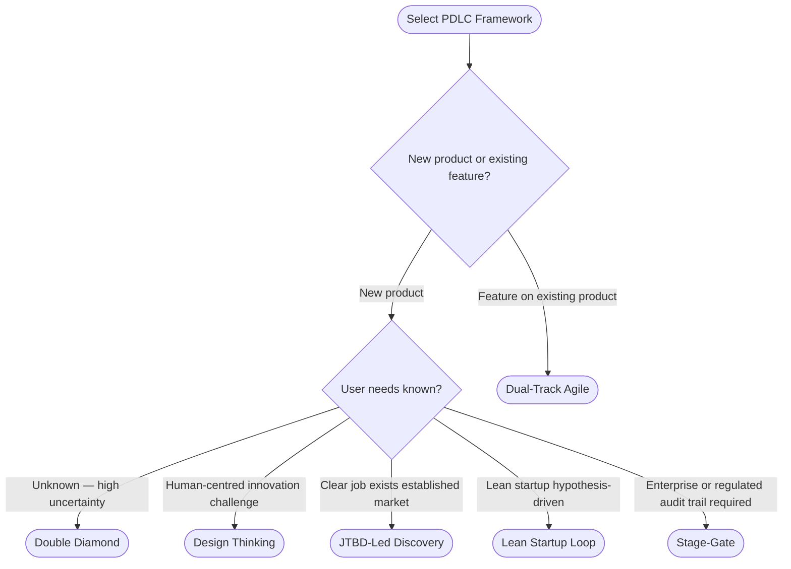
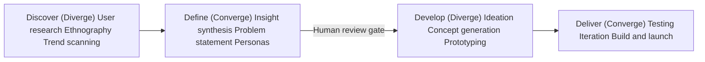
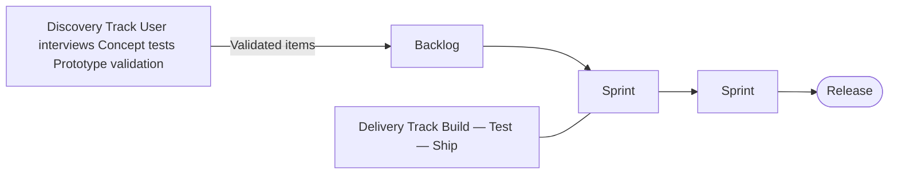
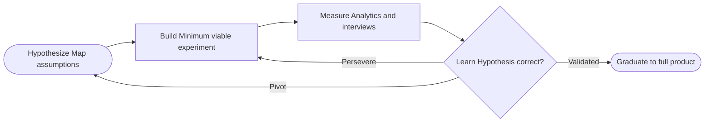
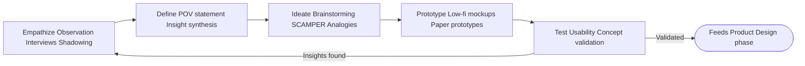
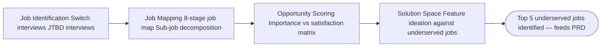
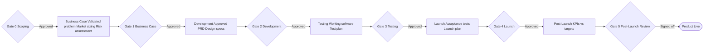

# PDLC Frameworks — Product Discovery Reference

Product Development Lifecycle (PDLC) frameworks define the stages, activities, and governance gates that take an idea from discovery to delivered product. Choosing the right framework before discovery begins shapes how thorough, fast, or iterative the entire process will be.

---

## Framework Selection

### Decision Matrix

Use this matrix to select the recommended PDLC before Phase 1.

| Scenario | Recommended Framework |
|---|---|
| Net-new product, unknown user needs, high uncertainty | Double Diamond |
| Feature on existing product, team has user access | Dual-Track Agile |
| Early-stage startup, lean resources, hypothesis-driven | Lean Startup Loop |
| Human-centred problem, cross-functional innovation team | Design Thinking |
| Clear user job exists, market has established solutions | JTBD-Led Discovery |
| Enterprise / regulated domain, audit trail required | Stage-Gate (Phase-Gate) |

### Selection Questions (ask during Phase 0)

1. Is this a new product or a feature on an existing product?
2. How much is known about user needs — validated, partially known, or unknown?
3. What is the team's capacity for iterative research vs. upfront planning?
4. Are there regulatory, compliance, or budget approval gates required?
5. What is the tolerance for building and discarding early versions?

Document the selection decision in the **PDLC Selection Record** artifact (see `artifacts-template.md`).

---

## Framework Descriptions

### Double Diamond

**Best for:** Net-new products, ambiguous problem spaces, high discovery risk.

| Diamond | Activities | Output |
|---|---|---|
| **Discover** (Diverge) | User research, ethnography, trend scanning, desk research | Research synthesis, themes |
| **Define** (Converge) | Insight synthesis, problem statement, HMW, personas | Problem brief, personas |
| **Develop** (Diverge) | Ideation, concept generation, prototyping | Concepts, prototypes |
| **Deliver** (Converge) | Testing, iteration, build, launch | Shipped product |

**Discovery scope:** Full (all 7 phases apply).

**Stage-gate:** Human review gate sits between Define and Develop diamonds. Product Discovery covers the first diamond (Discover → Define).

---

### Dual-Track Agile

**Best for:** Mature products, continuous delivery, teams with direct user access.

| Track | Activities | Cadence |
|---|---|---|
| **Discovery** | User interviews, concept tests, prototype validation | Continuous, parallel to delivery |
| **Delivery** | Build, test, ship sprint-defined scope | 2-week sprints |

**Discovery scope:** Compressed — skip Phase 0 framing if PDLC is already established; focus on specific opportunity areas rather than full market analysis.

**Stage-gate:** Weekly discovery review with product owner; items graduate to delivery backlog when confidence threshold is met (typically 3 positive signal data points).

---

### Lean Startup Loop

**Best for:** Startups, zero-to-one products, resource-constrained teams, hypothesis-driven culture.

| Loop Stage | Discovery Activity | Key Question |
|---|---|---|
| **Hypothesize** | Problem definition, assumption mapping | What do we believe to be true? |
| **Build** | Minimum viable experiment (not full product) | What is the cheapest test? |
| **Measure** | Analytics, interviews, cohort analysis | What actually happened? |
| **Learn** | Pivot or persevere decision | Was the hypothesis correct? |

**Discovery scope:** Rapid — compress Phases 1–4 into a 1-week sprint. Prioritise assumption mapping and invalidation over comprehensive research.

**Stage-gate:** Pivot/persevere decision meeting after each learning cycle. Document decision log.

---

### Design Thinking (IDEO/Stanford d.school)

**Best for:** Innovation challenges, cross-functional teams, human-centred problem reframing.

| Stage | Activities | Discovery Mapping |
|---|---|---|
| **Empathize** | Observation, interviews, shadowing | Phase 3 (User Research) |
| **Define** | POV statement, insight synthesis | Phase 2 (Problem Definition) |
| **Ideate** | Brainstorming, SCAMPER, analogies | Part of Phase 4b (Strategic Positioning) |
| **Prototype** | Low-fi mockups, role-play, paper prototypes | Feeds Product Design phase |
| **Test** | Usability, concept validation | Feeds QA / Product Design |

**Discovery scope:** Full phases apply. Emphasis on deep empathy work in Phase 3; problem statement uses POV format: `[User] needs [need] because [surprising insight]`.

**Stage-gate:** Prototype readiness review before entering full design.

---

### JTBD-Led Discovery (Jobs To Be Done)

**Best for:** Markets with established solutions, differentiation-focused products, B2B tools, productivity software.

| Stage | Activities | Discovery Mapping |
|---|---|---|
| **Job Identification** | Switch interviews, JTBD interviews | Phase 3 (User Research) |
| **Job Mapping** | 8-stage job map, sub-job decomposition | Phase 3 synthesis |
| **Opportunity Scoring** | Importance vs. satisfaction matrix | Phase 4b (Strategic Positioning) |
| **Solution Space** | Feature ideation against underserved jobs | Phase 7 (PRD user stories) |

**Discovery scope:** Full phases apply with emphasis on `strategic-frameworks.md → JTBD` section. Personas are reframed as job executors rather than demographic archetypes.

**Stage-gate:** Opportunity landscape validated; top 5 underserved jobs identified before entering design.

---

### Stage-Gate (Phase-Gate)

**Best for:** Enterprise products, regulated industries (healthcare, finance, gov), large capex investments.

| Gate | Entry Criteria | Discovery Relevance |
|---|---|---|
| **Gate 0** (Scoping) | Executive sponsor, rough concept | Phase 0–1 |
| **Gate 1** (Business Case) | Validated problem, market sizing, risk assessment | Phases 1–4b complete |
| **Gate 2** (Development) | Approved PRD, design specs, resource allocation | Phase 7 PRD approved |
| **Gate 3** (Testing) | Working software, test plan | QA phase |
| **Gate 4** (Launch) | Passed acceptance tests, launch plan ready | Deployment |
| **Gate 5** (Post-Launch) | KPIs measured against targets | Post-launch review |

**Discovery scope:** Full phases required, with formal business case document added after Phase 4b. Data dictionary is mandatory for Gate 1.

---

## Stage-Gate Entry/Exit Criteria (Universal)

Regardless of PDLC framework, the discovery phase uses these criteria.

### Entry Criteria (Discovery can begin when)
- [ ] Executive or product sponsor identified and available
- [ ] One-sentence product/feature hypothesis documented
- [ ] At least one stakeholder available for brief interview
- [ ] Timeline and resource constraints understood at high level

### Exit Criteria (Discovery is complete when)
- [ ] All discovery artifacts produced (see `discovery-checklist.md`)
- [ ] Human review gate passed (APPROVED or CONDITIONALLY APPROVED)
- [ ] Primary persona identified and validated
- [ ] PRD v1.0 drafted with P0 requirements defined
- [ ] Handoff package prepared for Product Design phase

---

## How PDLC Choice Shapes Discovery Scope

| Framework | Discovery Duration | Research Depth | Phase Skips Allowed |
|---|---|---|---|
| Double Diamond | 4–8 weeks | Deep | None |
| Dual-Track Agile | 1–2 weeks per cycle | Targeted | Phases 4b, 5b optional |
| Lean Startup | 3–5 days | Surface + assumption | Phases 5, 6 can be brief |
| Design Thinking | 2–4 weeks | Deep empathy | None |
| JTBD-Led | 3–6 weeks | Deep JTBD focus | Phase 6 can follow design |
| Stage-Gate | 6–12 weeks | Comprehensive | None — all mandatory |

**Agent guidance:** When a compressed timeline is declared, flag which phases are being skipped and document the risk in the Stakeholder Brief.
