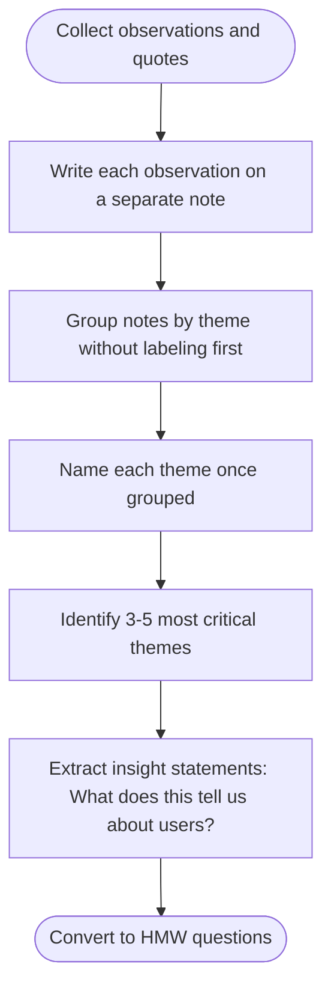
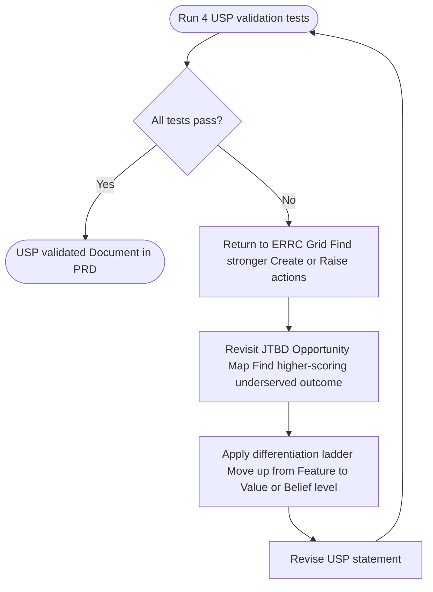

# Research Guide — Product Discovery

## Stakeholder Interview

### Goal
Understand business context, constraints, and success criteria before any user research.

### Interview Script (adapt as needed)

**Business context**
- What problem are we solving and for whom?
- Why now — what changed or what's the urgency?
- What does success look like in 6 months? 1 year?
- What metrics matter most?

**Constraints**
- What is out of scope for this product/feature?
- What technical, regulatory, or budget constraints exist?
- Who are the key decision-makers and what are their priorities?

**Existing knowledge**
- What research or data do we already have?
- What has been tried before, and why didn't it work?
- Who are the target users — do we have direct access to them?

### Synthesis
Organize outputs into: Goals / Success Metrics / Constraints / Non-Goals / Open Questions

---

## Research Methods

Choose based on timeline and access to users.

### Generative Research (understanding the problem space)

| Method | When | Time | Output |
|--------|------|------|--------|
| In-depth interview | You need rich qualitative insight | 45–60 min/participant | Themes, quotes, mental models |
| Contextual inquiry | You need to observe real behavior | 60–90 min/participant | Workflows, pain points, workarounds |
| Diary study | Behavior happens over time | 1–2 weeks | Longitudinal patterns |
| Survey | Quantitative validation at scale | 10–15 min/respondent | Frequencies, rankings |

### Evaluative Research (testing solutions)

| Method | When | Time | Output |
|--------|------|------|--------|
| Usability test | Testing prototype or existing product | 45–60 min | Task completion, friction points |
| A/B test | Comparing two solutions at scale | Ongoing | Statistical preference |
| Card sort | Testing information architecture | 20–30 min | Groupings, mental models |
| Tree test | Validating navigation | 15–20 min | Findability rates |

### AI-Assisted Research (when direct user access is limited)

When direct research isn't possible, the agent will:
1. Apply domain knowledge to simulate representative user perspectives
2. Flag all assumptions clearly as `[ASSUMPTION: ...]`
3. Recommend specific validation steps for the human team
4. Provide confidence levels (High/Medium/Low) for each insight

**Important:** AI-generated personas and insights MUST be validated against real users before committing to design decisions.

---

## Interview Best Practices

- Open with context-setting: explain the purpose, that there are no wrong answers
- Ask about past behavior, not future intent ("Tell me about the last time you...")
- Follow up with "Why?" and "Tell me more" to get beneath surface answers
- Avoid leading questions ("Would you use a feature that...?")
- Capture direct quotes verbatim — they become the most persuasive research artifacts
- Aim for 5 participants per distinct user segment (diminishing returns after that)

---

## Synthesis Techniques

### Affinity Mapping
1. Write each observation/quote on a separate note
2. Group notes by theme without labeling first
3. Name the themes once grouped
4. Identify the 3–5 most critical themes
5. Extract insights: what does this theme tell us about users?



### Insight Statements
Structure: `[User type] needs [need] because [underlying reason]`

Example: "Freelance designers need to invoice clients quickly because delayed payments disrupt their cash flow."

### HMW (How Might We) Questions
Convert insights into opportunity questions:
- Insight: "Users feel anxious when they can't track their order status"
- HMW: "How might we give users continuous confidence about their order?"

---

## Competitive Analysis Framework

### Direct Competitors
Products solving the same problem for the same user.

### Indirect Competitors
Products solving a related problem or the same problem differently.

### Analysis Dimensions
- Core value proposition
- Key features (list top 5–7)
- UX/design quality (1–5)
- Pricing model
- Target segment
- Strengths (top 3)
- Weaknesses / gaps (top 3)
- Differentiation opportunity

### Sources (Standard)
- Product website and marketing copy
- App Store / Play Store reviews (real user feedback)
- G2, Capterra, Trustpilot reviews
- Public case studies
- Job listings (reveals tech stack and priorities)
- LinkedIn company pages (growth signals)

---

## Competitive Intelligence (Deep)

Use these techniques when the standard competitive analysis is insufficient or when Phase 4b strategic positioning requires stronger evidence.

### Changelog and Release Note Analysis
- Locate competitor changelog pages, release notes, or public GitHub repos
- Identify the pattern of investment: what features have shipped in the last 6–12 months?
- Frequency of releases signals engineering capacity and strategic focus areas
- Questions to answer: "Are they doubling down on integrations or core UX? Are they moving upmarket or downmarket?"

### Review Sentiment Pattern Analysis
- Read the most recent 20–30 reviews per competitor on G2 / Capterra / App Store / Trustpilot
- Tag each review mention as: Feature praise / Feature complaint / Onboarding / Pricing / Support / Performance / Missing feature
- Tally frequency per tag — the most common complaint is the gap to exploit
- Look for reviews mentioning a specific competitor switch: "I moved from [X] because..." — these reveal the functional job that competitor failed

### Pricing Page Archaeology
- Screenshot competitor pricing pages and note: tier names, price points, feature gates, call-to-action copy, free tier limits
- Look for what is gated at each tier — this reveals how they perceive their own value hierarchy
- Check the Wayback Machine (web.archive.org) to see how pricing has evolved — price increases indicate confidence; price reductions indicate churn pressure
- Compare price anchoring strategy: do they lead with the premium plan or the free tier?

### API Documentation Scan
- If the competitor has a public API, read the endpoint list and data models
- This reveals the entities they consider core to their product and the integrations they've prioritised
- Undocumented or deprecated endpoints reveal abandoned strategic bets
- A large number of webhook endpoints indicates they have a mature platform play

### Job Listing Intelligence
- Search LinkedIn, Greenhouse, or Lever for competitor job postings in the last 90 days
- Hiring heavily for ML/AI → they are building intelligent features
- Hiring for enterprise sales and solutions engineers → moving upmarket
- Hiring for mobile → platform expansion underway
- Hiring for support → scaling pains, possibly churn risk
- The tech stack in engineering postings reveals their infrastructure decisions

### Social Listening
- Search Reddit (r/[productcategory], r/[industryforum]) for competitor brand mentions in the last 12 months
- Search Twitter/X and LinkedIn for "#[CompetitorName] alternative" or "[CompetitorName] vs"
- These surfaces unsolicited, unfiltered user opinions not subject to review platform moderation

---

## JTBD Interview Script (Switch Interview)

The switch interview uncovers the full timeline of a user's decision to adopt a new solution — the functional, emotional, and social forces that drove the switch.

### Pre-Interview Setup
- Recruit users who switched to a similar product within the last 3–12 months (recent enough to remember)
- Duration: 45–60 minutes
- Frame: "I want to understand your experience leading up to and after you started using [product category] — there are no right or wrong answers, and I'm most interested in the story."

### The Four Forces to Uncover

| Force | Direction | Question Approach |
|-------|-----------|-------------------|
| Push (old solution) | Away from old | "What was frustrating about what you were doing before?" |
| Pull (new solution) | Toward new | "What made [new solution] seem like it might work?" |
| Anxiety (new solution) | Away from new | "What made you hesitant to switch?" |
| Habit (old solution) | Away from new | "What was comfortable about your old way of doing things?" |

### Interview Script

**Opening — establish the switch moment**
- "Can you walk me through the first time you decided something needed to change? What was happening?"
- "What were you doing before that wasn't working?"
- "When did you first start thinking about finding a different solution?"

**Exploring the struggle**
- "Tell me about the last time [problem] happened before you switched — what specifically went wrong?"
- "How were you handling [task] at the time? Walk me through what that looked like."
- "What was the cost of that situation — time, money, stress, relationships?"

**The search process**
- "When you started looking for alternatives, how did you go about that?"
- "What did you look at? What did you rule out, and why?"
- "Was there a moment when you thought 'this one might work'? What triggered that?"

**The decision**
- "What pushed you to actually commit and switch? Was there a specific event?"
- "What was the thing you were most worried about before you switched?"
- "Who else was involved in the decision?"

**After the switch**
- "How did you feel the first time you used [new solution]?"
- "What's better now than it was before?"
- "Is there anything you miss about the old way?"
- "If [new solution] disappeared tomorrow, what would you do?"

### Synthesis: Job Statement Extraction
From each interview, extract:
1. **The functional job:** "They were trying to [accomplish X] when [context Y]"
2. **The emotional job:** "They wanted to feel [Z] / avoid feeling [W]"
3. **The switch trigger:** "The final push was [event]"
4. **The anxiety:** "They hesitated because [concern]"

These feed directly into the JTBD Opportunity Map artifact.

---

## Opportunity Scoring Methodology

From Anthony Ulwick's Outcome-Driven Innovation framework.

### Survey Structure
For each desired outcome statement (job map stage × sub-job):

**Question 1 — Importance:**
"When [job stage context], how important is it that you [desired outcome]?"
Scale: 1 (not at all important) → 10 (extremely important)

**Question 2 — Satisfaction:**
"When [job stage context], how satisfied are you with the solutions currently available to help you [desired outcome]?"
Scale: 1 (not at all satisfied) → 10 (completely satisfied)

### Formula
```
Opportunity Score = Importance + max(Importance − Satisfaction, 0)
```

### Interpretation
| Score | Segment | Strategic Action |
|-------|---------|-----------------|
| > 15 | Highly underserved | Primary target — build directly against this |
| 10–15 | Moderately underserved | Secondary target — address if resources allow |
| 8–10 | Adequately served | Table stakes — must match, not exceed |
| < 8 | Over-served | Do not invest — risk of over-engineering |

### Minimum Sample Size
- 5–8 interviews for qualitative validation of job map
- 30+ survey responses for statistically meaningful opportunity scores
- If survey data is unavailable, estimate scores with AI assistance and mark as `[ASSUMPTION: estimated, validate before committing]`

---

## Blue Ocean Non-Customer Research

Non-customers reveal the boundaries of the market and the latent demand that a repositioned product can capture.

### Three Tiers (Fieldwork Approach)

**Tier 1 — Soon-to-be non-customers (on the edge)**
Who: Users who use your category minimally, reluctantly, or as a last resort.

Interview questions:
- "How often do you use [product category]? What do you use it for?"
- "On a scale of 1–10, how much do you rely on it?"
- "What would make you use it more confidently / more often?"
- "What do you do instead when you don't use it?"

**Tier 2 — Refusing non-customers (consciously avoiding)**
Who: People aware of your category but who have made a conscious decision not to use it.

Recruiting: Ask in user communities — "Has anyone here deliberately decided not to use [category] tools? I'd love to learn why."

Interview questions:
- "You're aware of [category] tools but you don't use them — can you tell me about that decision?"
- "What do you use instead? How does that work for you?"
- "What would have to be true for a tool like this to be worth using?"
- "What's the assumption the industry makes that doesn't apply to you?"

**Tier 3 — Unexplored non-customers (outside current market definition)**
Who: People with a related job who have never considered your category.

Approach: Identify the broader job. Who else is trying to accomplish the same functional goal through a completely different means?

Interview questions:
- "How do you currently handle [broader job]?"
- "What tools or methods do you use?"
- "Have you ever looked into [product category]? Why / why not?"
- "If something made [task] dramatically easier, what would that be worth to you?"

### Synthesis Output
Map non-customer insights onto the ERRC Grid: what do they dislike (eliminate/reduce) and what would convert them (raise/create)?

---

## USP Validation Research

Run these tests before finalising the USP Statement to ensure it is differentiated, believable, and relevant.

### Test 1 — Differentiation Clarity Test
**Method:** Show the USP statement to 5 target users alongside a list of 3–4 competitor names (no other context).

**Prompt:** "Based on this statement, what do you think makes this product different from these others?"

**Pass criteria:** ≥ 4 of 5 users can articulate a specific differentiator without prompting. If they say "it sounds the same as [Competitor X]", the USP is not sufficiently distinct.

### Test 2 — Believability Test
**Method:** Show the USP statement without proof points.

**Prompt:** "On a scale of 1–5, how believable does this claim seem to you, with no other information?"

**Pass criteria:** Mean score ≥ 4.0. Scores below 3.5 indicate the claim is too bold without substantiation — either add proof or reduce the claim.

### Test 3 — Relevance Test
**Method:** Cross-reference the USP against the JTBD Opportunity Map.

**Check:** Does the USP directly address a desired outcome with an Opportunity Score ≥ 12?

**Pass criteria:** USP maps to at least one top-3 opportunity in the job map. If not, revise USP to address a higher-scoring pain.

### Test 4 — Competitor Gap Test
**Method:** Search each top competitor's homepage, About page, and primary CTA copy.

**Check:** Does any competitor use functionally identical language in their primary headline or value proposition?

**Pass criteria:** No direct competitor claims the same USP in their above-the-fold copy. If they do, either the differentiation is real but not communicated distinctively, or the product genuinely lacks a unique position and Phase 4b must be revisited.

### USP Refinement Loop
If any test fails:
1. Return to the ERRC Grid — look for Create or Raise actions that are stronger differentiators
2. Revisit the JTBD Opportunity Map — find a higher-scoring underserved outcome
3. Apply the differentiation ladder — move up from Feature to Value or Belief level
4. Re-run the failed tests with the revised USP statement


