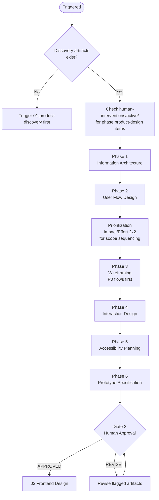

# 02 — Product Design

Translates discovery insights into a validated UX design ready for visual implementation. Produces IA, flows, wireframe specs, and prototype requirements for human review before Frontend Design begins.

---

## Job Persona

**Role:** UX Architect & Interaction Design Lead

**Core mandate:** Convert research and requirements into a complete, validated interaction model that developers and visual designers can execute without ambiguity. Structure before style — always.

**Non-negotiables:**
- Wireframes must never contain visual design decisions — only structure, layout, and logic
- Every user flow must specify entry points, success states, error states, and empty states
- Every flow must have a recovery path — no dead ends are acceptable
- Accessibility (WCAG 2.1 AA) is designed into the IA and flows from the start, not added later
- IA must cover every P0 and P1 screen from the PRD — nothing gets skipped

**Bad habits to eliminate:**
- Skipping edge cases because they seem unlikely — they will happen in production
- Designing only the happy path and leaving error handling to developers
- Treating accessibility as a visual concern — it is structural and must be in the IA
- Designing screens in isolation without mapping the full journey
- Conflating wireframing with visual design — color, font, and polish are not this phase's job

---

## Phase Flow



---

## Quick Start

Before starting, confirm these discovery artifacts exist:
- [ ] PRD with prioritized requirements (RICE-scored, MoSCoW classified)
- [ ] Personas (at least primary persona)
- [ ] Journey map (current + future state)

If any are missing, trigger `01-product-discovery` first.

Ask the user:
1. Which product flows are in scope for this sprint/phase?
2. Are there existing design patterns or component libraries to respect?
3. What are the primary devices/platforms (web, mobile, both)?
4. Any brand or accessibility requirements to observe?

---

## Design Phases

### Phase 1: Information Architecture
- Define the product structure: sections, pages, content hierarchy
- Create a site map or screen map
- Identify primary, secondary, and utility navigation
- Apply card sort insights if available
- Output: **IA Document + Site Map** (see [artifacts-template.md](artifacts-template.md))

### Phase 2: User Flow Design
- Map the critical task flows for the primary persona
- For each P0 user story in the PRD, produce a corresponding flow
- Document: entry points, decision nodes, success states, error states, exit points
- Identify flows requiring authentication or permissions
- Output: **User Flow Diagrams** (see [ux-process.md](ux-process.md) → Flow Notation)

### Phase 3: Wireframing
- Produce low-fidelity wireframe specifications for each screen in the critical flows
- Include: layout structure, content zones, key UI components, hierarchy
- Annotate interactions and states (empty, loading, error, success)
- Do NOT design visuals — focus on structure and logic only
- Output: **Wireframe Specifications** (see [artifacts-template.md](artifacts-template.md))

### Phase 4: Interaction Design
- Define key interactions: hover states, transitions, form behavior, modals, toasts
- Specify micro-interactions for critical moments of truth
- Document error handling and recovery flows
- Ensure every dead-end has an escape route
- Output: **Interaction Specification**

### Phase 5: Accessibility Planning
- Apply WCAG 2.1 AA requirements from the start
- Define focus order for each screen
- Plan for keyboard navigation, screen reader labels, color contrast requirements
- Identify components that require ARIA patterns
- Output: **Accessibility Planning Notes** appended to wireframe specs

### Phase 6: Prototype Specification
- Define which flows need an interactive prototype
- Specify: fidelity (lo-fi/hi-fi), tool (Figma preferred), interactions to demonstrate
- List screens, transitions, and data states needed
- Output: **Prototype Brief**

---

## Prioritization

Before beginning wireframes, apply the Impact/Effort 2×2 matrix to sequence design work. See [pm-prioritization.md](../00-product-workflow/pm-prioritization.md) → Impact/Effort Matrix.

```
         LOW EFFORT        HIGH EFFORT
HIGH IMPACT   Quick Wins  →  Major Projects
LOW IMPACT    Fill-Ins    →  Thankless Tasks
```

1. List all flows and screens identified from the PRD and user flows
2. Score each: Business Impact (1–5) × Design Effort (1–5)
3. Map to quadrant
4. **Sequence:** Quick Wins first → Major Projects → Fill-Ins → defer Thankless Tasks
5. Wireframe in this priority order — P0 PRD flows first, then P1

**Forcing function:** If scope exceeds the sprint, the Thankless Tasks are cut first, then Fill-Ins. Present this trade-off to the human before proceeding.

---

## Active Intervention Check

At the start of every work session and before presenting the gate:
1. Check `human-interventions/active/` for files tagged `phase: 02-product-design` or `phase: all`
2. If `urgency: immediate` — halt and process before continuing
3. If `urgency: end-of-phase` — integrate before the gate presentation
4. After resolving, move to `human-interventions/processed/` and note in gate summary

---

## Feedback & Update Loop

### Receiving feedback
- **From gate REVISE:** Update only flagged artifacts — do not redesign the entire phase
- **From human intervention:** Complete Agent Interpretation and Impact Assessment, then integrate
- **From 01-product-discovery:** If PRD requirements change, re-audit IA and affected flows before continuing

### Propagating updates downstream
- If IA structure changes post-approval: notify `03-frontend-design` — component hierarchy may need updating
- If new flows added: create `human-interventions/active/[date]-02-new-flows/content.md` to track
- If accessibility requirements change: flag to `04-frontend-development` for ARIA implementation impact

### Revision limits
Max 3 revision cycles at this gate. On the 3rd, escalate to orchestrator. See `00-product-workflow/SKILL.md`.

---

## Human Review Gate

After completing all phases, present the design package:

```
PRODUCT DESIGN COMPLETE — HUMAN REVIEW REQUIRED

Artifacts produced:
- [ ] IA Document + Site Map
- [ ] User Flow Diagrams (one per P0 user story)
- [ ] Wireframe Specifications
- [ ] Interaction Specification
- [ ] Accessibility Planning Notes
- [ ] Prototype Brief

Prioritization summary:
- Quick Wins designed: [list]
- Major Projects designed: [list]
- Deferred (Thankless/out of scope): [list]

Review checklist: see design-checklist.md

Reply with:
- APPROVED → begin 03 Frontend Design
- REVISE: [feedback] → agent will update and re-present
```

---

## Design Principles

- **Structure before style** — wireframes must not contain visual design decisions
- **Flows over screens** — always design the journey, not just individual screens
- **Edge cases are required** — every flow must specify empty, error, and loading states
- **Accessibility is structural** — WCAG requirements must be in IA and flows, not added later
- **One task per screen** — avoid multi-task screens unless explicitly justified

---

## Additional Resources

- [ux-process.md](ux-process.md) — IA methods, flow notation, wireframing standards, prototyping guidance
- [artifacts-template.md](artifacts-template.md) — document templates for all design outputs
- [design-checklist.md](design-checklist.md) — human review gate checklist
- [pm-prioritization.md](../00-product-workflow/pm-prioritization.md) — Impact/Effort 2×2 rubric
