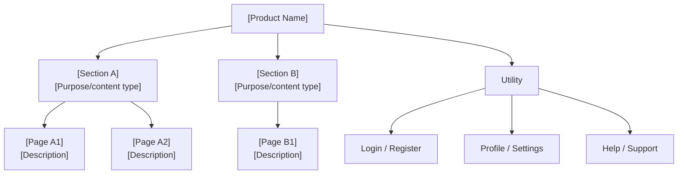

# Design Artifact Templates

Use these templates when producing Product Design outputs. Replace all `[PLACEHOLDER]` values.

---

## IA Document

```markdown
# Information Architecture — [Product Name]
**Version:** 1.0
**Date:** [Date]

## Scope
[Which surfaces / platforms does this IA cover?]

## Navigation Model
**Primary Navigation:** [Tab bar / Top nav / Sidebar / Hamburger / etc]
**Secondary Navigation:** [Breadcrumbs / Sub-nav / etc]
**Utility Navigation:** [Header: Login, Settings, Help]

## Site Map

### Level 1 (Primary Sections)
- [Section A]
- [Section B]
- [Section C]

### Full Structure



## URL Structure (if web)
- `/` — Home
- `/[section-a]` — [Section A]
- `/[section-a]/[page-a1]` — [Page A1]

## Content Types
| Content Type | Description | Where Used |
|-------------|-------------|------------|
| [Type 1] | [Description] | [Section(s)] |

## Navigation Rules
- [Rule 1: e.g., "Authenticated users always see X in primary nav"]
- [Rule 2: e.g., "Admin-only sections are hidden from standard users"]

## Open Questions
- [ ] [Question requiring stakeholder input]
```

---

## User Flow Document

```markdown
# User Flows — [Product Name]
**Date:** [Date]
**PRD Version:** [1.0]

---

## Flow: [Flow Name]
**ID:** UF-001
**Covers:** FR-001, FR-002 *(list all PRD functional requirement IDs this flow satisfies)*
**Persona:** [Primary persona]
**User Story:** US-001 — As a [user], I want to [action] so that [outcome]
**Entry Point:** [Where flow begins — e.g., "Home screen > CTA button"]
**Success State:** [What happens when the user completes the goal]

### Flow Diagram

```mermaid
flowchart TD
    entry([Entry Point:\n[Screen or trigger]]) --> step1[Step 1: User action]
    step1 --> step2{Decision or\nsystem check}
    step2 -->|Success| step3[Step 2: System response]
    step2 -->|Error condition| error[Show error message\n[User-facing message]]
    error --> recovery[Recovery action\navailable to user]
    recovery --> step1
    step3 --> step4[Step 3: User action]
    step4 --> success([Success State:\n[What the user achieves]])
    step1 -->|Alt A: [Condition]| altPath[Alternate path]
    altPath --> success
```

### Happy Path
1. User arrives at [entry point]
2. User [action]
3. System [response]
4. User [action]
5. System confirms → [success state]

### Alternate Paths
- **Alt A:** [Condition] → User takes [different path] → Arrives at [same success state / alternate state]

### Error States
| Error Condition | Trigger | User-Facing Message | Recovery Action |
|----------------|---------|---------------------|-----------------|
| [Error 1] | [What causes it] | "[Message text]" | [What user can do] |
| [Error 2] | | | |

### Empty States
| Screen | Condition | What Is Shown |
|--------|-----------|---------------|
| [Screen name] | First-time user | [Description of empty state UI] |
| [Screen name] | No results | [Description] |

---

## Flow: [Flow Name 2]
**ID:** UF-002
[Repeat structure above — include a Flow Diagram mermaid block for each flow]

---

## Downstream Use (03-frontend-design / wireframing)
- Flow IDs (UF-xxx) are referenced by wireframe screens — ensure every P0 flow has a unique UF-ID
- `Covers: FR-xxx` in each flow header enables traceability from PRD → flow → wireframe → design → code → test
- Error States table feeds directly into wireframe error state specs and Phase 03 error state designs
- Empty States table feeds into wireframe empty state specs
- Every screen referenced in a flow must have a corresponding wireframe (WF-xxx)
```

---

## Wireframe Specification

```markdown
# Wireframe Specifications — [Product Name]
**Version:** 1.0
**Date:** [Date]
**Fidelity:** Low / Mid

---

## Screen: [Screen Name]
**ID:** WF-001
**Flow(s):** UF-001, UF-002 *(list all flow IDs that include this screen)*
**Covers:** FR-001, FR-002 *(inherited from referenced flows — list all FR-IDs)*
**Platform:** Web / Mobile / Both
**Authentication Required:** Yes / No

### Layout Description
[Describe the layout zones: header, main content, sidebar, footer]

### Content Zones
| Zone | Content | Notes |
|------|---------|-------|
| Header | [Logo, nav items, auth controls] | |
| Primary | [Main content description] | |
| Actions | [Primary CTA, secondary actions] | |

### Components
| Component | Type | Label | Behavior |
|-----------|------|-------|----------|
| [Element] | Button (Primary) | "[Label]" | [Click → navigates to WF-002] |
| [Element] | Input (Text) | "[Placeholder]" | [Required, validates on blur] |
| [Element] | Modal trigger | "[Label]" | [Opens modal WF-003] |

### States
**Default:** [Description]
**Loading:** [Skeleton screen / Spinner in [zone]]
**Empty:** [Description of empty state — what is shown when no data]
**Error:** [Description of error state]

### Annotations
- [Note 1: Behavior detail]
- [Note 2: Content rule — e.g., "Title truncates at 60 characters with ellipsis"]

### Accessibility Notes
- Focus order: [1. Skip link, 2. Logo, 3. Nav item 1, ...]
- ARIA: [Any custom components needing ARIA labels]
- Touch targets: [Any targets needing size callouts]

---

## Screen: [Screen Name 2]
**ID:** WF-002
[Repeat structure]

---

## Downstream Use (03-frontend-design)
- Screen IDs (WF-xxx) are used by Phase 03 to map designs to Figma frames or screen specs — ensure every P0 screen has a unique WF-ID
- FR-IDs inherited from flows enable Phase 03 to verify design coverage against PRD requirements
- Component annotations (Type column) map to design system components — Phase 03 will design each as a component with all states
- Accessibility Notes (focus order, ARIA) feed directly into Phase 03 component ARIA specs and Phase 04 implementation
- States (loading, empty, error) must all be specified here — Phase 03 will create visual designs for each
```

---

## Interaction Specification

```markdown
# Interaction Specification — [Product Name]
**Date:** [Date]

## Transitions
| From | To | Type | Duration | Trigger |
|------|----|------|----------|---------|
| [Screen A] | [Screen B] | Slide left | 300ms | Nav tap |
| [Screen A] | [Modal] | Fade + scale | 200ms | Button click |

## Component Interactions

### Forms
- Validation: Inline, triggered on blur (not on submit)
- Error messages: appear below the field with ❌ icon
- Success state: field border turns green after valid input
- Submit button: disabled until all required fields valid

### Modals / Dialogs
- Open: fade in + scale from 0.95 to 1.0, 200ms ease-out
- Close: reverse, 150ms
- Backdrop: semi-transparent dark overlay; click to dismiss (if non-critical)
- Focus: traps inside modal when open; returns to trigger on close

### Loading States
- Page loads: skeleton screens (not spinners) for content-heavy views
- Action feedback: button shows spinner inline + disabled for async actions
- Timeout: after 10s, show error state with retry option

### Notifications / Toast
- Position: top-center (mobile), bottom-right (desktop)
- Duration: 4s auto-dismiss for success; persistent for errors
- Types: success (green), warning (amber), error (red), info (blue)

### Hover States (web)
- Interactive elements: cursor pointer + subtle background shift (100ms ease)
- Links: underline on hover
- Cards: elevation shadow increase on hover

## Motion Principles
- Purposeful: motion conveys meaning (not decoration)
- Fast: action feedback < 200ms; transitions 200–400ms
- Consistent: same component type = same animation everywhere
- Respects `prefers-reduced-motion`: all animations should have a no-motion fallback
```

---

## Prototype Brief

```markdown
# Prototype Brief — [Product Name]
**Date:** [Date]
**Version:** [Lo-fi / Hi-fi]
**Tool:** Figma

## Purpose
[Concept validation / Usability testing / Stakeholder presentation]

## Scope
Flows to prototype:
- [ ] [Flow 1 name] — [n] screens
- [ ] [Flow 2 name] — [n] screens

## Screens List
| Screen ID | Screen Name | Flow | Notes |
|-----------|-------------|------|-------|
| WF-001 | [Name] | UF-001 | |
| WF-002 | [Name] | UF-001 | |

## Interactions to Demonstrate
- [ ] [Interaction 1]
- [ ] [Interaction 2]

## Data States Needed
- [ ] Populated with realistic content
- [ ] Empty state
- [ ] Error state

## Usability Test Tasks (if applicable)
1. "[Task instruction for participant]"
2. "[Task instruction for participant]"

## Success Criteria
[What do you need to learn from this prototype to proceed?]
```
