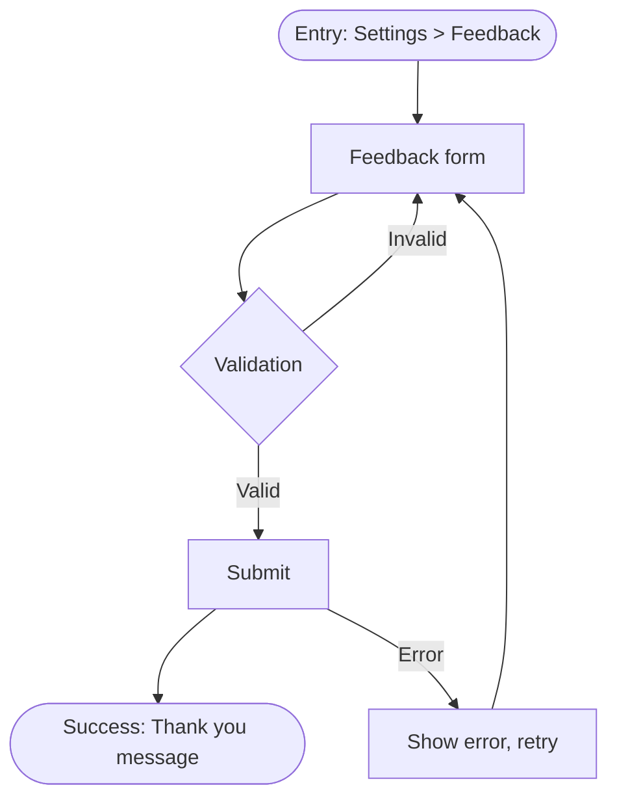

# User Feedback Design — Handover Template

Use this template for handover to user flows and wireframe specs.

---

## Feedback Flow — [Product Name]

**Flow ID:** UF-[xxx]
**Covers:** FR-[xxx]
**Persona:** [Primary persona]
**Entry Point:** [e.g., Settings > Feedback button]
**Success State:** [Feedback submitted, confirmation shown]

### Flow Diagram

### Happy Path

1. User navigates to [Feedback] from [entry point]
2. User fills form (type, message, optional contact)
3. User submits
4. System confirms → success state

### Error States

| Error | Message | Recovery |
|-------|---------|----------|
| Network failure | "Could not send. Check connection and try again." | Retry button |
| Validation | Inline field errors | Fix and resubmit |

### Wireframe Reference

- WF-[xxx]: Feedback form screen
- WF-[xxx]: Success confirmation
