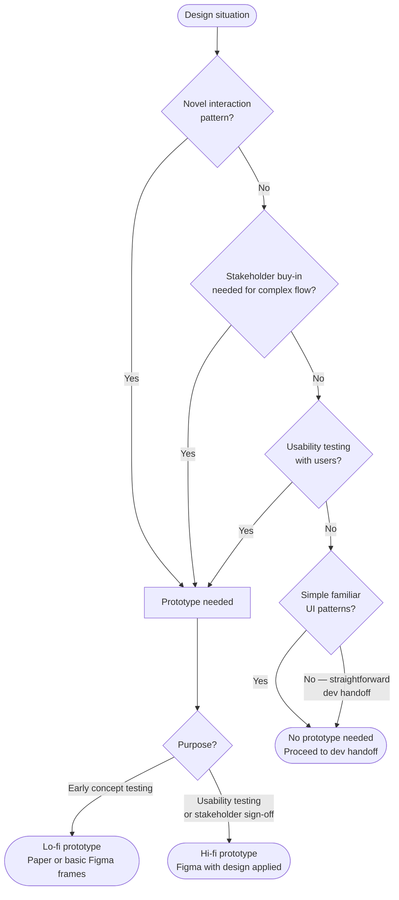

# UX Process Guide — Product Design

## Information Architecture Methods

### Card Sorting (open)
Users group unlabeled cards into categories they define. Use to discover mental models.
- Run with 15–20 participants
- Analyze with similarity matrix
- Output: category labels + groupings

### Card Sorting (closed)
Users sort cards into predefined categories. Use to validate an existing structure.
- Run with 10–15 participants
- Measure: percentage placing item in expected category

### Tree Testing
Users navigate a text-only tree to find items. Use to validate navigation before design.
- Run with 20+ participants
- Measure: success rate, directness, time
- Tool: Optimal Workshop, Maze

### Site Map Structure

```
Home
├── Section A
│   ├── Sub-page A1
│   └── Sub-page A2
├── Section B
│   └── Sub-page B1
└── Utility pages
    ├── Login / Register
    ├── Settings
    └── Help / Support
```

Conventions:
- Depth: aim for max 3 levels for primary content
- Breadth vs depth: 7±2 items per level maximum
- Label pages with user-facing language, not internal labels

---

## User Flow Notation

### Flow Elements

| Symbol | Meaning |
|--------|---------|
| Rounded rectangle | Screen / view |
| Diamond | Decision point |
| Rectangle | Action / process |
| Oval | Start / End |
| Arrow | Navigation direction |
| Dashed arrow | Optional path |
| X | Error / blocked state |

### Flow Types

**Happy Path:** The ideal uninterrupted journey from start to success.

**Alternate Path:** A valid but non-primary route to the same goal.

**Error Path:** What happens when something goes wrong — must include recovery.

**Edge Cases:** Empty states, permission-denied states, offline states.

### Flow Documentation Format

```
Flow Name: [e.g., User Registration]
Persona: [Primary persona name]
Entry Point: [Where does this flow begin?]
Goal: [What does the user achieve at the end?]

Steps:
1. [Screen/Action] → [Decision or next step]
2. [Decision] → Yes: [path] / No: [path]
3. [Screen] → [Action]
...
N. [End state: Success / Error / Exit]

Error States:
- [Error condition] → [Recovery path]
- [Error condition] → [Recovery path]

Empty States:
- [Screen] when no data: [what is shown]
```

---

## Wireframing Standards

### Fidelity Levels

**Low Fidelity (lo-fi):** Boxes and labels only. Focus on layout and content hierarchy.
- Use for early exploration and stakeholder alignment
- No color, no icons, no real content
- Use placeholder text: "Heading", "Body copy", "Button label"

**Mid Fidelity:** Real content, basic spacing, real component shapes.
- Use for flow validation and developer handoff prep
- Black/white/grey only
- Actual button labels, navigation items, field labels

**High Fidelity:** Only if combining wireframing with Frontend Design phase.

### Layout Conventions

**Grid System:** Reference the 8pt grid (all spacing multiples of 8px).

**Zones to define on every screen:**
- Header / Navigation zone
- Primary content zone
- Secondary / sidebar zone (if applicable)
- Footer / action zone

**Required annotations per screen:**
- Component labels (e.g., "Primary CTA button", "Inline form validation")
- Interaction notes (e.g., "Clicking X opens modal Y")
- State notes (e.g., "Button disabled until all required fields filled")
- Content notes (e.g., "Max 3 items shown; 'View all' expands list")

### Screen States to Document

For every significant screen, specify:
- **Default state** — normal loaded state
- **Loading state** — skeleton screens or spinners
- **Empty state** — no data, first-time user, search with no results
- **Error state** — validation errors, network errors, permission errors
- **Success state** — confirmation, completion feedback

---

## Prototyping Guidance

### When to Prototype

| Situation | Prototype Needed |
|-----------|-----------------|
| Testing a novel interaction pattern | Yes |
| Stakeholder buy-in for complex flow | Yes |
| Usability testing with users | Yes |
| Simple, familiar UI patterns | No |
| Developer handoff for straightforward screens | No |



### Prototype Fidelity Decision

**Lo-fi prototype:** Paper sketches or basic Figma frames linked together. Use for early concept testing.

**Hi-fi prototype:** Figma with actual design applied. Use for usability testing and stakeholder sign-off.

### Prototype Brief Template

```
Prototype Name: [Name]
Purpose: [Concept validation / Usability testing / Stakeholder review]
Fidelity: [Lo-fi / Hi-fi]
Tool: [Figma / etc]

Flows to prototype:
1. [Flow name] — screens: [list screen names]
2. [Flow name] — screens: [list screen names]

Interactions to demonstrate:
- [Interaction 1: e.g., form validation behavior]
- [Interaction 2: e.g., modal open/close]

Data states needed:
- [e.g., populated state with realistic data]
- [e.g., empty state]

Testing script:
- Task 1: [User task — e.g., "Create a new project"]
- Task 2: [User task]
```

---

## Accessibility in UX Design

### Focus Order
Every screen must have a defined tab order:
1. Skip to main content link (first focusable element)
2. Navigation
3. Main content, top to bottom, left to right
4. Actions and controls in reading order

### Touch / Click Targets
- Minimum 44×44px touch target
- 8px minimum spacing between adjacent targets

### Color and Contrast
- Do not rely on color alone to convey information
- Plan for icons + text labels for status indicators
- Note contrast requirements: 4.5:1 for normal text, 3:1 for large text

### ARIA Planning
Flag in wireframe annotations:
- Landmark regions: `<main>`, `<nav>`, `<header>`, `<footer>`
- Interactive components needing ARIA: custom dropdowns, tabs, modals, carousels
- Dynamic content needing live regions

### Keyboard Navigation Traps
- Modals must trap focus when open
- Focus must return to trigger element when modal closes
- All actions accessible without a pointer device
