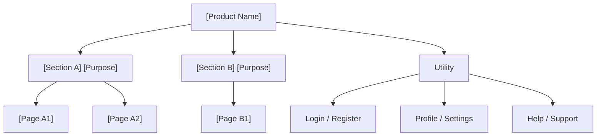

# Site Map Structure — Handover Template

Use this template for handover to IA Document and artifacts-template.

---

## Site Map — [Product Name]

**Date:** [Date]
**Covers:** [FR-IDs if applicable]

### Structure

```
Home
├── [Section A] — [Purpose]
│   ├── [Page A1] — [Description]
│   └── [Page A2] — [Description]
├── [Section B] — [Purpose]
│   └── [Page B1] — [Description]
└── Utility
    ├── Login / Register
    ├── Settings
    └── Help / Support
```

### Mermaid (for IA Document)



### URL Structure (if web)

| Path | Page |
|------|------|
| `/` | Home |
| `/[section-a]` | [Section A] |
| `/[section-a]/[page-a1]` | [Page A1] |

### Conventions Applied

- Depth: [N] levels max
- Breadth: [N] items per level max
- Labels: User-facing
