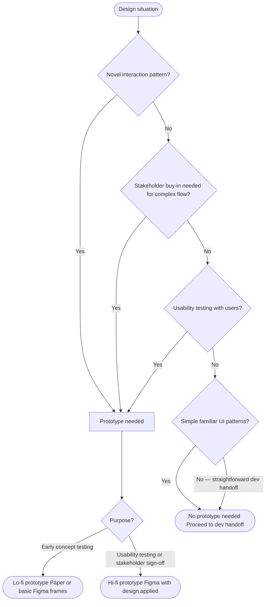

# Prototyping Guidance

Reference for prototype specification in Product Design. See [ux-process.md](ux-process.md) for orchestrator.

---

## When to Prototype

| Situation | Prototype Needed |
|-----------|-----------------|
| Testing a novel interaction pattern | Yes |
| Stakeholder buy-in for complex flow | Yes |
| Usability testing with users | Yes |
| Simple, familiar UI patterns | No |
| Developer handoff for straightforward screens | No |



---

## Prototype Fidelity Decision

**Lo-fi prototype:** Paper sketches or basic Figma frames linked together. Use for early concept testing.

**Hi-fi prototype:** Figma with actual design applied. Use for usability testing and stakeholder sign-off.

---

## Prototype Brief Template

```
Prototype Name: [Name]
Purpose: [Concept validation / Usability testing / Stakeholder review]
Fidelity: [Lo-fi / Hi-fi]
Tool: [Figma / etc]

Flows to prototype:
1. [Flow name] — screens: [list screen names]
2. [Flow name] — screens: [list screen names]

Interactions to demonstrate:
- [Interaction 1: e.g., form validation behavior]
- [Interaction 2: e.g., modal open/close]

Data states needed:
- [e.g., populated state with realistic data]
- [e.g., empty state]

Testing script:
- Task 1: [User task — e.g., "Create a new project"]
- Task 2: [User task]
```
