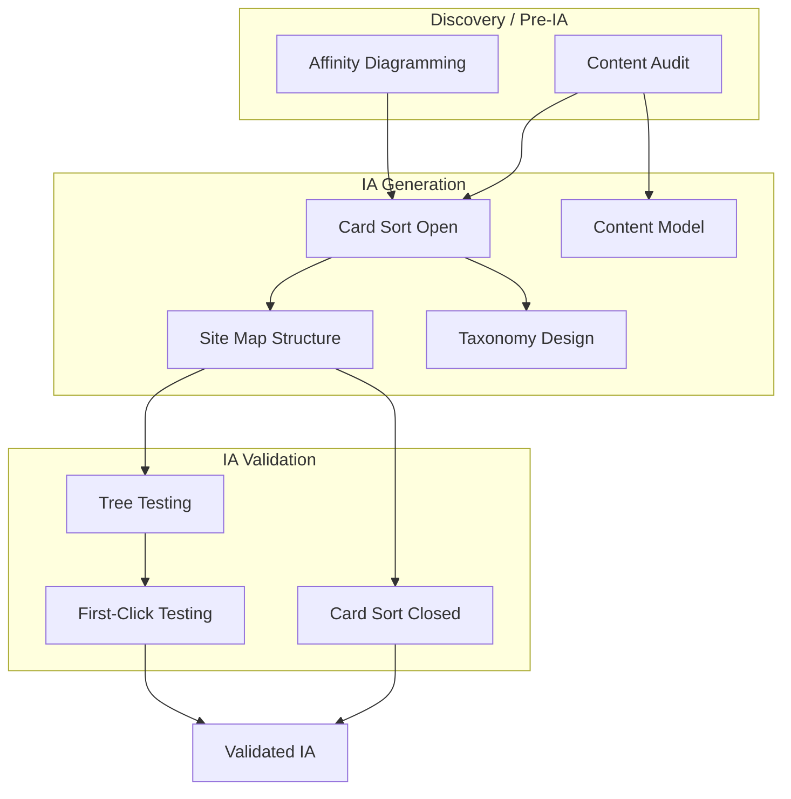

# UX Process — Orchestrator

Central coordination for Product Design UX process. Select IA methods, follow standards, and produce validated artifacts for handover.

---

## Overview

The UX process spans Information Architecture, User Flow Design, Wireframing, Interaction Design, Accessibility Planning, and Prototype Specification. Use this orchestrator to route to the right methods and reference documents.

---

## Information Architecture Method Selection

Select the right IA method(s) based on phase, context, and goal. See [ia-methods/README.md](ia-methods/README.md) for detailed guidance.

| Phase / Context | Goal | Method(s) |
|-----------------|------|------------|
| Pre-IA, existing product | Inventory and assess content | [Content Audit](ia-methods/content-audit/) |
| Discovery synthesis | Group research findings, align team | [Affinity Diagramming](ia-methods/affinity-diagramming/) |
| New IA, no structure | Discover mental models | [Card Sort (open)](ia-methods/card-sort-open/) |
| Existing IA to validate | Test proposed structure | [Card Sort (closed)](ia-methods/card-sort-closed/) |
| Navigation validation | Test findability before design | [Tree Testing](ia-methods/tree-testing/) |
| Navigation validation | Test first-click decisions | [First-Click Testing](ia-methods/first-click-testing/) |
| IA output | Define hierarchy and labels | [Site Map Structure](ia-methods/site-map-structure/) |
| Complex content, metadata | Controlled vocabulary, tagging | [Taxonomy Design](ia-methods/taxonomy-design/) |
| Content-heavy product | Define content types, fields | [Content Model](ia-methods/content-model/) |

### IA Process Flow

---

## Process Sections

| Section | Document | Use When |
|---------|----------|----------|
| User Flow Notation | [user-flow-notation.md](user-flow-notation.md) | Phase 2: Mapping user flows |
| Wireframing Standards | [wireframing-standards.md](wireframing-standards.md) | Phase 3: Specifying wireframes |
| Content Design | [content-design.md](content-design.md) | Phase 3: Content notes in wireframes |
| Prototyping Guidance | [prototyping-guidance.md](prototyping-guidance.md) | Phase 6: Prototype specification |
| Accessibility in UX | [accessibility-ux.md](accessibility-ux.md) | Phase 5: Accessibility planning |

---

## Feedback Loop

When feedback collection is a PRD requirement, plan feedback channels during Product Design. See [../feedback-loop/README.md](../feedback-loop/README.md).

---

## IA Method Subskills

Each IA method has a subskill with SKILL.md and synthesis/handover template for agent use:

- [content-audit](ia-methods/content-audit/)
- [affinity-diagramming](ia-methods/affinity-diagramming/)
- [card-sort-open](ia-methods/card-sort-open/)
- [card-sort-closed](ia-methods/card-sort-closed/)
- [site-map-structure](ia-methods/site-map-structure/)
- [content-model](ia-methods/content-model/)
- [taxonomy-design](ia-methods/taxonomy-design/)
- [tree-testing](ia-methods/tree-testing/)
- [first-click-testing](ia-methods/first-click-testing/)
