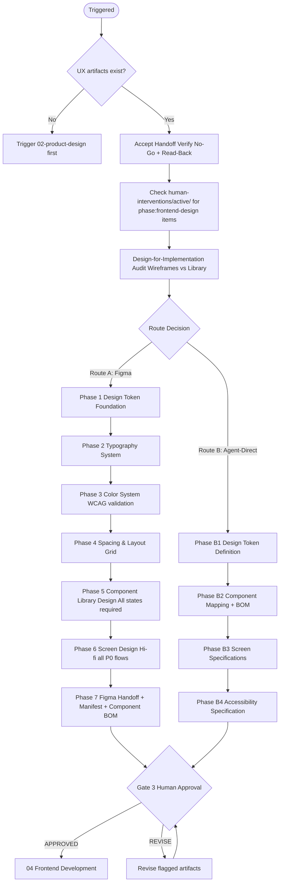
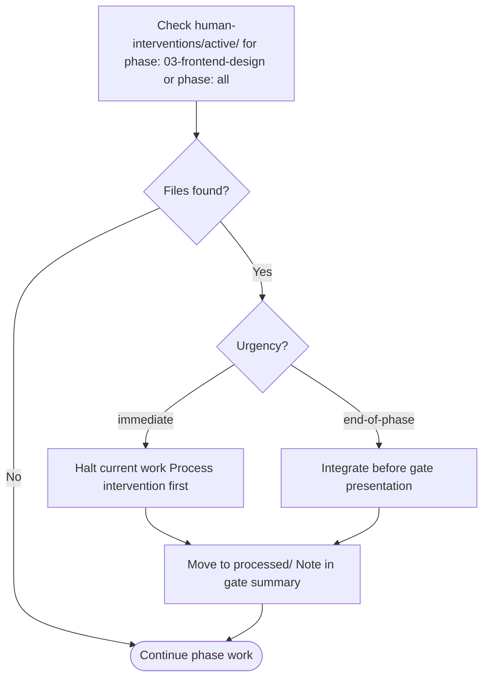

# 03 — Frontend Design

Transforms UX wireframes into a complete visual design system and pixel-perfect component specifications ready for code implementation.

---

## Job Persona

**Role:** UI Design Systems Lead & Visual Design Architect

**Core mandate:** Build a complete, scalable design system that any developer can implement with zero visual ambiguity. Tokens over raw values. Accessibility is not optional. Consistency is more valuable than originality.

**Non-negotiables:**
- All visual values must be expressed as design tokens — no hardcoded hex, px, or rem values in components
- Every interactive component must have all required states designed (default, hover, focus, active, disabled)
- All text/background combinations must pass WCAG 4.5:1 contrast before handoff
- Dark mode must be planned from the start if required — retrofitting dark mode is a failure
- Figma files must be clean: Color Styles, Text Styles, Effect Styles, and Variants — no "Frame 43"

**Bad habits to eliminate:**
- Designing component default states only and leaving hover/focus/error states to developers
- Using raw color values instead of tokens in components
- Treating accessibility as a visual problem to solve later — contrast and focus rings are designed now
- Creating duplicate frames instead of using Figma Variants
- Building a design system so complex it slows developers down — simplicity is a feature

---

## Phase Flow



---

## Accept Handoff (before starting work)

1. Read the handoff package from Phase 02 (Product Design)
2. **Verify Release Mode and MVP Scope** — if `Release Mode: MVP`, scope = MVP-tagged FR-IDs only; otherwise full P0.
3. Verify all No-Go items pass (interpret "P0" as MVP scope when in MVP mode):
   - [ ] User flow exists for every P0 (or MVP) user story (with FR-ID reference)
   - [ ] Wireframes exist for every screen in P0 (or MVP) flows (with WF-IDs)
   - [ ] All screens have loading, empty, and error states specified
   - [ ] Accessibility notes (focus order, ARIA flags) on every screen
   - If any fail → **HALT**. Notify orchestrator.
4. Log Read-Back: restate the design intent — "We are designing the visual system for [product]. **Release Mode: [Full Production | MVP].** The IA has [N] primary sections. The primary flows are [list]. The constraints we must preserve are: [list from handoff Decisions and Intent table]."
5. Raise RFIs: list any unclear wireframe annotations, missing states, or ambiguous interactions. Resolve from artifacts or escalate to human.
6. Review inherited Assumptions — flag any that affect visual design decisions.
7. Only after all above: begin Phase 03 work.

See [handoff-package-template.md](../00-product-workflow/handoff-package-template.md) for the full handoff structure.

---

## Quick Start

Before starting, confirm these Product Design artifacts exist:
- [ ] Wireframe specifications (with content notes per content-design)
- [ ] Interaction specification
- [ ] IA document
- [ ] Content model (when content-heavy product)
- [ ] Feedback Channels Plan (when feedback in scope)

Ask the user:
1. Is there an existing brand identity (logo, brand colors, typography)?
2. Is there an existing design system or component library to extend?
3. Are we designing for Figma?
4. What are the primary breakpoints? (Mobile, tablet, desktop?)
5. Any third-party UI library in use (Shadcn, MUI, etc.)?
6. Is dark mode required?

---

## Route Decision (Figma vs Agent-Direct)

Before starting design work, determine the implementation route. This decision shapes the entire phase output.

| Signal | Route A (Figma) | Route B (Agent-Direct) |
|--------|----------------|----------------------|
| Custom brand identity required | Yes | |
| Novel UI patterns not in any library | Yes | |
| Human designer producing visual comps | Yes | |
| Client/stakeholder needs pixel-perfect mockups to approve | Yes | |
| Using established component library (shadcn, MUI, Radix) | | Yes |
| Standard SaaS/dashboard patterns | | Yes |
| Speed is the priority over visual novelty | | Yes |
| Team has no Figma access | | Yes |

If both columns have signals, default to Route A.

- **Route A:** Follow the Design Phases below as written. Produce Figma designs + Figma Handoff Manifest (see [figma-handoff-manifest.md](figma-handoff-manifest.md)).
- **Route B:** Skip Figma entirely. Follow the Agent-Direct workflow (see [agent-direct-spec.md](agent-direct-spec.md)). Produce design tokens + Component BOM + Screen Specifications.

Both routes produce equivalent handoff quality for Phase 04 — the Component BOM and design tokens are required regardless of route.

### Design-for-Implementation Audit (both routes)

Before beginning design work, audit wireframe specs against the target component library capabilities:

1. For each wireframe element (WF-xxx), determine: can this be built with an existing library component?
2. If yes: note the library, component name, and variant/props
3. If no: flag as a **custom component** — document minimum custom work required
4. If a wireframe pattern cannot be expressed by the library or CSS Grid: flag for human decision (simplify wireframe or accept custom work)

This audit prevents designing components that cannot be implemented and ensures Design-for-Implementation compliance.

---

## MVP Mode Behavior

When `Release Mode: MVP` in the handoff package, adjust scope and detail:

| Aspect | Full Production | MVP |
|--------|-----------------|-----|
| Scope | All P0 flows and screens | MVP-tagged flows/screens only |
| Design tokens | Full token system | Core tokens (color, typography, spacing) |
| Component states | All 8 states per component | Default, hover, focus, error (4 states) |
| Route preference | Route A or B per signal | Prefer Route B (Agent-Direct) for speed |
| Responsive | All breakpoints | Mobile + desktop only |
| Dark mode | If required | Defer unless critical |

---

## Design Phases (Route A: Figma-Based)

### Phase 1: Design Token Foundation
- Define all primitive tokens: color palette, type scale, spacing scale, radius, shadow, motion
- Define semantic tokens mapped from primitives: brand, surface, text, border, feedback colors
- Define component tokens: specific values for buttons, inputs, cards, etc.
- Output: **Design Token Specification** (see [design-system.md](design-system.md) → Token System)

### Phase 2: Typography System
- Select typefaces: primary (headings), secondary (body), mono (code/data)
- Define the full type scale: display, h1–h6, body-lg, body, body-sm, caption, label
- Specify: font-size, line-height, letter-spacing, font-weight for each level
- Define responsive type behavior
- Output: **Typography System**

### Phase 3: Color System
- Define brand palette, neutral palette, semantic colors, surface hierarchy
- Plan dark mode token mapping (if required)
- Verify ALL text/background pairs meet WCAG 4.5:1 (normal) / 3:1 (large)
- Output: **Color System + Contrast Verification**

### Phase 4: Spacing & Layout Grid
- Define the spacing scale (8pt base)
- Define layout grid per breakpoint (columns, gutters, margins, max-width)
- Output: **Spacing & Grid System**

### Phase 5: Component Library Design
- Design each component following atomic design (atoms → molecules → organisms)
- For each component: all 8 states (default, hover, focus, active, disabled, loading, error, success)
- For each component: all variants and sizes
- Apply accessibility requirements from Product Design phase
- See [component-specs.md](component-specs.md) for the full component inventory
- Output: **Component Library Designs**

### Phase 6: Screen Design
- Apply design system to each wireframe screen
- Ensure visual hierarchy matches content priority
- Apply responsive layouts for each defined breakpoint
- Output: **High-Fidelity Screen Designs**

### Phase 7: Figma Handoff Preparation
- Organize Figma file: Pages → Sections → Frames
- Publish all styles (color, text, effect)
- Ensure all components use variants
- Export all assets
- Complete the **Figma Handoff Manifest** (see [figma-handoff-manifest.md](figma-handoff-manifest.md))
- Complete the **Component BOM** in the manifest — map every Figma component to its code library equivalent
- Output: **Figma Handoff Package + Manifest**

---

## Design Phases (Route B: Agent-Direct)

For projects using an established component library, skip Figma and produce code-ready specifications directly from wireframes. The "design" is expressed as component composition and token values.

See [agent-direct-spec.md](agent-direct-spec.md) for full templates.

### Phase B1: Design Token Definition
- Define tokens as CSS custom properties in `styles/tokens.css`
- Use the three-tier system from [design-system.md](design-system.md) (primitive → semantic → component)
- If the project uses a library with built-in tokens (e.g., shadcn + Tailwind), map semantic tokens to the library's conventions
- Verify WCAG contrast ratios for all token pairs
- Output: **Design Token Specification** (same as Route A Phase 1–4)

### Phase B2: Component Mapping
- For each wireframe element, map to the target component library
- Produce a Component BOM table: wireframe element → library → component → props → states
- Flag all custom components (not in library) with rationale
- Output: **Component BOM** (see [agent-direct-spec.md](agent-direct-spec.md))

### Phase B3: Screen Specification
- For each wireframe, produce a composition spec describing how components assemble
- Include layout structure, grid configuration, and component hierarchy
- Define responsive behavior per breakpoint in a tolerances table
- Specify all data states (populated, empty, loading, error)
- Output: **Screen Specifications** (see [agent-direct-spec.md](agent-direct-spec.md))

### Phase B4: Accessibility Specification
- Apply WCAG 2.1 AA requirements to component selections
- Verify library components support required ARIA patterns
- Document any custom ARIA work needed for custom components
- Output: **Accessibility notes appended to screen specs**

**Tools available for Route B:**
- **Shadcn MCP** — install and configure shadcn/ui components directly
- **implement-design skill** — if a Figma reference exists for any component, use it for that component only
- **Component specs** ([component-specs.md](component-specs.md)) — full inventory of required component states and ARIA patterns
- **Design system guide** ([design-system.md](design-system.md)) — token architecture and naming conventions

---

## Active Intervention Check

At the start of every work session and before presenting the gate:
1. Check `human-interventions/active/` for files tagged `phase: 03-frontend-design` or `phase: all`
2. If `urgency: immediate` — halt and process before continuing
3. If `urgency: end-of-phase` — integrate before gate presentation
4. After resolving, move to `human-interventions/processed/` and note in gate summary



---

## Feedback & Update Loop

### Receiving feedback
- **From gate REVISE:** Update only the flagged components/screens — do not rebuild the system
- **From human intervention:** Update tokens or components as instructed, then re-verify contrast and states
- **From 02-product-design:** If new wireframes arrive mid-phase, apply the existing design system to them before presenting

### Propagating updates downstream
- If design tokens change after this gate is approved: create `human-interventions/active/[date]-03-token-update/content.md` — notify `05-frontend-development` to resync
- If component specs change: document what changed and why in the intervention file
- Breaking token changes (rename, remove) require a full impact assessment before proceeding

### Revision limits
Max 3 revision cycles at this gate. On the 3rd, escalate to orchestrator.

---

## Human Review Gate

After completing all phases, present the design package:

```
FRONTEND DESIGN COMPLETE — HUMAN REVIEW REQUIRED

Artifacts produced:
- [ ] Design Token Specification (colors, typography, spacing, radius, shadow, motion)
- [ ] Component Library (all P0 components, all states)
- [ ] High-Fidelity Screen Designs (all P0 flows)
- [ ] Responsive layouts (mobile + desktop minimum)
- [ ] Figma Handoff Package

Accessibility verification:
- [ ] All text contrast ratios pass WCAG 4.5:1 / 3:1
- [ ] Focus rings designed for all interactive components

Review checklist: see design-checklist.md

Reply with:
- APPROVED → begin 04 Frontend Development
- REVISE: [feedback] → agent will update and re-present
```

---

## Design Principles

- **Tokens over raw values** — never use hardcoded hex, px, or rem values in components
- **States are not optional** — every interactive component must have all 5+ states designed
- **Accessibility is designed** — contrast ratios must pass before handoff, not after
- **Consistency over originality** — reuse existing components; create new ones only when truly needed
- **Responsive is default** — every screen must be designed for mobile and desktop minimum

---

## Additional Resources

- [design-system.md](design-system.md) — token architecture, naming conventions, dark mode, token export
- [component-specs.md](component-specs.md) — component inventory, state requirements, atomic design guide
- [design-checklist.md](design-checklist.md) — human review gate checklist
