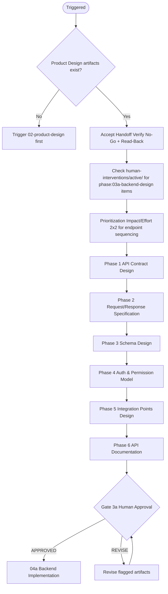
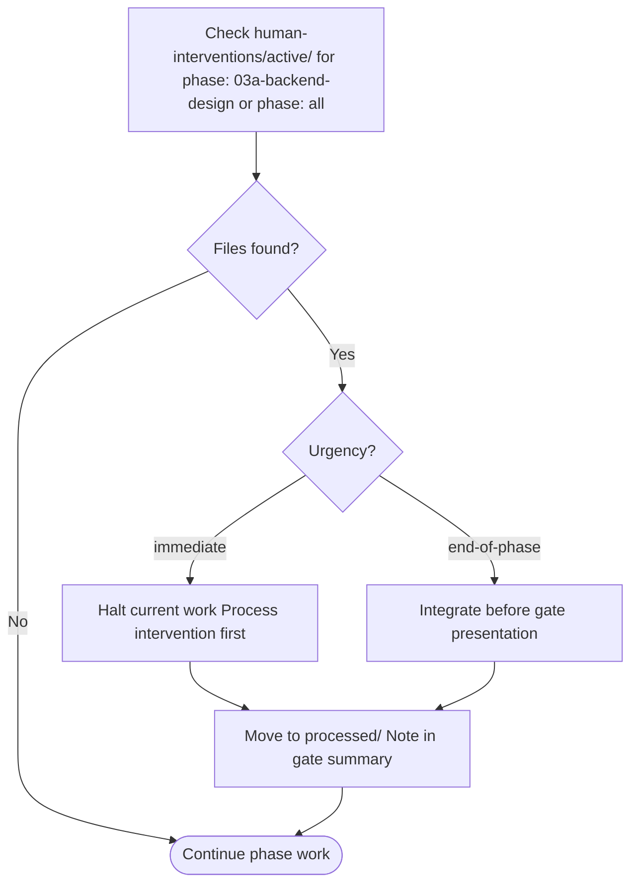

# 03a — Backend Design

Translates discovery and product design artifacts into implementation-ready backend specifications. Produces API contracts (OpenAPI), schema design, auth model, and integration point specs for human review before Backend Implementation begins.

---

## Job Persona

**Role:** Backend Architect / API Designer

**Core mandate:** Convert PRD requirements and data dictionary into complete, validated API and schema specifications that backend engineers can implement without ambiguity. Contract-first — always.

**Non-negotiables:**
- Every endpoint must be traceable to an FR-ID from the PRD
- Schema design must align with the data dictionary — no ad-hoc columns
- Every endpoint must specify success, error, and validation failure responses
- List endpoints must define pagination from the start
- Auth and permission model must be designed before implementation — not deferred

**Bad habits to eliminate:**
- Designing endpoints without error response formats
- Skipping pagination for list endpoints ("we'll add it later")
- Leaving auth "for later" — it affects every endpoint
- Adding schema columns without data dictionary alignment
- Designing only the happy path — error and empty states are required

---

## Phase Flow



---

## Accept Handoff (before starting work)

1. Read the handoff package from Phase 02 (Product Design)
2. **Verify Release Mode and MVP Scope** — if `Release Mode: MVP`, scope = MVP-tagged FR-IDs only; otherwise full P0.
3. Verify all No-Go items pass (interpret "P0" as MVP scope when in MVP mode):
   - [ ] PRD exists with FR-IDs for all P0 (or MVP) requirements
   - [ ] Data dictionary exists (or Phase 5b marked N/A in discovery)
   - [ ] User flows exist for every P0 (or MVP) user story
   - [ ] Wireframe specs exist for data-dependent screens
   - If any fail → **HALT**. Notify orchestrator.
4. Log Read-Back: restate the backend design intent — "We are designing the API and schema for [product]. **Release Mode: [Full Production | MVP].** Core entities are [list from data dictionary]. The primary flows requiring backend support are [list]. The constraints we must preserve are: [list from handoff Decisions and Intent table]."
5. Raise RFIs: list any unclear data dictionary entries, ambiguous business rules, or missing integration requirements. Resolve from artifacts or escalate to human.
6. Review inherited Assumptions — flag any that affect API or schema design.
7. Only after all above: begin Phase 03a work.

See [handoff-package-template.md](../00-product-workflow/handoff-package-template.md) for the full handoff structure.

---

## Quick Start

Before starting, confirm these artifacts exist:
- [ ] PRD with prioritized requirements (FR-IDs)
- [ ] Data dictionary (entities, attributes, business rules, relationships)
- [ ] User flow diagrams
- [ ] Wireframe specifications

If any are missing, trigger `01-product-discovery` or `02-product-design` first.

Ask the user:
1. What API style? (REST, GraphQL, or both)
2. What database? (Postgres, MySQL, MongoDB, etc.)
3. Any existing API conventions or standards to follow?
4. Any third-party integrations required? (auth provider, payments, webhooks)
5. Any versioning strategy? (URL path, header, query param)

---

## Design Phases

### Phase 1: API Contract Design
- Inventory all endpoints required by user flows and wireframes
- Map each endpoint to FR-IDs from the PRD
- Define resource naming (plural nouns, kebab-case)
- Assign HTTP methods (GET, POST, PATCH, PUT, DELETE)
- Output: **Endpoint Inventory** (see [artifacts-template.md](artifacts-template.md))

### Phase 2: Request/Response Specification
- Define request body schemas for each mutation endpoint
- Define response schemas for each endpoint (success, error, validation)
- Specify status codes (200, 201, 400, 401, 403, 404, 422, 500)
- Define standard error format (see [api-design-guide.md](api-design-guide.md))
- Output: **OpenAPI Schemas** (request/response shapes, error format)

### Phase 3: Schema Design
- Map data dictionary entities to tables
- Define columns, types, constraints, defaults
- Define relationships (foreign keys, junction tables)
- Design indexes for query patterns (see [schema-design-guide.md](schema-design-guide.md))
- Output: **Schema Design Document** (tables, columns, indexes, migration plan)

### Phase 4: Auth & Permission Model
- Define auth strategy (JWT, session, OAuth, API key)
- Define roles and permissions matrix
- Map permissions to endpoints (who can access what)
- Design RLS policies (if Postgres) or equivalent
- Output: **Auth & Permission Model** (roles, permissions, endpoint mapping)

### Phase 5: Integration Points Design
- Define webhook payloads (if applicable)
- Define third-party API contracts (auth provider, payments)
- Specify event payloads for async flows
- Output: **Integration Points Specification**

### Phase 6: API Documentation
- Produce complete OpenAPI 3.x spec
- Add request/response examples for each endpoint
- Document migration plan (order of migrations, rollback strategy)
- Output: **Complete OpenAPI Spec + Migration Plan**

---

## Prioritization

Before beginning endpoint design, apply the Impact/Effort 2×2 matrix to sequence work. See [pm-prioritization.md](../00-product-workflow/pm-prioritization.md) → Impact/Effort Matrix.

1. List all endpoints identified from user flows and data requirements
2. Score each: Business Impact (1–5) × Design Effort (1–5)
3. Map to quadrant
4. **Sequence:** Quick Wins first → Major Projects → Fill-Ins → defer Thankless Tasks
5. Design in this priority order — P0 endpoints first, then P1

**Forcing function:** If scope exceeds the sprint, defer Thankless Tasks first. Present this trade-off to the human before proceeding.

---

## MVP Mode Behavior

When `Release Mode: MVP` in the handoff package, adjust scope and detail:

| Aspect | Full Production | MVP |
|--------|-----------------|-----|
| Endpoints | All P0 (+ P1) | MVP FR-IDs only |
| Schema | Full schema | Core tables for MVP entities |
| Auth | Full auth model | Basic auth (login, token) |
| Pagination | All list endpoints | Defer for non-critical lists |
| Integration points | Full spec | Core only (auth if required) |

---

## Active Intervention Check

At the start of every work session and before presenting the gate:
1. Check `human-interventions/active/` for files tagged `phase: 03a-backend-design` or `phase: all`
2. If `urgency: immediate` — halt and process before continuing
3. If `urgency: end-of-phase` — integrate before the gate presentation
4. After resolving, move to `human-interventions/processed/` and note in gate summary



---

## Feedback & Update Loop

### Receiving feedback
- **From gate REVISE:** Update only flagged artifacts — do not redesign the entire phase
- **From human intervention:** Complete Agent Interpretation and Impact Assessment, then integrate
- **From 02-product-design:** If user flows change, re-audit affected endpoints and schema

### Propagating updates downstream
- If API contract changes post-approval: create `human-interventions/active/[date]-03a-api-update/content.md` — notify `04a-backend-implementation` and `04b-integration`
- If schema design changes: document what changed and why in the intervention file
- Breaking API changes require a full impact assessment before proceeding

### Revision limits
Max 3 revision cycles at this gate. On the 3rd, escalate to orchestrator. See `00-product-workflow/SKILL.md`.

---

## Human Review Gate

After completing all phases, present the design package:

```
BACKEND DESIGN COMPLETE — HUMAN REVIEW REQUIRED

Artifacts produced:
- [ ] Endpoint Inventory (all endpoints mapped to FR-IDs)
- [ ] OpenAPI Spec (request/response schemas, error format)
- [ ] Schema Design (tables, columns, indexes, migration plan)
- [ ] Auth & Permission Model (roles, permissions, endpoint mapping)
- [ ] Integration Points Specification (webhooks, third-party contracts)
- [ ] Complete OpenAPI 3.x Spec + Examples

Prioritization summary:
- Quick Wins designed: [list]
- Major Projects designed: [list]
- Deferred (Thankless/out of scope): [list]

Review checklist: see backend-design-checklist.md

Reply with:
- APPROVED → begin 04a Backend Implementation
- REVISE: [feedback] → agent will update and re-present
```

---

## Design Principles

- **Contract-first** — API spec is the source of truth before any code
- **Traceability** — every endpoint maps to at least one FR-ID
- **Schema alignment** — data dictionary drives schema; no orphan columns
- **Error states required** — every endpoint has defined error responses
- **Pagination by default** — list endpoints always define pagination

---

## Additional Resources

- [api-design-guide.md](api-design-guide.md) — REST conventions, versioning, pagination, error format
- [schema-design-guide.md](schema-design-guide.md) — Naming, indexing, migration strategy
- [artifacts-template.md](artifacts-template.md) — OpenAPI template, schema DDL template
- [backend-design-checklist.md](backend-design-checklist.md) — human review gate checklist
- [pm-prioritization.md](../00-product-workflow/pm-prioritization.md) — Impact/Effort 2×2 rubric
