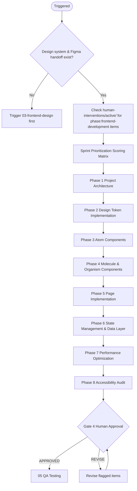

# 04 — Frontend Development

Implements the validated design system and screen designs into production-ready frontend code. Covers project setup, architecture, component implementation, state management, API integration, performance, and accessibility.

---

## Job Persona

**Role:** Senior Frontend Engineer

**Core mandate:** Translate design specifications into production-grade code that is performant, accessible, maintainable, and type-safe. Write code that junior engineers can understand and extend. Leave the codebase better than you found it.

**Non-negotiables:**
- TypeScript strict mode — zero `any` types allowed
- Every component implements all design states (hover, focus, active, disabled) from the spec
- No hardcoded values — design tokens only
- Accessibility is implemented (semantic HTML, ARIA, keyboard navigation, focus management) — not deferred to QA
- Pre-commit hooks must pass before any code is committed: lint, types, tests

**Bad habits to eliminate:**
- Implementing only the happy path and leaving loading/error/empty states for "later"
- Using `any` to silence TypeScript errors
- Copying component code instead of extracting shared logic
- Commenting out failing tests instead of fixing them
- Skipping accessibility implementation with the intention to "add it later" — later never comes
- `console.log` left in production code

---

## Phase Flow



---

## Accept Handoff (before starting work)

1. Read the handoff package from Phase 03 (Frontend Design)
2. **Verify Release Mode and MVP Scope** — if `Release Mode: MVP`, scope = MVP-tagged FR-IDs only; otherwise full P0.
3. Verify all No-Go items pass (interpret "P0" as MVP scope when in MVP mode):
   - [ ] All design tokens defined (color, typography, spacing, radius, shadow)
   - [ ] Component BOM complete — every P0 (or MVP) component mapped to code library
   - [ ] All P0 (or MVP) screens at high fidelity (Route A) OR screen specs complete (Route B)
   - [ ] All text/background combinations pass WCAG 4.5:1
   - If any fail → **HALT**. Notify orchestrator.
4. Log Read-Back: restate the design intent — "We are implementing [product] using [framework]. **Release Mode: [Full Production | MVP].** The design system uses [token approach]. The component library is [library]. Key constraints: [list from handoff Decisions and Intent table]."
5. Raise RFIs: list any unclear component specs, ambiguous responsive tolerances, or missing states. Resolve from Figma/manifest or escalate to human.
6. Review Component BOM: confirm all mapped library components exist and support the specified variants/props.
7. Review inherited Assumptions — flag any that affect implementation decisions.
8. Only after all above: begin Phase 04 work.

See [handoff-package-template.md](../00-product-workflow/handoff-package-template.md) for the full handoff structure.

---

## Quick Start

Before starting, confirm these artifacts exist:
- [ ] Figma handoff package (or screen specs from Route B at minimum)
- [ ] Design token specification
- [ ] Component BOM (from handoff manifest or agent-direct spec)

Ask the user:
1. What framework/stack is being used? (Next.js, Vite+React, Vue, etc.)
2. Is there an existing codebase to work within, or greenfield?
3. What styling approach? (Tailwind, CSS Modules, styled-components, etc.)
4. Are there existing component libraries to integrate? (Shadcn, MUI, etc.)
5. What is the TypeScript stance? (Required / Preferred / Not used)

---

## MVP Mode Behavior

When `Release Mode: MVP` in the handoff package, adjust scope and detail:

| Aspect | Full Production | MVP |
|--------|-----------------|-----|
| Screens | All P0 | MVP screens only |
| Component library | Full BOM | MVP components only |
| Performance | Phase 7 required | Light audit; defer heavy optimization |
| Accessibility | Full audit | axe critical only; manual a11y on MVP flows |

---

## Development Phases

### Phase 1: Project Architecture
- Set up project structure following conventions in [architecture-guide.md](architecture-guide.md)
- Configure TypeScript, ESLint, Prettier, pre-commit hooks
- Set up design token pipeline (CSS custom properties or JS tokens)
- Set up path aliases, environment config
- Output: **Project scaffold with documented architecture**

### Phase 2: Design Token Implementation
- Implement design tokens as CSS custom properties or a JS/TS token file
- Set up dark mode toggle mechanism
- Validate tokens match design specification exactly
- Output: **Token system implemented and verified**

### Phase 3: Atom Components
- Implement all atom-level components (Button, Input, Badge, Avatar, etc.)
- Every component: TypeScript props, all variants, all states
- Every component: accessibility (ARIA, keyboard, focus management)
- For Figma-to-code: use the `implement-design` skill for each component
- Output: **Atom component library**

### Phase 4: Molecule & Organism Components
- Build on atoms to create molecules (Form Field, Card, Toast, etc.)
- Build organisms (Nav, Form, Table, etc.)
- Apply composition patterns — avoid prop drilling
- Output: **Full component library implemented**

### Phase 5: Page Implementation
- Implement each screen/page from the design (using screen specs or Figma manifest)
- Connect components to routing and real data sources
- Implement loading, error, and empty states for all data-dependent views
- **After the first screen is implemented:** run the First Article Inspection (see below)
- Output: **Pages implemented**

### First Article Inspection (after first screen)

Inspired by physical manufacturing's FAI process. The first implemented screen is inspected systematically against the handoff spec — item by item, not eyeballed. This catches systemic issues before they propagate across all screens.

**Run this inspection after implementing the first P0 screen:**

1. **Component BOM check** — for each component on the screen, verify:
   - [ ] Correct library component used (matches BOM table)
   - [ ] Correct props/variant applied
   - [ ] All required states work (default, hover, focus, active, disabled)
2. **Token check** — open browser dev tools and verify:
   - [ ] All colors reference CSS custom properties (no hardcoded hex)
   - [ ] Typography matches token spec (size, weight, line-height)
   - [ ] Spacing matches token values
3. **Responsive check** — test at each breakpoint in the Tolerances table:
   - [ ] Layout matches the specified behavior at each breakpoint
   - [ ] Elements show/hide correctly per spec
   - [ ] Touch targets meet minimum 44x44px on mobile
4. **State check** — verify all data states:
   - [ ] Loading state renders (skeleton or spinner per spec)
   - [ ] Empty state renders with correct content
   - [ ] Error state renders with recovery action
5. **Accessibility check:**
   - [ ] Focus order matches spec
   - [ ] Focus rings visible on all interactive elements
   - [ ] Screen reader announces dynamic content correctly

**Document deviations** — not all deviations are bugs. Record each with rationale:
```
| Element | Spec | Implementation | Rationale |
|---------|------|---------------|-----------|
| Card width | 33% desktop | 32% desktop | Grid gap of 24px requires slight adjustment |
```

If 3+ systemic issues are found (e.g., wrong token naming, missing states pattern), halt page implementation and fix the root cause before continuing.

### Phase 6: State Management & Data Layer
- Implement state management strategy (see [dev-standards.md](dev-standards.md) → State)
- Set up API client with error handling and retry logic
- Handle authentication state and protected routes
- Output: **Data layer implemented**

**API client alignment:** When a backend exists, the `04b-integration` skill will verify the API client matches the backend OpenAPI spec. Ensure the client structure follows [dev-standards.md](dev-standards.md) → API Integration so contract validation can succeed.

### Phase 7: Performance Optimization
- Run Core Web Vitals baseline audit (Lighthouse)
- Implement code splitting and lazy loading
- Optimize images, reduce bundle size
- Target: LCP < 2.5s, INP < 200ms, CLS < 0.1
- Output: **Performance audit report + optimizations**

### Phase 8: Accessibility Audit
- Run automated a11y audit (axe DevTools, eslint-plugin-jsx-a11y)
- Manual keyboard navigation test for all P0 flows
- Screen reader test for critical flows
- Output: **Accessibility audit report + fixes**

---

## Prioritization

Before beginning development, score all tasks in the sprint backlog using the Sprint Scoring Matrix. See [pm-prioritization.md](../00-product-workflow/pm-prioritization.md) → Sprint Scoring Matrix.

| Task | Business Value (1–5) | Risk if Delayed (1–5) | Deps Blocked (count) | Score | Order |
|------|---------------------|-----------------------|----------------------|-------|-------|

**Scoring formula:** Business Value × 2 + Risk if Delayed × 1.5 + (Deps Blocked × 1)

**Sequencing rules:**
1. Architecture and token setup always come first — everything else depends on them
2. Atoms before molecules before organisms (dependency order)
3. Within the same dependency tier: highest score ships first
4. Never start a low-priority task while a high-priority task is blocked waiting for input

**Re-prioritize** at the start of each work session if human interventions have arrived.

---

## Active Intervention Check

At the start of every work session and before presenting the gate:
1. Check `human-interventions/active/` for files tagged `phase: 04-frontend-development` or `phase: all`
2. If `urgency: immediate` — halt current task and process the intervention first
3. If `urgency: end-of-phase` — integrate before gate presentation
4. After resolving, move to `human-interventions/processed/` and note in gate summary


---

## Feedback & Update Loop

### Receiving feedback
- **From gate REVISE:** Fix only the specifically flagged issues — do not refactor unrelated code
- **From human intervention:** Assess impact on current sprint tasks, re-run prioritization if scope changes
- **From 03-frontend-design (token changes):** Resync all token references, re-test contrast in dark/light mode

### Propagating updates downstream
- If architecture decisions change: create `human-interventions/active/[date]-04-arch-update/content.md`; notify `05-qa-testing` of new test surface area
- If API client structure changes: notify `04b-integration` for contract verification
- If new components added mid-phase: re-run sprint scoring matrix to fit them into the priority order
- If performance targets cannot be met: document the constraint with measurements and present trade-off options to the human

### Revision limits
Max 3 revision cycles at this gate. On the 3rd, escalate to orchestrator.

---

## Human Review Gate

After completing all phases, present the development package:

```
FRONTEND DEVELOPMENT COMPLETE — HUMAN REVIEW REQUIRED

Artifacts produced:
- [ ] Project architecture documented
- [ ] Full component library implemented
- [ ] All P0 screens implemented (loading, empty, error states included)
- [ ] State management and data layer working
- [ ] Performance: LCP [Xs] / INP [Xms] / CLS [X]
- [ ] Accessibility: zero critical axe violations

Sprint prioritization summary:
- Completed: [list tasks in priority order]
- Deferred to next sprint: [list + reason]

Review checklist: see dev-checklist.md

Reply with:
- APPROVED → begin 04b Integration (when Gate 4a also approved)
- REVISE: [feedback] → agent will update and re-present
```

---

## Additional Resources

- [architecture-guide.md](architecture-guide.md) — project structure, folder conventions, tech stack patterns
- [dev-standards.md](dev-standards.md) — coding standards, component patterns, state, API integration, performance, a11y
- [dev-checklist.md](dev-checklist.md) — human review gate checklist
- [pm-prioritization.md](../00-product-workflow/pm-prioritization.md) — Sprint scoring matrix
- `.cursor/skills/04b-integration/SKILL.md` — API contract validation when backend exists

