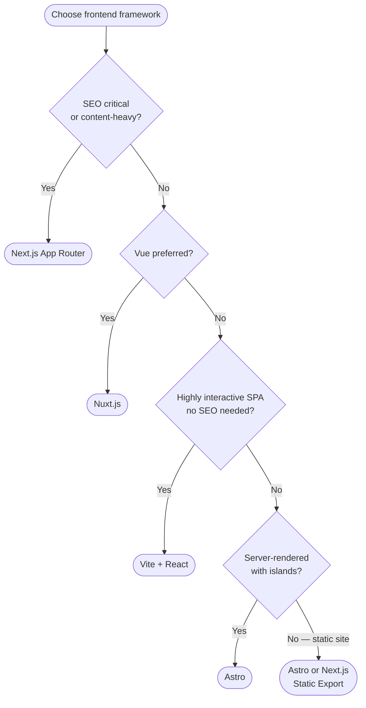
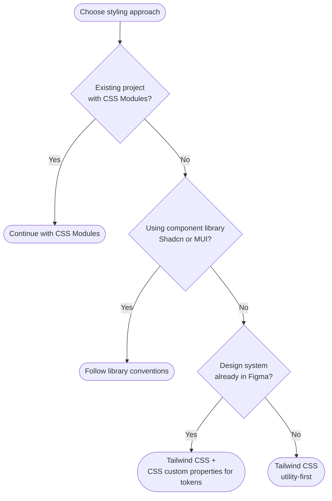

# Architecture Guide — Frontend Development

## Tech Stack Decision Framework

### Framework Selection

| Signal | Recommended Stack |
|--------|------------------|
| SEO critical, content-heavy | Next.js (App Router) |
| Highly interactive SPA, no SEO needs | Vite + React |
| Server-rendered with islands | Astro |
| Vue preferred | Nuxt.js |
| Static site | Astro / Next.js Static Export |



### Styling Approach

| Situation | Recommendation |
|-----------|---------------|
| New project, utility-first | Tailwind CSS |
| Design system already in Figma | Tailwind + CSS custom properties for tokens |
| Existing CSS Modules project | Continue with CSS Modules |
| Component library (Shadcn, MUI) | Follow their conventions |



Default: **Tailwind CSS + CSS custom properties for design tokens**

### Type Safety
- Use TypeScript for all new projects
- Strict mode enabled: `"strict": true` in tsconfig
- Avoid `any` — use `unknown` and narrow types
- Generate API types from OpenAPI spec if available

---

## Project Structure

### Next.js App Router (recommended default)

```
src/
├── app/                       # Routing (file-based)
│   ├── layout.tsx             # Root layout
│   ├── page.tsx               # Home page
│   ├── (auth)/                # Route group (no URL segment)
│   │   ├── login/page.tsx
│   │   └── register/page.tsx
│   ├── dashboard/
│   │   ├── layout.tsx         # Nested layout
│   │   └── page.tsx
│   └── api/                   # Route handlers
│       └── [...]/route.ts
├── components/
│   ├── ui/                    # Atoms (Button, Input, Badge, etc.)
│   ├── features/              # Organisms tied to features
│   │   ├── auth/
│   │   └── dashboard/
│   └── layouts/               # Layout components (Shell, Sidebar, etc.)
├── lib/
│   ├── api/                   # API client, fetch wrappers
│   ├── hooks/                 # Custom React hooks
│   ├── utils/                 # Pure utility functions
│   └── validators/            # Zod schemas / validation
├── styles/
│   ├── tokens.css             # Design tokens (CSS custom properties)
│   └── globals.css            # Base styles, font imports
├── types/                     # Shared TypeScript types
└── config/                    # App config, constants
```

### Vite + React (SPA)

```
src/
├── routes/                    # Route components (React Router / TanStack Router)
├── pages/                     # Page-level components
├── components/
│   ├── ui/                    # Atoms
│   ├── features/              # Feature-specific
│   └── layouts/
├── lib/
│   ├── api/
│   ├── hooks/
│   └── utils/
├── stores/                    # Zustand / Jotai stores
├── styles/
│   ├── tokens.css
│   └── index.css
└── types/
```

---

## Naming Conventions

### Files
- Components: `PascalCase.tsx` — `Button.tsx`, `UserCard.tsx`
- Hooks: `camelCase.ts` starting with `use` — `useAuth.ts`, `useDebounce.ts`
- Utilities: `camelCase.ts` — `formatDate.ts`, `cn.ts`
- Types: `PascalCase.ts` — `User.ts`, `ApiResponse.ts`
- Constants: `UPPER_SNAKE_CASE.ts` — `API_ENDPOINTS.ts`

### Component Naming
- Components: `PascalCase`
- Props interface: `ComponentNameProps`
- Avoid default exports for components — use named exports for discoverability

```typescript
// ✅ Good
export interface ButtonProps { ... }
export function Button({ ... }: ButtonProps) { ... }

// ❌ Avoid
export default function({ ... }) { ... }
```

### CSS Classes (Tailwind)
- Use `cn()` utility (clsx + tailwind-merge) for conditional classes
- Extract repeated patterns to component variants (CVA or custom)
- Never inline long class strings — use a `variants` object

---

## Path Aliases

Configure in `tsconfig.json` and bundler config:

```json
{
  "compilerOptions": {
    "paths": {
      "@/*": ["./src/*"],
      "@/components/*": ["./src/components/*"],
      "@/lib/*": ["./src/lib/*"],
      "@/types/*": ["./src/types/*"]
    }
  }
}
```

---

## Environment Configuration

```
.env.local          # Local development (gitignored)
.env.development    # Development environment defaults
.env.production     # Production environment defaults
.env.example        # Template — committed to git (no real values)
```

All env vars accessed via a typed config object, not `process.env` directly:

```typescript
// lib/config.ts
export const config = {
  apiBaseUrl: process.env.NEXT_PUBLIC_API_URL!,
  appName: process.env.NEXT_PUBLIC_APP_NAME ?? 'App',
} as const;
```

---

## Design Token Implementation

### CSS Custom Properties (recommended)

```css
/* styles/tokens.css */
:root {
  /* Primitives */
  --color-blue-500: #3B82F6;
  --color-neutral-900: #111827;
  --spacing-4: 16px;

  /* Semantic */
  --color-brand-primary: var(--color-blue-500);
  --color-text-primary: var(--color-neutral-900);
  --spacing-component-md: var(--spacing-4);
}

[data-theme="dark"] {
  --color-text-primary: var(--color-neutral-50);
}
```

### Tailwind Integration

```javascript
// tailwind.config.js
module.exports = {
  theme: {
    extend: {
      colors: {
        brand: {
          primary: 'var(--color-brand-primary)',
          'primary-hover': 'var(--color-brand-primary-hover)',
        },
        text: {
          primary: 'var(--color-text-primary)',
          secondary: 'var(--color-text-secondary)',
        }
      }
    }
  }
}
```

---

## Routing Patterns

### Protected Routes (Next.js App Router)

```typescript
// middleware.ts
export function middleware(request: NextRequest) {
  const isAuthenticated = checkAuth(request);
  if (!isAuthenticated && isProtectedRoute(request.nextUrl.pathname)) {
    return NextResponse.redirect(new URL('/login', request.url));
  }
}
```

### Route Organization
- Group related routes with route groups `(group-name)/`
- Use parallel routes `@slot` for complex layouts (modals, sidebars)
- Use intercepting routes for modal-on-page patterns

---

## Error Boundaries

Wrap feature sections (not individual components) in error boundaries:

```typescript
// In Next.js: create error.tsx in each route segment
// In React SPA: use react-error-boundary

<ErrorBoundary fallback={<FeatureErrorFallback />}>
  <FeatureSection />
</ErrorBoundary>
```

---

## Bundle Analysis

Run before shipping each major release:

```bash
# Next.js
ANALYZE=true next build

# Vite
npx vite-bundle-visualizer
```

Target: initial JS bundle < 200KB gzipped for first load.
