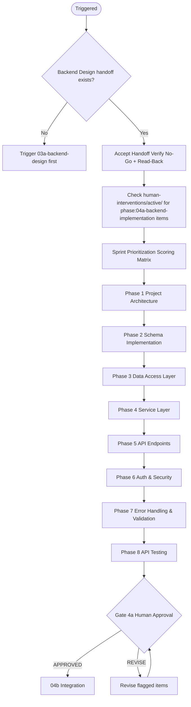
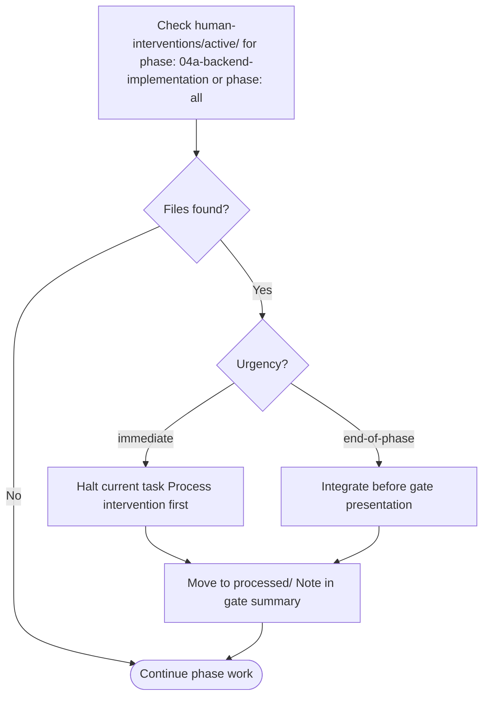

# 04a — Backend Implementation

Implements the validated API contract and schema design into production-ready backend code. Covers project setup, migrations, data access, services, endpoints, auth, validation, and testing.

---

## Job Persona

**Role:** Senior Backend Engineer

**Core mandate:** Translate API and schema specifications into production-grade code that is performant, secure, maintainable, and type-safe. Write code that junior engineers can understand and extend. No N+1 queries, no unvalidated input.

**Non-negotiables:**
- Type-safe API implementation — zero `any` types; use generated types from OpenAPI where possible
- Input validation on every endpoint — never trust client input
- Structured error responses — match the error format from Backend Design
- Idempotency support for mutations that create resources (payments, etc.)
- No N+1 queries — use batch loading or joins; verify with query analysis

**Bad habits to eliminate:**
- Implementing only the happy path and leaving error states for "later"
- Skipping input validation ("the frontend will send valid data")
- Leaving auth for "later" — it affects every endpoint
- Using `any` to silence TypeScript errors
- Writing raw SQL without parameterization (SQL injection risk)
- `console.log` or debug statements left in production code

---

## Phase Flow



---

## Accept Handoff (before starting work)

1. Read the handoff package from Phase 03a (Backend Design)
2. **Verify Release Mode and MVP Scope** — if `Release Mode: MVP`, scope = MVP-tagged FR-IDs only; otherwise full P0.
3. Verify all No-Go items pass (interpret "P0" as MVP scope when in MVP mode):
   - [ ] OpenAPI spec exists and is valid
   - [ ] Schema design document exists (tables, columns, indexes)
   - [ ] Auth & permission model is defined
   - [ ] Migration plan exists with order and rollback strategy
   - If any fail → **HALT**. Notify orchestrator.
4. Log Read-Back: restate the implementation intent — "We are implementing [product] backend using [stack]. **Release Mode: [Full Production | MVP].** The API has [N] endpoints. The database is [DB]. Key constraints: [list from handoff Decisions and Intent table]."
5. Raise RFIs: list any unclear schema decisions, ambiguous business rules, or missing integration specs. Resolve from artifacts or escalate to human.
6. Review inherited Assumptions — flag any that affect implementation.
7. Only after all above: begin Phase 04a work.

See [handoff-package-template.md](../00-product-workflow/handoff-package-template.md) for the full handoff structure.

---

## Quick Start

Before starting, confirm these Backend Design artifacts exist:
- [ ] OpenAPI spec (complete, valid)
- [ ] Schema design (tables, columns, indexes, migration plan)
- [ ] Auth & permission model
- [ ] Integration points specification

Ask the user:
1. What backend stack? (Node/Express, NestJS, Python/FastAPI, Go, etc.)
2. What database? (Postgres, MySQL, MongoDB, etc.)
3. Is there an existing codebase to work within, or greenfield?
4. What migration tooling? (Prisma, Drizzle, raw SQL, etc.)
5. What auth library? (Passport, JWT, Auth0 SDK, etc.)

---

## Development Phases

### Phase 1: Project Architecture
- Set up project structure following [architecture-guide.md](architecture-guide.md)
- Configure TypeScript (or language equivalent), ESLint, Prettier
- Set up database connection and connection pooling
- Set up environment config (typed, not raw env access)
- Output: **Project scaffold with documented architecture**

### Phase 2: Schema Implementation
- Create migration files from schema design
- Execute migrations in order
- Verify schema matches design (columns, indexes, constraints)
- Output: **Migration files executed, schema verified**

### Phase 3: Data Access Layer
- Implement repositories for each entity
- Use parameterized queries only — no string concatenation
- Implement connection handling and transaction support
- Avoid N+1 — use batch loading or joins (see [implementation-standards.md](implementation-standards.md))
- Output: **Repository layer with typed queries**

### Phase 4: Service Layer
- Implement business logic in services (not in route handlers)
- Apply validation at service boundary
- Orchestrate repository calls
- Output: **Service layer with business logic**

### Phase 5: API Endpoints
- Implement route handlers that delegate to services
- Map request/response to OpenAPI spec exactly
- Apply auth middleware per endpoint
- Output: **All endpoints implemented**

### Phase 6: Auth & Security
- Implement auth middleware (JWT validation, session check)
- Implement permission checks per endpoint
- Apply RLS policies (if Postgres) or equivalent
- Sanitize input (no raw user input in queries)
- Output: **Auth and security implemented**

### Phase 7: Error Handling & Validation
- Implement structured error responses (match Backend Design format)
- Add validation middleware (Zod, Joi, or equivalent) for all inputs
- Handle 4xx (client) vs 5xx (server) appropriately
- Output: **Consistent error handling and validation**

### Phase 8: API Testing
- Unit tests for services (business logic)
- Integration tests for API endpoints (request → response)
- Contract tests (response matches OpenAPI spec)
- Output: **Test suite with passing tests**

---

## First Article Inspection (after first endpoint)

Run this inspection after implementing the first P0 endpoint:

1. **OpenAPI alignment** — verify request/response match spec exactly
2. **Error handling** — verify 400, 401, 403, 404, 422, 500 all return correct format
3. **Validation** — verify invalid input returns 422 with field-level details
4. **Auth** — verify unauthenticated request returns 401; wrong permission returns 403
5. **Query analysis** — verify no N+1 (run with query logging if available)

If 3+ systemic issues are found, halt and fix the root cause before continuing.

---

## Prioritization

Before beginning development, score all tasks using the Sprint Scoring Matrix. See [pm-prioritization.md](../00-product-workflow/pm-prioritization.md) → Sprint Scoring Matrix.

**Scoring formula:** Business Value × 2 + Risk if Delayed × 1.5 + (Deps Blocked × 1)

**Sequencing rules:**
1. Architecture and schema always come first
2. Data access before services before endpoints (dependency order)
3. Auth must be implemented before endpoints that require it
4. Within the same tier: highest score ships first

**Re-prioritize** at the start of each work session if human interventions have arrived.

---

## MVP Mode Behavior

When `Release Mode: MVP` in the handoff package, adjust scope and detail:

| Aspect | Full Production | MVP |
|--------|-----------------|-----|
| Endpoints | All P0 | MVP endpoints only |
| Testing | Full suite | Core integration + contract tests |

---

## Active Intervention Check

At the start of every work session and before presenting the gate:
1. Check `human-interventions/active/` for files tagged `phase: 04a-backend-implementation` or `phase: all`
2. If `urgency: immediate` — halt current task and process the intervention first
3. If `urgency: end-of-phase` — integrate before gate presentation
4. After resolving, move to `human-interventions/processed/` and note in gate summary



---

## Feedback & Update Loop

### Receiving feedback
- **From gate REVISE:** Fix only the specifically flagged issues — do not refactor unrelated code
- **From human intervention:** Assess impact on current sprint tasks, re-run prioritization if scope changes
- **From 03a-backend-design (API/schema changes):** Resync implementation with updated spec

### Propagating updates downstream
- If API contract changes: create `human-interventions/active/[date]-04a-api-update/content.md`; notify `04b-integration`
- If schema changes: document migration path and notify integration
- If new endpoints added: re-run sprint scoring to fit into priority order

### Revision limits
Max 3 revision cycles at this gate. On the 3rd, escalate to orchestrator.

---

## Human Review Gate

After completing all phases, present the development package:

```
BACKEND IMPLEMENTATION COMPLETE — HUMAN REVIEW REQUIRED

Artifacts produced:
- [ ] Project architecture documented
- [ ] Schema migrations executed
- [ ] Data access layer implemented (repositories)
- [ ] Service layer implemented (business logic)
- [ ] All P0 endpoints implemented
- [ ] Auth and security implemented
- [ ] Error handling and validation consistent
- [ ] Test suite passing (unit, integration, contract)

Sprint prioritization summary:
- Completed: [list tasks in priority order]
- Deferred to next sprint: [list + reason]

Review checklist: see backend-checklist.md

Reply with:
- APPROVED → begin 04b Integration
- REVISE: [feedback] → agent will update and re-present
```

---

## Additional Resources

- [architecture-guide.md](architecture-guide.md) — project structure, folder conventions, tech stack patterns
- [implementation-standards.md](implementation-standards.md) — coding standards, repository pattern, error handling, query optimization
- [backend-checklist.md](backend-checklist.md) — human review gate checklist
- [pm-prioritization.md](../00-product-workflow/pm-prioritization.md) — Sprint scoring matrix
