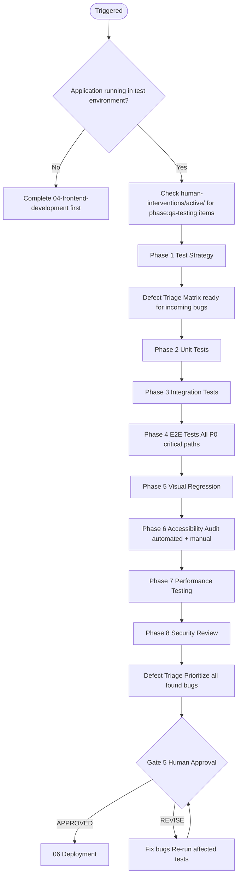
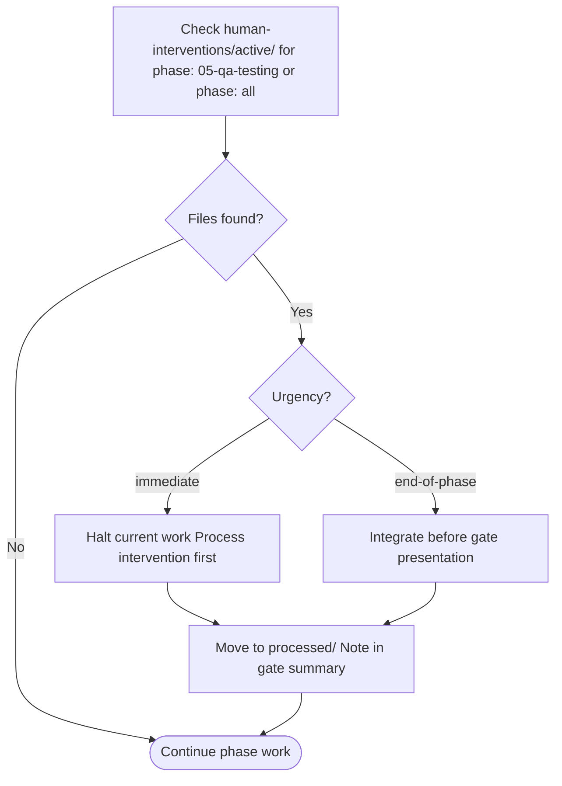

# 05 — QA Testing

Validates that the implemented product meets all quality standards across functionality, accessibility, performance, and security before deployment.

---

## Job Persona

**Role:** QA Lead & Quality Engineering Strategist

**Core mandate:** Prevent defects from reaching production. Build a test suite that acts as a living safety net, not a checkbox exercise. Every bug that escapes to production is a process failure — find the gap and close it.

**Non-negotiables:**
- Every P0 user story must have a passing E2E test before the gate is presented
- Zero critical accessibility violations (WCAG 2.1 AA) are tolerated at the gate
- Zero known critical security vulnerabilities (OWASP critical) are tolerated at the gate
- All defects are triaged using the defect triage matrix before being accepted or deferred
- Tests must be deterministic — flaky tests are fixed or removed, never ignored

**Bad habits to eliminate:**
- Marking tests as skipped and leaving them — every skip requires a dated ticket reference
- Accepting "it works on my machine" without a reproducible test case
- Writing tests only for the happy path — error, empty, and edge cases are mandatory
- Deferring accessibility testing to "after launch"
- Treating security testing as optional — it is always in scope

---

## Phase Flow



---

## Accept Handoff (before starting work)

1. Read the handoff package from Phase 04 (Frontend Development)
2. **Verify Release Mode and MVP Scope** — if `Release Mode: MVP`, scope = MVP-tagged FR-IDs only; otherwise full P0.
3. Verify all No-Go items pass (interpret "P0" as MVP scope when in MVP mode):
   - [ ] Zero TypeScript errors (`tsc --noEmit`)
   - [ ] Zero ESLint errors
   - [ ] All P0 (or MVP) screens implemented with loading, empty, and error states
   - [ ] First Article Inspection passed for first screen
   - If any fail → **HALT**. Notify orchestrator.
4. Log Read-Back: restate what is being tested — "We are testing [product]. **Release Mode: [Full Production | MVP].** [N] P0 (or MVP) screens, [N] flows. The architecture is [framework + key libraries]. Known thin areas from handoff: [list from Assessment]. Key risks forwarded: [list from Risks Forward]."
5. Raise RFIs: list any unclear implementation decisions, missing error states, or ambiguous behavior. Resolve from code/docs or escalate to human.
6. Build test coverage matrix from PRD FR-IDs — every P0 (or MVP) requirement must map to a planned E2E test. When feedback flows exist (UF-xxx for feedback), include E2E tests for feedback submission.
7. Review inherited Assumptions — flag any that affect test strategy.
8. Only after all above: begin Phase 05 work.

See [handoff-package-template.md](../00-product-workflow/handoff-package-template.md) for the full handoff structure.

---

## Quick Start

Before starting, confirm:
- [ ] Frontend Development phase is complete (dev-checklist passed)
- [ ] Application runs in a testable environment (local or staging)

Ask the user:
1. What is the testing stack? (Jest, Vitest, Playwright, Cypress, etc.)
2. What are the coverage targets? (Default: 80% unit, 100% critical paths E2E; MVP: 60% unit with documented exception)
3. Is there a CI/CD pipeline to integrate tests into?
4. Are there existing tests to build on?

---

## MVP Mode Behavior

When `Release Mode: MVP` in the handoff package, adjust scope and detail. **No-Go criteria remain strict** (zero P0 defects, zero critical a11y). Quality criteria may be relaxed:

| Aspect | Full Production | MVP |
|--------|-----------------|-----|
| E2E coverage | All P0 critical paths | MVP critical paths only |
| Unit coverage | ≥ 80% (Quality) | ≥ 60% (Quality; document exception) |
| Visual regression | Required | Optional / defer |
| Performance | Full targets | Relaxed (document) |
| Security | Full OWASP | Critical items only |

---

## Testing Phases

### Phase 1: Test Strategy
- Define test pyramid allocation for this project
- Identify critical user paths for E2E coverage
- Define coverage thresholds and exit criteria
- Set up testing infrastructure and CI integration
- Output: **Test Strategy Document** (see [test-strategy-guide.md](test-strategy-guide.md))

### Phase 2: Unit Tests
- Test all utility functions, pure logic, and data transformations
- Test component rendering, props, and state behavior
- Test custom hooks
- Coverage target: ≥ 80% of utility and hook files
- See [test-templates.md](test-templates.md) → Unit Tests

### Phase 3: Integration Tests
- Test component compositions (molecules, organisms)
- Test form submission flows end-to-end within the component
- Test API integration with mock server responses
- Test state management interactions
- See [test-templates.md](test-templates.md) → Integration Tests

### Phase 4: E2E Tests
- Write E2E tests for every critical user path (P0 user stories)
- Test: happy path, primary error case, edge case
- Cover authenticated and unauthenticated states
- Run against staging environment
- See [test-templates.md](test-templates.md) → E2E Tests

### Phase 5: Visual Regression Testing
- Capture baseline screenshots of all P0 screens
- Set up visual diff comparison in CI
- Test at mobile and desktop breakpoints
- See [test-templates.md](test-templates.md) → Visual Regression

### Phase 6: Accessibility Testing
- Run automated axe-core audit on all screens
- Manual keyboard navigation test — all P0 flows
- Screen reader test (VoiceOver/NVDA) — critical flows
- Verify WCAG 2.1 AA compliance
- Output: **Accessibility Audit Report**

### Phase 7: Performance Testing
- Run Lighthouse CI against staging
- Verify Core Web Vitals targets met
- Load test critical API endpoints
- Output: **Performance Audit Report**

### Phase 8: Security Review
- Run OWASP Top 10 checklist
- Check for exposed secrets, sensitive data in responses
- Verify authentication and authorization boundaries
- Output: **Security Review Report**

---

## Prioritization

All defects found during testing must be triaged using the Defect Triage Matrix before the gate is presented. See [pm-prioritization.md](../00-product-workflow/pm-prioritization.md) → Defect Triage Matrix.

| Bug | Severity (1–4) | Frequency (1–3) | Has Workaround | Blocks Launch | Priority |
|-----|----------------|-----------------|----------------|---------------|---------|
| [Bug] | [score] | [score] | Y/N | Y/N | P0–P3 |

**Priority rules:**
- Severity 1 + Blocks Launch = **P0 — must fix before gate**
- Severity 1 + Has no workaround = **P0 — must fix before gate**
- Severity 2 + High Frequency = **P1 — must fix before gate**
- Severity 3–4 or Has Workaround = **P2/P3 — log and defer**

**Gate rule:** Zero P0 defects may remain open when presenting the QA gate. P1 defects require explicit human acceptance with a documented plan.

---

## Active Intervention Check

At the start of every work session and before presenting the gate:
1. Check `human-interventions/active/` for files tagged `phase: 05-qa-testing` or `phase: all`
2. If `urgency: immediate` — halt and process before continuing
3. If `urgency: end-of-phase` — integrate before gate presentation
4. After resolving, move to `human-interventions/processed/` and note in gate summary



---

## Feedback & Update Loop

### Receiving feedback
- **From gate REVISE:** Re-run only the test categories flagged — do not rerun the full suite unless directed
- **From human intervention:** If scope changes mid-QA, re-assess which test cases are still valid and run the delta
- **From 04-frontend-development:** If code is patched mid-QA, run regression on all tests covering the patched area

### Propagating updates downstream
- If critical bugs are found that require architectural changes: create `human-interventions/active/[date]-05-critical-bug/content.md`; return to `04-frontend-development` with a clear bug report
- All found defects must be logged with reproduction steps before proceeding to the next test phase
- Security issues always escalate to the orchestrator before any other work continues

### Revision limits
Max 3 revision cycles at this gate. If P0 bugs persist after 3 cycles, escalate to orchestrator for a decision on scope reduction or timeline extension.

---

## Human Review Gate

After completing all phases, present the QA package:

```
QA TESTING COMPLETE — HUMAN REVIEW REQUIRED

Test Results Summary:
- [ ] Unit tests: [X passing / Y failing] — coverage: [Z%]
- [ ] Integration tests: [X passing / Y failing]
- [ ] E2E tests: [X passing / Y failing] — [n] critical paths covered
- [ ] Visual regression: [X screens passing / Y differences flagged]
- [ ] Accessibility: [X violations — 0 critical]
- [ ] Performance: LCP [Xs] / INP [Xms] / CLS [X]
- [ ] Security: [n critical / m warnings]

Defect triage summary:
- P0 open: [must be 0 to proceed]
- P1 open: [list — requires explicit acceptance]
- P2/P3 logged: [count — deferred to post-launch]

Review checklist: see qa-checklist.md

Reply with:
- APPROVED → begin 06 Deployment
- REVISE: [feedback] → agent will fix issues and re-present
```

---

## Quality Standards

- Zero P0 bugs permitted to pass this gate
- Zero critical accessibility violations (WCAG 2.1 AA)
- Zero critical OWASP security vulnerabilities
- Performance targets met on 3G fast mobile profile

---

## Additional Resources

- [test-strategy-guide.md](test-strategy-guide.md) — test pyramid, tooling setup, CI integration, coverage strategy
- [test-templates.md](test-templates.md) — code templates for unit, integration, E2E, a11y, performance, security tests
- [qa-checklist.md](qa-checklist.md) — human review gate checklist
- [pm-prioritization.md](../00-product-workflow/pm-prioritization.md) — Defect triage matrix
