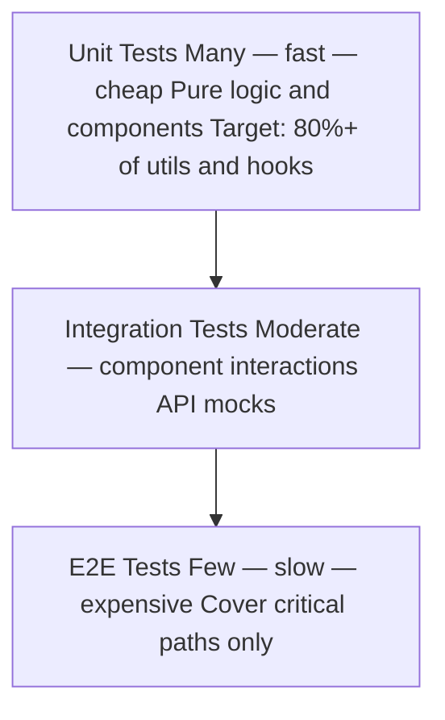

# Test Strategy Guide — QA Testing

## The Test Pyramid



### Allocation Guidelines

| Layer | Coverage Target | Speed | What to Test |
|-------|----------------|-------|--------------|
| Unit | ≥ 80% of utils/hooks | Fast (< 100ms each) | Pure functions, custom hooks, component props/state |
| Integration | Key flows and forms | Medium (100ms–2s) | Component composition, form submission, API mocking |
| E2E | All P0 user stories | Slow (5–30s each) | Full user journeys, cross-browser critical paths |

---

## Tooling Stack

### Recommended (React / Next.js)

| Purpose | Tool |
|---------|------|
| Unit + Integration | Vitest + React Testing Library |
| E2E | Playwright |
| Visual Regression | Playwright screenshots or Chromatic |
| Accessibility | axe-core + @axe-core/playwright |
| Performance | Lighthouse CI |
| Load Testing | k6 |
| Security | OWASP ZAP (automated scan) + manual checklist |
| Coverage | v8 (built into Vitest) |

### Alternative: Jest Stack
- Unit + Integration: Jest + React Testing Library
- E2E: Cypress (alternative to Playwright)

---

## Test Infrastructure Setup

### Vitest Config

```typescript
// vitest.config.ts
import { defineConfig } from 'vitest/config'
import react from '@vitejs/plugin-react'

export default defineConfig({
  plugins: [react()],
  test: {
    environment: 'jsdom',
    setupFiles: ['./src/test/setup.ts'],
    coverage: {
      provider: 'v8',
      reporter: ['text', 'lcov'],
      thresholds: {
        functions: 80,
        branches: 75,
        lines: 80,
      },
      exclude: ['**/node_modules/**', '**/test/**', '**/*.stories.*', '**/types/**'],
    },
  },
  resolve: {
    alias: { '@': '/src' },
  },
})
```

### Test Setup File

```typescript
// src/test/setup.ts
import '@testing-library/jest-dom'
import { server } from './mocks/server'

beforeAll(() => server.listen({ onUnhandledRequest: 'warn' }))
afterEach(() => server.resetHandlers())
afterAll(() => server.close())
```

### MSW (Mock Service Worker) for API Mocking

```typescript
// src/test/mocks/handlers.ts
import { http, HttpResponse } from 'msw'

export const handlers = [
  http.get('/api/users/:id', ({ params }) => {
    return HttpResponse.json({ id: params.id, name: 'Test User' })
  }),
  http.post('/api/auth/login', () => {
    return HttpResponse.json({ token: 'fake-token' })
  }),
]
```

### Playwright Config

```typescript
// playwright.config.ts
import { defineConfig, devices } from '@playwright/test'

export default defineConfig({
  testDir: './e2e',
  fullyParallel: true,
  retries: process.env.CI ? 2 : 0,
  reporter: [['html'], ['list']],
  use: {
    baseURL: process.env.E2E_BASE_URL ?? 'http://localhost:3000',
    trace: 'on-first-retry',
    screenshot: 'only-on-failure',
  },
  projects: [
    { name: 'chromium', use: { ...devices['Desktop Chrome'] } },
    { name: 'Mobile Safari', use: { ...devices['iPhone 13'] } },
  ],
})
```

---

## CI Integration

### GitHub Actions Example

```yaml
# .github/workflows/test.yml
name: Tests

on: [push, pull_request]

jobs:
  unit-tests:
    runs-on: ubuntu-latest
    steps:
      - uses: actions/checkout@v4
      - uses: actions/setup-node@v4
        with: { node-version: '20' }
      - run: npm ci
      - run: npm run test:unit -- --coverage
      - uses: actions/upload-artifact@v4
        with:
          name: coverage-report
          path: coverage/

  e2e-tests:
    runs-on: ubuntu-latest
    steps:
      - uses: actions/checkout@v4
      - uses: actions/setup-node@v4
        with: { node-version: '20' }
      - run: npm ci
      - run: npx playwright install --with-deps
      - run: npm run build
      - run: npx playwright test
      - uses: actions/upload-artifact@v4
        if: failure()
        with:
          name: playwright-report
          path: playwright-report/
```

---

## What to Test (and What Not To)

### Test These
- All pure utility functions (100% unit coverage)
- All custom React hooks (100% unit coverage)
- All form validation logic
- All state transitions (reducers, stores)
- All API error handling paths
- All P0 user journeys (E2E)
- All authentication/authorization boundaries

### Don't Test These
- Third-party library internals
- Implementation details (internal state, method calls)
- Style/CSS correctness (use visual regression instead)
- Trivial components with no logic (static text, icons)
- Types and interfaces (TypeScript covers this)

---

## Test Strategy Document Template

```markdown
# Test Strategy — [Product Name]
**Version:** 1.0
**Date:** [Date]

## Scope
[Which features / flows are covered by this test plan?]

## Test Environment
- Unit/Integration: Vitest + jsdom
- E2E: Playwright against [staging URL]
- Browsers: Chrome (primary), Mobile Safari

## Coverage Targets
- Unit coverage: [X]%
- E2E critical paths: 100% of P0 user stories

## Critical Paths (E2E priority)
1. [User story / flow name]
2. [User story / flow name]
3. [User story / flow name]

## Out of Scope
- [What is explicitly not tested in this phase]

## Defect Severity Definitions
| Severity | Definition | Example |
|----------|------------|---------|
| Critical | Blocks core user path; no workaround | Login fails |
| High | Major feature broken; workaround exists | Save fails but data persists |
| Medium | Feature partially broken | Pagination off by one |
| Low | Minor UI/UX issue | Tooltip misaligned |

## Test Exit Criteria
- All Critical and High defects resolved
- Unit coverage ≥ target
- All E2E critical paths passing
- Accessibility: zero Critical violations
- Performance: Core Web Vitals in "Good" range
```
