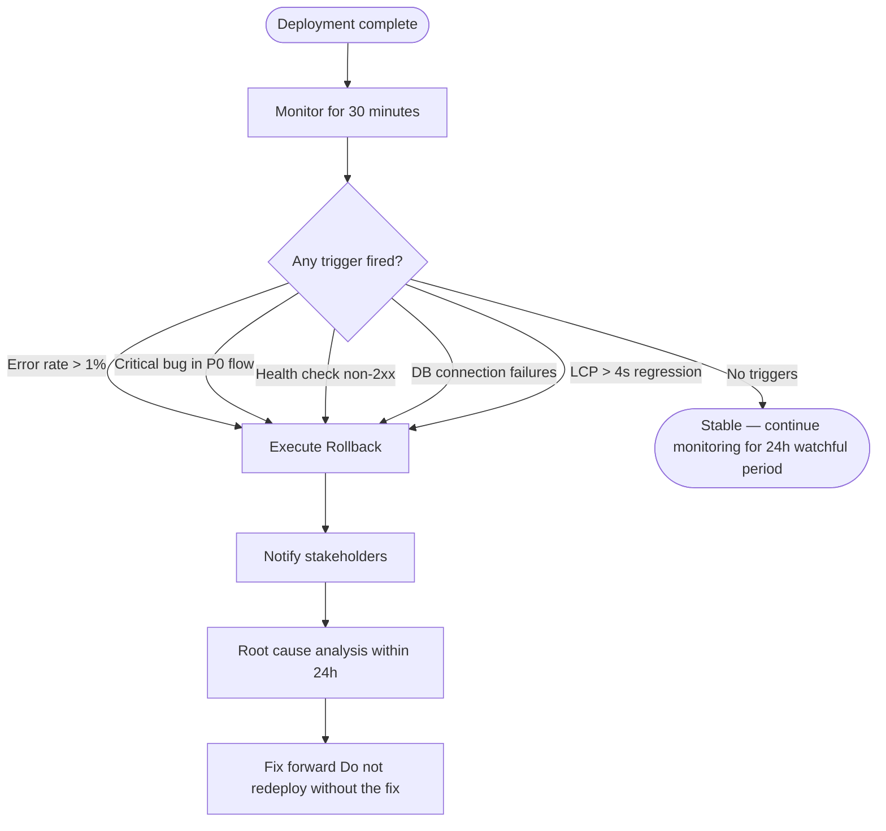
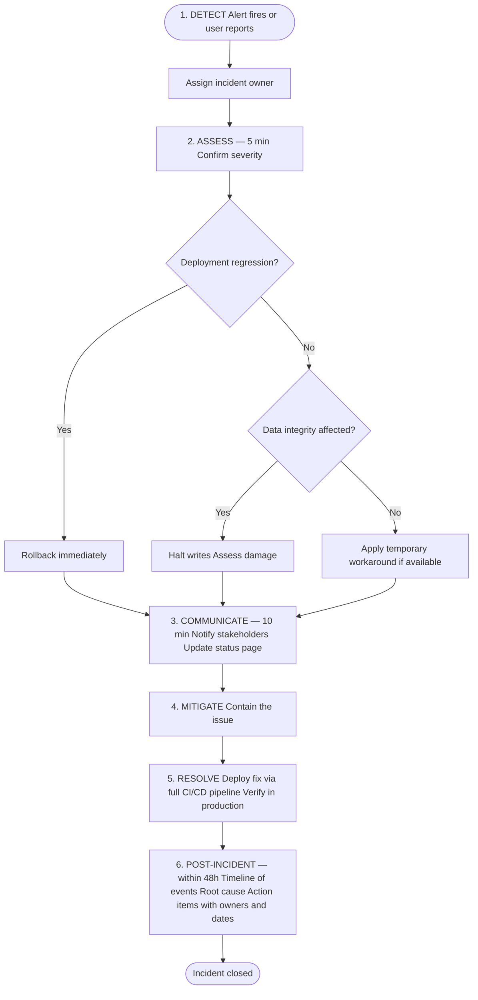

# Operations Runbook — Deployment

## Release Process

### Semantic Versioning

Format: `MAJOR.MINOR.PATCH`

| Change | Version Bump | Example |
|--------|-------------|---------|
| Breaking change | MAJOR | 1.0.0 → 2.0.0 |
| New feature (backward-compatible) | MINOR | 1.0.0 → 1.1.0 |
| Bug fix | PATCH | 1.0.0 → 1.0.1 |

### Release Steps

```bash
# 1. Ensure all tests pass on main
git checkout main && git pull
npm run test && npm run build

# 2. Bump version
npm version patch  # or minor / major
# This creates a commit and a git tag automatically

# 3. Generate changelog
npx conventional-changelog -p angular -i CHANGELOG.md -s

# 4. Push with tag
git push origin main --tags

# 5. Create GitHub Release
gh release create v$(node -p "require('./package.json').version") \
  --title "Release v$(node -p "require('./package.json').version")" \
  --notes-file CHANGELOG.md
```

### Changelog Format (Keep a Changelog)

```markdown
# Changelog

## [1.2.0] - 2024-01-15

### Added
- User profile page with avatar upload
- Dark mode toggle in settings

### Changed
- Improved dashboard loading performance by 40%

### Fixed
- Login form was not clearing error on successful retry
- Mobile navigation overlapping content on small screens

### Security
- Updated dependencies to patch CVE-2024-XXXX
```

---

## Rollback Procedure

### When to Roll Back

Trigger rollback if any of the following occur within 30 minutes of deployment:
- Error rate > 1% (versus < 0.1% baseline)
- Any Critical-severity bug in a P0 user flow
- Health check endpoint returning non-2xx
- Database connection failures
- Significant performance regression (LCP > 4s)



### Rollback Steps

#### Vercel

```bash
# List recent deployments
vercel ls

# Roll back to previous deployment
vercel rollback [deployment-url]

# Or via CLI
vercel promote [previous-deployment-url] --scope=your-org
```

#### GitHub Actions + Custom Deployment

```bash
# 1. Identify the last stable deployment tag
git tag --sort=-v:refname | head -5

# 2. Deploy the previous version
git checkout v1.1.2
npm ci && npm run build
# Execute deploy command for your platform

# 3. Verify health check
curl -f https://your-domain.com/api/health
```

#### Docker / Container

```bash
# 1. Get previous image tag
docker images your-app --format "{{.Tag}}" | head -5

# 2. Deploy previous image
docker service update --image your-app:v1.1.2 your-service-name

# 3. Monitor
docker service logs -f your-service-name
```

### Post-Rollback

1. Notify stakeholders: "We've rolled back to v[X.X.X] due to [brief reason]"
2. Open a post-incident issue
3. Root cause analysis within 24h
4. Fix forward — never deploy to production again without the fix

---

## Incident Response

### Severity Levels

| Level | Definition | Response Time | Example |
|-------|------------|---------------|---------|
| P1 — Critical | Site down or core feature unusable for all users | 15 minutes | Login broken, data loss |
| P2 — High | Core feature degraded for many users | 1 hour | Checkout failing for 20% of users |
| P3 — Medium | Feature partially broken, workaround exists | 4 hours | Search returning stale results |
| P4 — Low | Minor issue, no user impact | Next sprint | Tooltip slightly misaligned |

### Incident Response Process



### Communication Template

**Initial notification:**
> We are currently experiencing [brief description]. Our team is investigating. We will provide an update in [time].

**Update:**
> Update: We have identified [root cause]. We are [action being taken]. ETA for resolution: [time].

**Resolution:**
> This incident has been resolved as of [time]. [Brief explanation]. A post-incident review will be completed within 48 hours.

---

## Post-Deployment Monitoring (24h Watchful Period)

For every production release, monitor for 24 hours:

### First 30 Minutes (Critical)
- [ ] Error rate normal (< 0.1%)
- [ ] P95 response time within baseline ± 20%
- [ ] All health check endpoints returning 200
- [ ] No P1/P2 alerts triggered
- [ ] Core user paths manually verified in production

### First 2 Hours
- [ ] User session analytics show normal patterns
- [ ] No spike in support tickets or user reports
- [ ] Database query performance normal
- [ ] Memory and CPU within normal range

### 24 Hours
- [ ] No degraded error rate trend
- [ ] Core Web Vitals RUM data in "Good" range
- [ ] No new Sentry error groups above threshold
- [ ] Stakeholders confirm acceptance

### Sign-Off
After 24 hours of stable operation, sign off the release:
```
Release v[X.X.X] — STABLE
Signed off by: [Name]
Date: [Date]
Notes: [Any observations]
```
