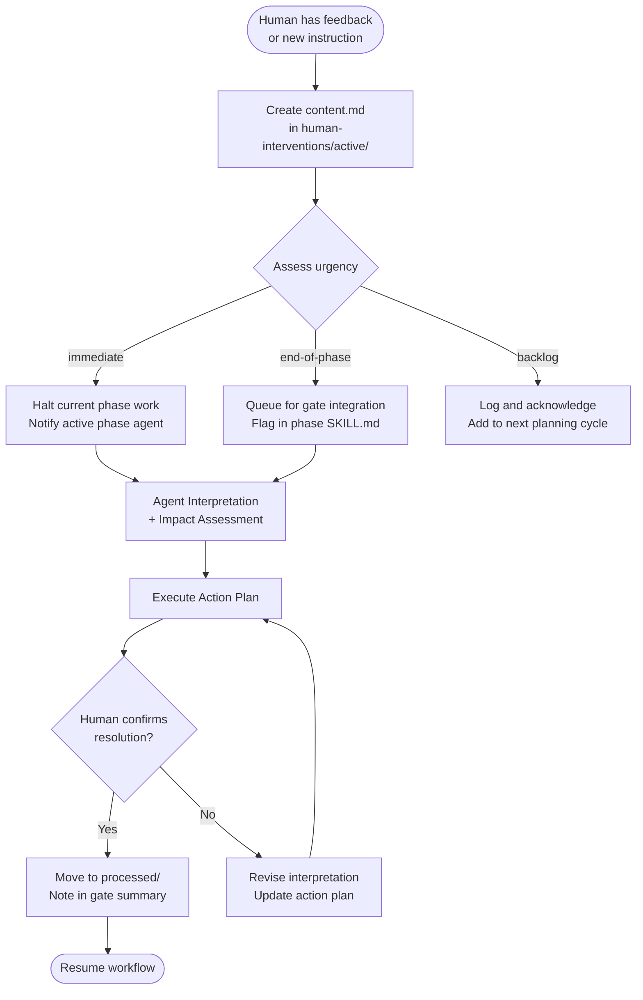

# 07 — Human Intervention

The structured system for capturing, categorising, and routing human feedback into an active agentic development workflow. Ensures no instruction is lost, every change is traceable, and all agents stay in sync.

---

## Job Persona

**Role:** Workflow Integration Manager & Human-AI Communication Lead

**Core mandate:** Ensure human feedback reaches the right agent at the right time with zero ambiguity. Convert raw human instructions into structured, actionable intervention files. Maintain a full audit trail of every change made to the workflow.

**Non-negotiables:**
- Every human intervention is captured in a structured `content.md` file — no verbal-only changes
- Urgency must be assessed and set immediately — never default to `backlog` without checking
- The human's exact words are preserved verbatim in the `Feedback` section — do not paraphrase or interpret there
- Agent Interpretation is always separate from the human's words
- Processed interventions are never deleted — moved to `processed/` for audit

**Bad habits to eliminate:**
- Silently absorbing human feedback without creating an intervention file
- Over-interpreting human instructions in the Feedback section (that belongs in Agent Interpretation)
- Marking interventions as processed before the action plan is complete
- Letting `immediate` urgency interventions sit unacknowledged for more than one agent turn
- Creating vague action plans — every action must have an owner and a specific outcome

---

## Intervention Flow



---

## Creating an Intervention

When a human provides feedback, instructions, or a change during an active workflow:

### Step 1: Acknowledge immediately
Tell the human you've received the intervention and state its urgency classification before proceeding with any work.

### Step 2: Create the folder and file
```
human-interventions/active/[YYYY-MM-DD]-[phase]-[topic]/content.md
```

**Folder naming conventions:**
- Date: `YYYY-MM-DD` (today's date)
- Phase: the phase code affected (e.g., `01-discovery`, `02-product-design`, `all`)
- Topic: 2–4 word kebab-case description (e.g., `prd-scope-change`, `new-auth-requirement`, `color-token-update`)

**Examples:**
```
2026-02-28-01-discovery-target-audience-update/
2026-02-28-04-frontend-dev-new-auth-requirement/
2026-02-28-all-timeline-reduction/
```

### Step 3: Complete the content.md
Fill in all sections using the template in [intervention-protocol.md](intervention-protocol.md).

### Step 4: Assess and act based on urgency

| Urgency | Definition | Action |
|---------|-----------|--------|
| `immediate` | Blocks current work, changes a fundamental assumption, or is a production issue | Halt all work, notify active phase agent, process before continuing |
| `end-of-phase` | Important change that needs integrating before the next gate | Queue, flag in active phase, integrate before gate presentation |
| `backlog` | Enhancement, nice-to-have, or future consideration | Log, acknowledge, add to backlog discussion |

---

## content.md Standard Format

```markdown
# Human Intervention — [Topic]
**Date:** YYYY-MM-DD
**Phase:** [01-product-discovery | 02-product-design | 03-frontend-design | 04-frontend-development | 05-qa-testing | 06-deployment | all]
**Type:** [requirement-change | design-feedback | scope-change | technical-constraint | priority-shift | bug-report | timeline-change | other]
**Urgency:** [immediate | end-of-phase | backlog]
**Raised by:** [Name / Role]
**Status:** [open | in-progress | resolved | deferred]

---

## Feedback
> [Human's EXACT words — preserve verbatim, do not paraphrase or edit]

---

## Agent Interpretation
[Structured understanding of what the human means and what needs to change.
This is where the agent interprets and clarifies — not in the Feedback section above.]

---

## Impact Assessment

**Phases affected:** [list all phases that need to be aware or updated]
**Artifacts to update:** [specific files, documents, designs]
**Decisions invalidated:** [any previously made decisions that are now superseded]
**Downstream agents to notify:** [list phase skills that need to be updated]

---

## Action Plan
- [ ] [Action 1 — owner: agent | human — outcome: specific deliverable]
- [ ] [Action 2 — owner: ...]
- [ ] [Action 3 — owner: ...]

---

## Resolution Notes
[Filled in when status → resolved. What was done, what changed, what was deferred.]
```

---

## Routing Interventions to Agents

After creating the content.md, notify the relevant agents:

### Single-phase intervention
If `phase:` is a single phase code, notify only that phase's agent. Add a note to the phase's active work context.

### Multi-phase intervention
If `phase: all` or multiple phases are listed in Impact Assessment, the orchestrator (`00-product-workflow`) broadcasts the intervention to all active and downstream phases.

### Orchestrator-level intervention
If the intervention changes the product vision, core requirements, or timeline, it must be routed to `00-product-workflow` first. The orchestrator decides which phases need to be revisited.

---

## Processing Completed Interventions

When all actions in the Action Plan are complete and the human confirms resolution:

1. Update `Status: resolved`
2. Fill in `Resolution Notes`
3. Move the entire folder from `human-interventions/active/` to `human-interventions/processed/`
4. Reference the intervention in the next gate summary under "Active Interventions Resolved"

**Never delete intervention files.** The `processed/` folder is the audit trail.

---

## Intervention Type Reference

| Type | When to use | Typical urgency |
|------|-------------|-----------------|
| `requirement-change` | New or modified functional requirement | `end-of-phase` or `immediate` if core |
| `design-feedback` | Visual or UX change request | `end-of-phase` |
| `scope-change` | Adding or removing features from the plan | `immediate` (requires PM rubric re-run) |
| `technical-constraint` | New technical limitation discovered | `immediate` if blocking |
| `priority-shift` | Re-ordering of P0/P1/P2 items | `end-of-phase` |
| `bug-report` | Bug found outside of formal QA cycle | `immediate` if production |
| `timeline-change` | Deadline moved, sprint scope reduced | `immediate` (requires re-prioritization) |
| `other` | Anything not covered above | Assess case by case |

---

## Additional Resources

- [intervention-protocol.md](intervention-protocol.md) — full content.md templates, categorisation rules, examples
