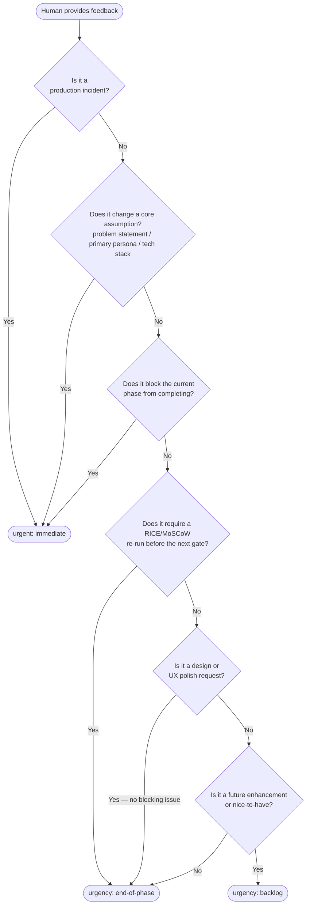
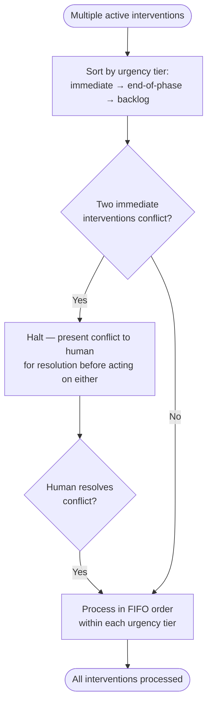
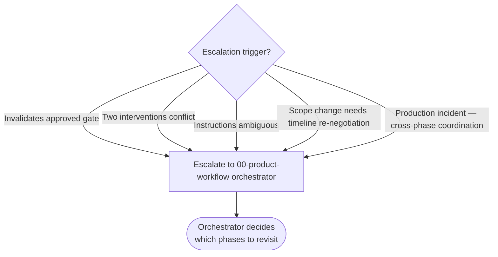

# Intervention Protocol — Full Reference

## Folder Naming Rules

All intervention folders live at the project root in `human-interventions/`:

```
human-interventions/
├── active/             ← interventions in progress
│   └── YYYY-MM-DD-[phase]-[topic]/
│       └── content.md
└── processed/          ← resolved interventions (audit trail)
    └── YYYY-MM-DD-[phase]-[topic]/
        └── content.md
```

### Folder Name Format
`YYYY-MM-DD-[phase-code]-[topic-slug]`

| Part | Format | Example |
|------|--------|---------|
| Date | `YYYY-MM-DD` | `2026-02-28` |
| Phase code | `01-discovery`, `02-product-design`, `03-frontend-design`, `04-frontend-dev`, `05-qa`, `06-deployment`, `08-documentation`, `all` | `04-frontend-dev` |
| Topic slug | kebab-case, 2–4 words, describes the change | `new-auth-flow`, `prd-scope-reduction`, `token-color-update` |

**Full example:** `2026-02-28-04-frontend-dev-new-auth-flow/`

---

## content.md Templates by Type

### Requirement Change

```markdown
# Human Intervention — [Requirement Name]
**Date:** YYYY-MM-DD
**Phase:** [phase code]
**Type:** requirement-change
**Urgency:** [immediate | end-of-phase]
**Raised by:** [Name / Role]
**Status:** open

---

## Feedback
> "[Human's exact words]"

---

## Agent Interpretation
The human is requesting [description of the new or changed requirement].
This [adds to / modifies / replaces] the existing requirement [FR-XXX] in the PRD.

---

## Impact Assessment

**Phases affected:** [01-product-discovery for PRD update; 02-product-design if flows change; etc.]
**Artifacts to update:** [prd.md → Section X; user-flows.md → Flow UF-0XX]
**Decisions invalidated:** [list any prior decisions that no longer apply]
**Downstream agents to notify:** [list]

---

## Action Plan
- [ ] Update PRD requirement [FR-XXX] with new specification — owner: agent — outcome: updated PRD
- [ ] Re-run RICE scoring if priority tier changes — owner: agent — outcome: updated scoring table
- [ ] Notify 02-product-design of flow impact — owner: orchestrator

---

## Resolution Notes
[Filled in when resolved]
```

---

### Design Feedback

```markdown
# Human Intervention — [Design Element]
**Date:** YYYY-MM-DD
**Phase:** 02-product-design or 03-frontend-design
**Type:** design-feedback
**Urgency:** end-of-phase
**Raised by:** [Name / Role]
**Status:** open

---

## Feedback
> "[Human's exact words about the design]"

---

## Agent Interpretation
The human wants [specific design element] to be changed from [current state] to [desired state].
This affects [component/screen/flow].

---

## Impact Assessment

**Phases affected:** [03-frontend-design if visual; 04-frontend-development if component logic changes]
**Artifacts to update:** [specific Figma frames, wireframe spec sections, component specs]
**Decisions invalidated:** [prior approved design decisions that change]
**Downstream agents to notify:** [list]

---

## Action Plan
- [ ] Update [wireframe/Figma/component spec] — owner: agent — outcome: revised design
- [ ] Re-verify WCAG contrast if color changes — owner: agent
- [ ] Re-present at gate if change is substantial — owner: agent

---

## Resolution Notes
[Filled in when resolved]
```

---

### Scope Change

```markdown
# Human Intervention — [Scope Change Description]
**Date:** YYYY-MM-DD
**Phase:** all
**Type:** scope-change
**Urgency:** immediate
**Raised by:** [Name / Role]
**Status:** open

---

## Feedback
> "[Human's exact words]"

---

## Agent Interpretation
The human is [adding / removing / replacing] the following from the product scope:
- Adding: [description]
- Removing: [description]

---

## Impact Assessment

**Phases affected:** All phases from [earliest affected phase] onward
**Artifacts to update:** [PRD, user stories, flows, designs, sprint backlog]
**Decisions invalidated:** [Previously approved items that no longer apply]
**Downstream agents to notify:** All active phase agents

---

## Action Plan
- [ ] Re-run RICE + MoSCoW scoring with updated scope — owner: agent
- [ ] Update PRD with new/removed requirements — owner: agent
- [ ] Assess timeline impact and present options to human — owner: orchestrator
- [ ] Update sprint backlog prioritization — owner: agent

---

## Resolution Notes
[Filled in when resolved]
```

---

### Technical Constraint

```markdown
# Human Intervention — [Constraint Description]
**Date:** YYYY-MM-DD
**Phase:** [04-frontend-dev | 06-deployment | other]
**Type:** technical-constraint
**Urgency:** immediate
**Raised by:** [Name / Role]
**Status:** open

---

## Feedback
> "[Human's exact words describing the constraint]"

---

## Agent Interpretation
A technical constraint has been discovered: [description].
The current approach [X] is affected because [reason].

---

## Impact Assessment

**Phases affected:** [current phase + any downstream phases affected]
**Artifacts to update:** [architecture doc, implementation decisions]
**Decisions invalidated:** [architecture or design decisions that need revisiting]
**Alternative approaches to explore:** [list 2–3 alternatives]
**Downstream agents to notify:** [list]

---

## Action Plan
- [ ] Evaluate alternative approach A: [description] — owner: agent — outcome: feasibility assessment
- [ ] Evaluate alternative approach B: [description] — owner: agent
- [ ] Present trade-offs to human for decision — owner: agent
- [ ] Update architecture documentation with chosen approach — owner: agent

---

## Resolution Notes
[Filled in when resolved]
```

---

### Timeline Change

```markdown
# Human Intervention — Timeline Change
**Date:** YYYY-MM-DD
**Phase:** all
**Type:** timeline-change
**Urgency:** immediate
**Raised by:** [Name / Role]
**Status:** open

---

## Feedback
> "[Human's exact words about the timeline change]"

---

## Agent Interpretation
The available timeline has [been reduced / extended] by [duration].
New deadline: [date].
Original deadline: [date].

---

## Impact Assessment

**Phases affected:** All remaining phases
**Artifacts to update:** [PRD timeline, sprint plan]
**Decisions invalidated:** [scope commitments that can no longer be met]
**Required trade-off:** [what must be descoped to meet the new timeline]

---

## Action Plan
- [ ] Re-run sprint scoring matrix with new capacity — owner: agent
- [ ] Identify Must-Have features that no longer fit — owner: agent
- [ ] Present descope options ranked by RICE score — owner: agent
- [ ] Get human approval on revised scope — owner: human
- [ ] Update PRD and sprint plan — owner: agent

---

## Resolution Notes
[Filled in when resolved]
```

---

## Urgency Decision Guide

Use this to classify urgency when a human provides feedback:



---

## Multi-Intervention Management

When multiple interventions are active simultaneously:

1. Sort by urgency: `immediate` → `end-of-phase` → `backlog`
2. Within the same urgency tier: process in creation order (FIFO)
3. Exception: if two `immediate` interventions conflict (one says add X, another says remove X), halt and present the conflict to the human for resolution before acting on either



---

## Escalation Rules

Escalate to the orchestrator (`00-product-workflow`) when:
- An intervention invalidates an already-approved gate decision
- Two interventions conflict with each other
- The human's instructions are ambiguous and clarification is needed
- A scope change requires timeline re-negotiation
- A production incident requires cross-phase coordination


