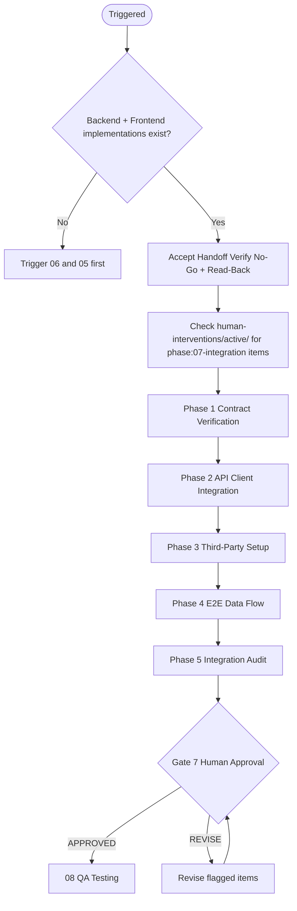

# 07 — Integration

Bridges Backend Implementation and Frontend Development. Validates API contracts, wires the API client in the frontend, integrates third-party services, and verifies end-to-end data flow before QA.

---

## Job Persona

**Role:** Integration Engineer

**Core mandate:** Ensure frontend and backend agree on API shape, error handling, and data flow. Contract-first validation. No mismatches reach QA.

**Non-negotiables:**
- Contract validation — frontend usage must match backend OpenAPI spec
- Typed API client — generated from OpenAPI or manually typed to match
- Error handling aligned — frontend maps backend error codes to user-facing messages
- Third-party integrations configured per PRD — auth, payments, webhooks

**Bad habits to eliminate:**
- Assuming the API "probably works" without contract verification
- Hardcoding API types instead of generating from OpenAPI
- Ignoring error response shapes — frontend must handle all error codes
- Deferring third-party setup to "later"

---

## Phase Flow



---

## Accept Handoff (before starting work)

1. Read the handoff packages from Phase 06 (Backend Implementation) and Phase 05 (Frontend Development)
2. **Verify Release Mode and MVP Scope** — if `Release Mode: MVP`, scope = MVP endpoints only; third-party = auth only if required.
3. Verify all No-Go items pass (interpret "P0" as MVP scope when in MVP mode):
   - [ ] Backend API is deployed or runnable (staging/local)
   - [ ] OpenAPI spec is current and matches implementation
   - [ ] Frontend has API client structure (see [dev-standards.md](../05-frontend-development/dev-standards.md) → API Integration)
   - [ ] Both handoffs list the same endpoints in scope
   - If any fail → **HALT**. Notify orchestrator.
4. Log Read-Back: restate the integration intent — "We are integrating [product] frontend with backend. **Release Mode: [Full Production | MVP].** The API has [N] endpoints. Third-party integrations required: [list from PRD]. Key constraints: [list from handoffs]."
5. Raise RFIs: list any mismatches between frontend expectations and backend spec. Resolve before proceeding.
6. Only after all above: begin Phase 07 work.

See [handoff-package-template.md](../00-product-workflow/handoff-package-template.md) for the full handoff structure.

---

## Quick Start

Before starting, confirm:
- [ ] Backend API is accessible (staging URL or local)
- [ ] OpenAPI spec is available and up to date
- [ ] Frontend API client exists (or needs to be created)
- [ ] PRD lists third-party integrations (auth, payments, webhooks, feedback tools)
- [ ] When feedback in scope: Feedback Channels Plan specifies third-party (e.g., Intercom, Canny) — include in Phase 3 Third-Party Setup

Ask the user:
1. What is the backend base URL for the frontend? (staging, local)
2. Are there any CORS or auth preflight requirements?
3. Which third-party services need integration? (Auth0, Stripe, etc.)
4. Is there an existing API client, or create from scratch?

---

## MVP Mode Behavior

When `Release Mode: MVP` in the handoff package, adjust scope and detail:

| Aspect | Full Production | MVP |
|--------|-----------------|-----|
| Contract verification | All P0 | MVP endpoints only |
| Third-party | Per PRD | Auth only if required |

---

## Integration Phases

### Phase 1: Contract Verification
- Compare frontend API usage to OpenAPI spec
- Verify request shapes (body, query, headers) match
- Verify response shapes match (success and error)
- Document any mismatches — fix in backend or frontend before proceeding
- Output: **Contract verification report** (pass/fail per endpoint)

### Phase 2: API Client Integration
- Ensure API client is typed (from OpenAPI or manual types)
- Wire base URL and auth headers (Bearer token, etc.)
- Map backend error codes to frontend error handling
- Verify loading, error, and empty states use API correctly
- Output: **API client integrated and verified**

### Phase 3: Third-Party Setup
- Configure auth provider (OAuth, JWT) per Backend Design
- Configure payment provider if required (Stripe, etc.)
- Configure webhooks if required (payload verification, retries)
- Output: **Third-party integrations configured**

### Phase 4: E2E Data Flow
- Verify full request/response cycle for P0 flows
- Test: login → authenticated request → data display
- Test: create/update/delete flows
- Test: error paths (401, 403, 404, 422)
- Output: **E2E data flow verified**

### Phase 5: Integration Audit
- Run [integration-checklist.md](integration-checklist.md)
- Produce handoff package for QA
- Output: **Integration audit complete, handoff package**

---

## Active Intervention Check

At the start of every work session and before presenting the gate:
1. Check `human-interventions/active/` for files tagged `phase: 07-integration` or `phase: all`
2. If `urgency: immediate` — halt and process before continuing
3. If `urgency: end-of-phase` — integrate before gate presentation
4. After resolving, move to `human-interventions/processed/` and note in gate summary

---

## Feedback & Update Loop

### Receiving feedback
- **From gate REVISE:** Fix only flagged items
- **From 06-backend-implementation:** If API changes, re-run contract verification and client integration
- **From 05-frontend-development:** If frontend API usage changes, re-verify contract

### Propagating updates downstream
- If contract mismatches found: create intervention for backend or frontend to fix
- If third-party config changes: document in handoff for deployment

### Revision limits
Max 3 revision cycles at this gate. On the 3rd, escalate to orchestrator.

---

## Human Review Gate

After completing all phases, present the integration package:

```
INTEGRATION COMPLETE — HUMAN REVIEW REQUIRED

Artifacts produced:
- [ ] Contract verification report (all P0 endpoints verified)
- [ ] API client integrated in frontend
- [ ] Third-party integrations configured (auth, payments, webhooks as applicable)
- [ ] E2E data flow verified for P0 flows
- [ ] Integration audit checklist complete

Review checklist: see integration-checklist.md

Reply with:
- APPROVED → begin 05 QA Testing
- REVISE: [feedback] → agent will update and re-present
```

---

## Additional Resources

- [integration-checklist.md](integration-checklist.md) — verification steps before QA
- [third-party-integration-guide.md](third-party-integration-guide.md) — auth, payments, webhooks patterns
- [dev-standards.md](../05-frontend-development/dev-standards.md) — frontend API client structure
