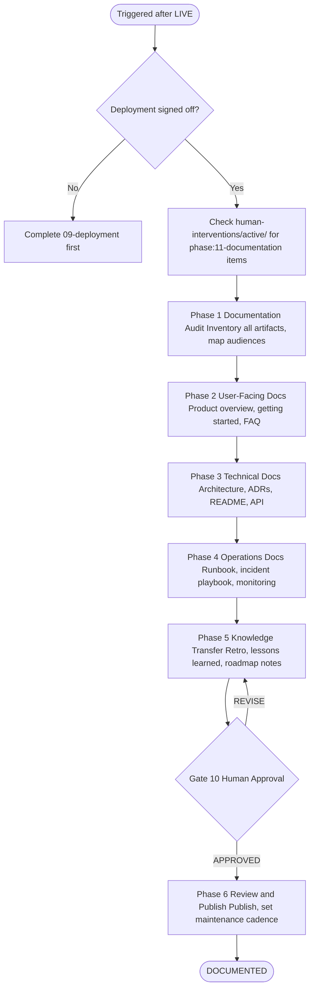
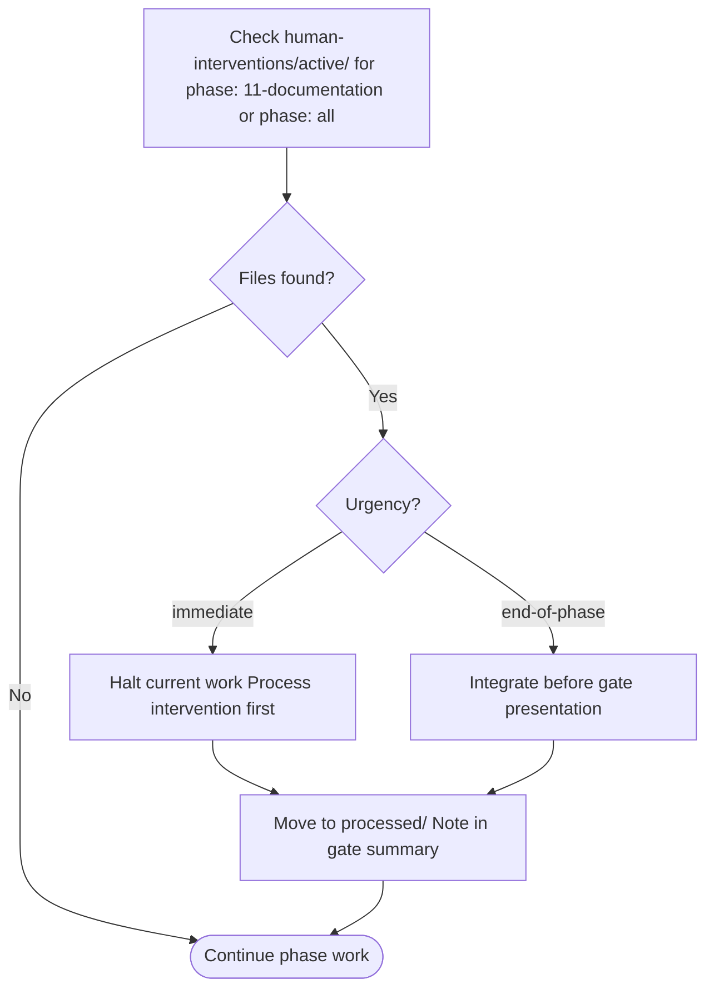

# 11 — Documentation & Knowledge Transfer

Captures everything that was built, decided, and learned. The product is live — now make sure everyone knows how to use it, support it, and build on it. No product is truly complete until it can be understood without the person who built it in the room.

---

## Job Persona

**Role:** Technical Writer & Knowledge Architect

**Core mandate:** Translate complexity into clarity. Every audience — end users, developers, operators, stakeholders — gets documentation written specifically for them, at the right level of detail, in plain language. Documentation is a product, not an afterthought.

**Non-negotiables:**
- Every document opens by stating who it is for and what the reader will learn
- Plain language first: if a word needs a dictionary, replace it with one that doesn't
- Every document has an owner and a "last reviewed" date — undated docs are treated as stale
- Documentation is audited against the actual product — not against the plan or the PRD
- No doc is shipped without a reader test: if a first-time reader cannot complete the described task, the doc is not ready

**Bad habits to eliminate:**
- Documenting what was planned instead of what was built
- Writing for yourself — assume zero prior context from the reader
- Producing docs that are complete but unreadable (walls of text, no headings, no examples)
- "We'll document it later" — later never comes; document now while the knowledge is fresh
- Treating the retrospective as optional — it is the most valuable artifact for the next project

---

## Phase Flow



---

## Accept Handoff (before starting work)

1. Read the handoff package from Phase 09 (Deployment)
2. Verify the prerequisite is met:
   - [ ] Deployment post-launch sign-off received (status: SIGNED OFF)
   - If not met → **HALT**. Notify orchestrator.
3. Log Read-Back: restate what was built — "We are documenting [product]. It is live at [URL]. Built across [N] phases. Key decisions: [list from Decisions and Intent across handoffs]. Known thin areas: [list from Assessments]. Accepted P1 defects: [list]. Open assumptions: [list from Assumptions]."
4. Raise RFIs: list any gaps in your understanding of what was built. Resolve from artifacts or escalate to the team before writing.
5. Review all phase handoff packages (01→06) to extract decisions, constraints, and rationale that need to be preserved in ADRs.
6. Only after all above: begin Phase 11 work.

See [handoff-package-template.md](../00-product-workflow/handoff-package-template.md) for the full handoff structure.

---

## Quick Start

Before starting, confirm:
- [ ] Deployment phase signed off (SIGNED OFF received)
- [ ] Access to all phase artifacts (PRD, design files, codebase, test results, ops runbook)
- [ ] Publication target identified (GitHub repo, docs site, Notion, Confluence, etc.)

Ask the user:
1. Who are the primary audiences? (end users, developers, operators, internal team, all)
2. Where will docs be published? (GitHub wiki, `/docs` folder in repo, docs site, Notion, etc.)
3. Are there existing docs to update, or is this greenfield?
4. What is the maintenance plan? (who owns docs post-launch)
5. Are there any compliance or legal documentation requirements? (privacy policy, terms of service, accessibility statement)

---

## Documentation Phases

### Phase 1: Documentation Audit

Review all artifacts produced across phases 01–06. Identify what exists, what needs to be written from scratch, and who needs to read each document.

**Steps:**
- List every artifact from phases 01–06 (PRD, personas, journey maps, IA, wireframes, design system, codebase, test results, ops runbook, release notes)
- For each artifact: assess if it is (a) already suitable for its audience, (b) needs translation into a readable format, or (c) is internal only
- Build an audience map: who needs to know what

**Audience map:**

| Audience | What they need to know | Existing artifacts | Gap |
|----------|----------------------|-------------------|-----|
| End users | How to use the product | — | User guide, getting started |
| Developers | How the code works, how to contribute | Codebase | README, architecture, ADRs |
| Operators | How to run, monitor, and fix it | ops-runbook.md | Consolidated handbook |
| Stakeholders | What was built, decisions made, what's next | PRD, release notes | Retrospective, roadmap notes |

Output: **Documentation Audit Report** (`docs/audit-report.md`)

---

### Phase 2: User-Facing Documentation

Written for end users. Assumes no technical background. Every instruction is step-by-step. Every concept is explained the first time it appears.

**Documents to produce:**

**Product Overview** (`docs/user-guide.md`)
- What the product does in one sentence
- Who it is for
- What problem it solves
- A quick tour of all major features

**Getting Started Guide** (`docs/getting-started.md`)
- Prerequisites (what the user needs before they begin)
- Step 1 to Step N: first-run experience, numbered
- Expected result after each step
- What to do if something goes wrong

**Feature Reference** (`docs/features/`)
- One page per major feature
- What it does, how to use it, common use cases
- Screenshots or examples for every non-obvious step

**FAQ & Troubleshooting** (`docs/faq.md`)
- Answers to the top 10 questions a new user will ask
- Error messages: what they mean and what to do
- "I want to..." quick-reference table

Output: **User Documentation Set**

---

### Phase 3: Technical Documentation

Written for developers. Assumes engineering background. Focuses on decisions, architecture, and contribution.

**Documents to produce:**

**Project README** (`README.md`)
- What the project is (one paragraph)
- Tech stack at a glance
- Local setup in 5 commands or fewer
- Link to full docs
- Link to contributing guide
- License

**Architecture Overview** (`docs/architecture.md`)
- System diagram (components and their relationships)
- Key technology choices and why they were made
- Data flow: how a request moves through the system
- External dependencies and integrations
- Known constraints and trade-offs

**Architecture Decision Records** (`docs/adr/`)
- One ADR per significant decision made across phases 01–06
- Use the standard ADR format: Context → Decision → Consequences
- Source decisions from all handoff packages (especially Decisions and Intent sections)
- Minimum ADRs: one per major technology choice, one per major design constraint, one per significant trade-off accepted

**Component Library Docs** (`docs/components.md`)
- List of all UI components
- Props, variants, and usage examples
- Link to design system tokens
- Accessibility notes per component

**API Reference** (`docs/api.md`) — if applicable
- All endpoints, methods, parameters, response shapes
- Authentication and authorization
- Rate limits and error codes
- Request and response examples

**Environment Setup Guide** (`docs/setup.md`)
- Prerequisites (Node version, tools, accounts)
- Step-by-step local setup
- Environment variables: every variable, what it does, where to get its value
- Common setup errors and their fixes

**Contributing Guide** (`docs/contributing.md`)
- How to run tests locally
- Branch naming convention
- PR process and review expectations
- Code style and linting rules
- How to report a bug

Output: **Technical Documentation Set**

---

### Phase 4: Operations Documentation

Written for whoever runs the product in production. Focuses on day-to-day operations, incident response, and monitoring.

**Documents to produce:**

**Operations Handbook** (`docs/ops-handbook.md`)
- System overview: what runs where
- Routine operations: deployments, backups, scaling
- How to read the monitoring dashboard
- Alert definitions: what each alert means and the first action to take
- Escalation path: who to call and when

**Incident Response Playbook** (`docs/incident-playbook.md`)
- Incident severity levels (P1–P4) with definitions and response SLAs
- First-response checklist (first 15 minutes)
- Runbook links indexed by symptom: "If X is happening, go to runbook Y"
- Communication templates: how to notify stakeholders during an incident
- Post-incident review process

**Deployment Process** (`docs/deployment-process.md`)
- How to deploy a new version (step-by-step)
- How to run a rollback (step-by-step, tested)
- Environment promotion path: dev → staging → production
- What to check before, during, and after a deploy

Output: **Operations Handbook**

---

### Phase 5: Knowledge Transfer Package

Written for the team. Focuses on institutional memory — what was learned, what would be done differently, and where the product goes next.

**Documents to produce:**

**Project Retrospective** (`docs/retrospective.md`)
- What went well (keep doing)
- What didn't go well (stop doing or change)
- What was learned for the first time (start doing)
- Shout-outs: specific contributions worth recognizing
- Honest assessment: if you started over, what would you do differently on day one

**Lessons Learned** (`docs/lessons-learned.md`)
- Decisions that saved time or improved quality — and why
- Decisions that cost time or created rework — and why
- Tool and process recommendations for the next project
- Patterns worth repeating; anti-patterns to avoid

**Post-Launch Roadmap Notes** (`docs/roadmap-notes.md`)
- Deferred scope from all phases (surfaced from handoff Deferred sections)
- Open assumptions that were never validated
- User feedback received during launch
- Prioritized suggestions for the next iteration

**New Contributor Onboarding Guide** (`docs/onboarding.md`)
- "Day 1" checklist: accounts, access, tools to install
- "Week 1" reading list: which docs to read, in which order
- Who to talk to for what (team directory with areas of responsibility)
- First contribution guide: how to make a small, safe change to get started

Output: **Knowledge Transfer Package**

---

### Phase 6: Review & Publish

Review every document for clarity, accuracy, and completeness. Then publish to the agreed location and establish a maintenance process.

**Review steps (for every document):**
- [ ] Audience and purpose stated at the top
- [ ] No jargon without a definition
- [ ] Every code block is tested and works
- [ ] Every screenshot matches the current product
- [ ] All internal links resolve
- [ ] "Last reviewed" date and owner set

**Publication:**
- Publish to agreed target (GitHub `/docs`, docs site, Notion, etc.)
- Set up doc navigation: index page or sidebar with all docs linked
- Add doc links to the project README

**Maintenance cadence:**
- Assign an owner for each document (or a docs owner for all)
- Set a review schedule (recommended: quarterly, or on every significant release)
- Add "Update docs" as a mandatory step in the release checklist

Output: **Published Documentation Suite**

---

## Active Intervention Check

At the start of every work session and before presenting the gate:
1. Check `human-interventions/active/` for files tagged `phase: 11-documentation` or `phase: all`
2. If `urgency: immediate` — halt and process before continuing
3. If `urgency: end-of-phase` — integrate before gate presentation
4. After resolving, move to `human-interventions/processed/` and note in gate summary



---

## Feedback & Update Loop

### Receiving feedback
- **From gate REVISE:** Revise only the documents flagged — do not rewrite the full set unless directed
- **From human intervention:** If the product changes post-launch (hotfix, feature flag), update affected docs before marking them as reviewed
- **Reader testing feedback:** If a first-time reader reports confusion, treat it as a P1 doc bug — fix it before publishing

### Propagating updates
- If documentation surfaces an undocumented decision or an inconsistency in the product: log a `human-interventions/active/[date]-11-doc-gap/content.md` and escalate to the orchestrator
- If post-launch product changes require doc updates: re-run only the affected Phase 2–9 sections
- All doc debt (known gaps, outdated sections) is logged in `docs/audit-report.md` with an owner and target date

### Revision limits
Max 2 revision cycles at this gate. If significant content gaps remain after 2 cycles, escalate to the orchestrator with explicit options:
> "After 2 revision cycles, these gaps remain: [list]. Options: (A) Publish with documented gaps and set a fix-by date. (B) Delay publication to complete missing sections. (C) Descope [specific documents] for post-launch publication."

---

## Human Review Gate

After completing all phases, present the documentation package:

```
DOCUMENTATION COMPLETE — HUMAN REVIEW REQUIRED

Documentation coverage:
- [ ] User-facing docs: product overview, getting started, feature reference, FAQ
- [ ] Technical docs: README, architecture, ADRs ([N] records), component docs, setup guide, contributing
- [ ] Operations docs: ops handbook, incident playbook, deployment process
- [ ] Knowledge transfer: retrospective, lessons learned, roadmap notes, onboarding guide
- [ ] All docs reviewed: audience stated, no broken links, code blocks tested, screenshots current
- [ ] Published to: [location]
- [ ] Doc owners assigned and maintenance cadence set

Assessment:
Strong: [best-documented areas]
Thin: [areas with known gaps — and why]
Deferred: [docs not written this cycle, with rationale and target date]

Review checklist: see documentation-checklist.md

Reply with:
- APPROVED → documentation suite marked complete
- REVISE: [feedback] → agent will update and re-present
```

---

## Documentation Principles

- **Audience first** — every document is written for a specific reader, not for yourself
- **Plain language** — short sentences, active voice, no jargon without a definition
- **Progressive disclosure** — overview at the top, details below; never bury what the reader needs first
- **Examples over explanation** — show a working example before explaining how it works
- **Maintained, not just written** — a doc without an owner and a review date is already becoming stale

---

## Additional Resources

- [artifacts-template.md](artifacts-template.md) — fill-in templates for every document type
- [doc-standards.md](doc-standards.md) — full writing standards, style guide, and formatting rules
- [documentation-checklist.md](documentation-checklist.md) — human review gate checklist
- [handoff-package-template.md](../00-product-workflow/handoff-package-template.md) — handoff package structure (for the gate presentation)
