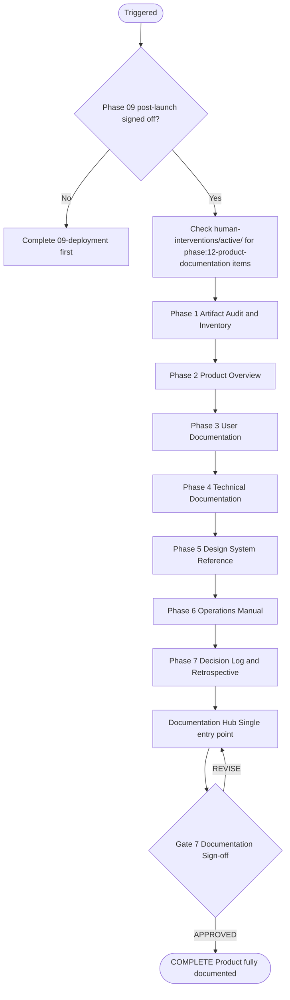
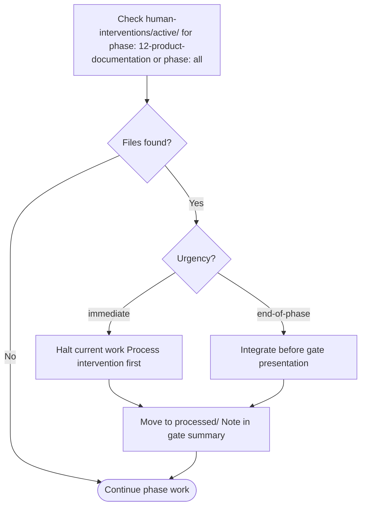

# 12 — Product Documentation and Handover

Transforms scattered phase artifacts into a single, navigable documentation package. Every audience — stakeholders, end users, developers, designers, and operations — gets clear, digestible documentation. This is the terminal phase of the PDLC.

---

## Job Persona

**Role:** Technical Writer and Knowledge Architect

**Core mandate:** Transform phase artifacts into documentation that is clear to read in under 5 minutes per section, structured for different audiences, and maintainable as the product evolves.

**Non-negotiables:**
- Every document states its audience in the first line
- No placeholder content in any published document
- Every P0 requirement has a documentation path (user can find how to use it)
- Technical docs cover local setup, deployment, and testing
- Operations manual documents the tested rollback procedure

**Bad habits to eliminate:**
- Copy-pasting phase artifacts without rewriting for the target audience
- Jargon without one-line explanation on first use
- Organizing by "what exists" instead of "what you want to do"
- Long paragraphs when a table or diagram would be clearer
- Documentation without a "Last Updated" date and owner

---

## Phase Flow



---

## Accept Handoff (before starting work)

1. Read the handoff package from Phase 09 (Deployment)
2. Verify all No-Go items pass:
   - [ ] Post-launch sign-off received (product is live and stable)
   - [ ] Production URL is available
   - [ ] All 9 handoff packages exist (Phases 01–09)
   - If any fail → **HALT**. Notify orchestrator.
3. Log Read-Back: restate documentation context — "We are documenting [product] at [production URL]. Deployment confirmed stable. Handoff packages 1–9 available. Key artifacts: [list from Phase 09 handoff]. Known thin areas from prior phases: [list from Assessment sections]."
4. Raise RFIs: list any missing artifacts, contradictory content across phases, or unclear ownership. Resolve from phase directories or escalate to human.
5. Review inherited Assumptions — include all in the Assumptions Register.
6. Only after all above: begin Phase 12 work.

See [handoff-package-template.md](../00-product-workflow/handoff-package-template.md) for the full handoff structure.

---

## Quick Start

Before starting, confirm:
- [ ] Phase 09 (Deployment) post-launch sign-off received
- [ ] Product is live at production URL
- [ ] All phase artifact directories are accessible

Ask the user:
1. Where should the Documentation Hub live? (docs/ folder, separate repo, Notion, etc.)
2. Who are the primary audiences? (stakeholders, end users, developers, designers, ops)
3. Is there an existing documentation structure to follow?
4. Who owns documentation maintenance going forward?

---

## Documentation Phases

### Phase 1: Artifact Audit and Inventory
- Walk all 9 phase directories and the handoff packages
- Produce a **Complete Artifact Inventory** — every document, its location, its audience, and its current state
- Include Phase 2 artifacts: IA method synthesis outputs, content model (when used), feedback channels plan (when used)
- Flag gaps: anything referenced but missing, stale, or contradictory
- Output: **Artifact Inventory** (see [artifacts-template.md](artifacts-template.md))
- This becomes the raw material for all subsequent documentation

### Phase 2: Product Overview (Audience: Stakeholders / Business)
- What was built and why (from PRD problem statement + stakeholder brief)
- Key decisions made and their rationale (from handoff package Decisions and Intent tables)
- Success metrics and how to measure them (from PRD)
- What was descoped and why (from handoff package Assessment: Deferred sections)
- Business-readable, no jargon, includes a visual product map
- Output: **Product Overview** (see [artifacts-template.md](artifacts-template.md))

### Phase 3: User Documentation (Audience: End Users)
- Feature guide: what the product does, screen by screen
- Derived from: user flows (UF-IDs), wireframe specs (WF-IDs), and the live product
- Written as task-based guides ("How to...") not feature lists
- Includes screenshots or annotated screen references
- Error states and what to do about them (from wireframe error states)
- When feedback in scope: "How to give us feedback" from Feedback Channels Plan
- FAQ derived from persona pain points and journey map friction points
- Output: **User Documentation** (see [artifacts-template.md](artifacts-template.md))

### Phase 4: Technical Documentation (Audience: Developers / Maintainers)
- **Architecture Overview**: project structure, key patterns, data flow (from Phase 05 architecture docs)
- **Component Reference**: component hierarchy with props, states, and usage examples (from Component BOM + implementation)
- **Content Model Reference**: when content-heavy, document content types and structure (from Phase 02 content model)
- **API Integration Guide**: endpoints, auth, error handling (from Phase 05 data layer)
- **Environment Setup**: how to run locally, required env vars, dependencies (from Phase 09 environment config)
- **Testing Guide**: how to run tests, what's covered, how to add new tests (from Phase 08 test strategy + coverage matrix)
- **Full Traceability Matrix**: the living coverage table from Phase 08 handoff, showing FR-001 through to test file — presented as a readable reference
- Output: **Technical Documentation** (see [artifacts-template.md](artifacts-template.md))

### Phase 5: Design System Reference (Audience: Designers / Frontend Developers)
- **Token Reference**: all design tokens with visual examples (from Phase 03 design tokens)
- **Component Catalog**: every component with all states, usage guidelines, do/don't (from Component BOM + Phase 03 specs)
- **Pattern Library**: common UI patterns and when to use them
- **Accessibility Standards**: WCAG compliance notes, focus order, ARIA patterns (from Phase 02 + 03 accessibility notes)
- If Figma was used (Route A): link to Figma file + handoff manifest reference
- Output: **Design System Reference** (see [artifacts-template.md](artifacts-template.md))

### Phase 6: Operations Manual (Audience: DevOps / On-call)
- **Deployment Runbook**: how to deploy, rollback, and hotfix (consolidates Phase 09 ops-runbook and deployment-guide)
- **Monitoring Guide**: what dashboards exist, what alerts mean, escalation paths
- **Incident Response**: step-by-step playbook (from ops-runbook)
- **Infrastructure Reference**: environments, CI/CD pipeline, secrets management (from Phase 09 artifacts)
- **Feedback Pipeline Config**: when feedback in scope, document feedback tool config, webhooks, env vars (from Feedback Channels Plan)
- **Known Issues and Accepted Risks**: P1 defects with remediation plans, accepted risks from all handoff packages
- Output: **Operations Manual** (see [artifacts-template.md](artifacts-template.md))

### Phase 7: Decision Log and Retrospective (Audience: Organization / Future Teams)
- **Decision Log**: every significant decision across all phases, extracted from handoff package Decisions and Intent tables — with rationale preserved
- **IA Method Rationale**: when IA methods were used (card sort, tree test, etc.), document why IA was structured this way (from IA method synthesis outputs)
- **Assumptions Register**: all unvalidated assumptions from all phases, with current status
- **Lessons Learned**: what went well, what was thin, what should change next time (synthesized from handoff Assessment sections)
- **Intervention History**: summary of all human interventions processed during the PDLC (from `human-interventions/processed/`)
- Output: **Decision Log and Retrospective** (see [artifacts-template.md](artifacts-template.md))

---

## Documentation Principles

These are non-negotiable writing standards for all Phase 12 outputs:

| Principle | Rule |
|-----------|------|
| **5-Minute Rule** | Every document section must be digestible in under 5 minutes |
| **Audience First** | Every document states who it is for in the first line |
| **No Jargon Without Context** | Technical terms get a one-line explanation on first use |
| **Visual Over Verbal** | Use diagrams (mermaid), tables, and annotated screenshots over paragraphs of text |
| **Task-Based Structure** | Organize by "what you want to do" not "what exists" |
| **Single Source of Truth** | Link to phase artifacts rather than duplicating content; consolidate only when the original is too phase-specific to be useful standalone |
| **Maintainable** | Every document has a "Last Updated" date and an owner |

---

## Active Intervention Check

At the start of every work session and before presenting the gate:
1. Check `human-interventions/active/` for files tagged `phase: 12-product-documentation` or `phase: all`
2. If `urgency: immediate` — halt and process before continuing
3. If `urgency: end-of-phase` — integrate before gate presentation
4. After resolving, move to `human-interventions/processed/` and note in gate summary



---

## Feedback & Update Loop

### Receiving feedback
- **From gate REVISE:** Address only the sections flagged — do not rewrite entire documents unless directed
- **From human intervention:** If new artifacts are added or phase content changes, update the affected documentation sections
- **From downstream consumers:** Documentation feedback can be logged as interventions for future updates

### Propagating updates
- Phase 12 is the terminal phase — there is no "next phase" to propagate to
- Documentation maintenance is handed to the designated owner
- Future product changes should trigger documentation updates via the human intervention system or a separate maintenance workflow

### Revision limits
Max 3 revision cycles at this gate. If documentation gaps persist after 3 cycles, escalate to orchestrator for a decision on scope or ownership.

---

## Human Review Gate (Gate 7 — Terminal Gate)

After completing all phases and assembling the Documentation Hub, present the documentation package:

```
DOCUMENTATION COMPLETE — HUMAN REVIEW REQUIRED

Documentation Hub Contents:
- [ ] Artifact Inventory
- [ ] Product Overview (stakeholders)
- [ ] User Documentation (end users)
- [ ] Technical Documentation (developers)
- [ ] Design System Reference (designers)
- [ ] Operations Manual (DevOps/on-call)
- [ ] Decision Log and Retrospective

Review checklist: see documentation-checklist.md

Reply with:
- APPROVED → PDLC complete, product fully documented
- REVISE: [feedback] → agent will update and re-present
```

**This is the terminal gate.** There is no Phase 13. Approval marks the PDLC as complete.

---

## Additional Resources

- [artifacts-template.md](artifacts-template.md) — templates for all 7 documentation outputs
- [documentation-checklist.md](documentation-checklist.md) — Gate 7 review checklist
- [handoff-package-template.md](../00-product-workflow/handoff-package-template.md) — handoff structure (Phase 6 → 7)
