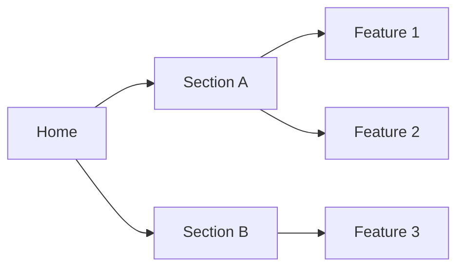
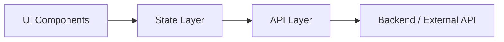

# Documentation Artifact Templates

Use these templates when producing Phase 12 outputs. Replace all `[PLACEHOLDER]` values. Every document must state its audience in the first line and include a "Last Updated" date and owner.

---

## Artifact Inventory

**Audience:** Phase 12 agent, documentation maintainers  
**Last Updated:** [Date]  
**Owner:** [Name/Role]

```markdown
# Complete Artifact Inventory — [Product Name]
**Date:** [Date]
**Purpose:** Master list of all PDLC artifacts used as source material for documentation.

## Phase 01 — Product Discovery

| Artifact | Path | Audience | State | Notes |
|----------|------|----------|-------|-------|
| [Stakeholder Brief] | `[path]` | [Stakeholders / PM] | [Complete / Stale / Missing] | [Gaps or notes] |
| [Problem Statement] | `[path]` | [PM / Design] | [Complete / Stale / Missing] | |
| [PRD] | `[path]` | [All] | [Complete / Stale / Missing] | FR-IDs: [count] |
| [Personas] | `[path]` | [Design / PM] | [Complete / Stale / Missing] | [count] personas |
| [Journey Map] | `[path]` | [Design / PM] | [Complete / Stale / Missing] | |
| [Research Synthesis] | `[path]` | [PM] | [Complete / Stale / Missing] | |
| [Competitive Analysis] | `[path]` | [PM / Stakeholders] | [Complete / Stale / Missing] | |
| Handoff Package 1 | `[path]` | [All] | [Complete / Stale / Missing] | |

## Phase 02 — Product Design

| Artifact | Path | Audience | State | Notes |
|----------|------|----------|-------|-------|
| [IA Document] | `[path]` | [Design / Dev] | [Complete / Stale / Missing] | |
| [IA Method Synthesis] | `[path]` | [Design / PM] | [Complete / Stale / Missing] | Card sort, tree test, etc. when used |
| [Content Model] | `[path]` | [Design / Dev] | [Complete / Stale / Missing] | When content-heavy |
| [User Flows] | `[path]` | [Design / Dev / QA] | [Complete / Stale / Missing] | UF-IDs: [count] |
| [Wireframe Specs] | `[path]` | [Design / Dev] | [Complete / Stale / Missing] | WF-IDs: [count] |
| [Interaction Spec] | `[path]` | [Design / Dev] | [Complete / Stale / Missing] | |
| [Feedback Channels Plan] | `[path]` | [PM / Ops] | [Complete / Stale / Missing] | When feedback in scope |
| [Prototype Brief] | `[path]` | [Design] | [Complete / Stale / Missing] | |
| Handoff Package 2 | `[path]` | [All] | [Complete / Stale / Missing] | |

## Phase 03 — Frontend Design

| Artifact | Path | Audience | State | Notes |
|----------|------|----------|-------|-------|
| [Design Tokens] | `[path]` | [Design / Dev] | [Complete / Stale / Missing] | |
| [Component BOM] | `[path]` | [Design / Dev] | [Complete / Stale / Missing] | |
| [Figma File / Screen Specs] | `[path or URL]` | [Design / Dev] | [Complete / Stale / Missing] | Route A/B |
| [Figma Handoff Manifest] | `[path]` | [Dev] | [Complete / Stale / Missing] | Route A only |
| Handoff Package 3 | `[path]` | [All] | [Complete / Stale / Missing] | |

## Phase 05 — Frontend Development

| Artifact | Path | Audience | State | Notes |
|----------|------|----------|-------|-------|
| [Repository] | `[URL]` | [Dev / Ops] | [Complete / Stale / Missing] | |
| [Architecture Doc] | `[path]` | [Dev] | [Complete / Stale / Missing] | |
| [First Article Inspection] | `[path]` | [Dev / QA] | [Complete / Stale / Missing] | |
| [Test Coverage Matrix] | `[path]` | [QA / Dev] | [Complete / Stale / Missing] | |
| Handoff Package 5 | `[path]` | [All] | [Complete / Stale / Missing] | |

## Phase 04 — Backend Design

| Artifact | Path | Audience | State | Notes |
|----------|------|----------|-------|-------|
| [OpenAPI Spec] | `[path]` | [Dev / Integration] | [Complete / Stale / Missing] | |
| [Schema Design] | `[path]` | [Dev] | [Complete / Stale / Missing] | |
| [Auth Model] | `[path]` | [Dev / Ops] | [Complete / Stale / Missing] | |
| Handoff Package 4 | `[path]` | [All] | [Complete / Stale / Missing] | |

## Phase 06 — Backend Implementation

| Artifact | Path | Audience | State | Notes |
|----------|------|----------|-------|-------|
| [API Endpoints] | `[path]` | [Dev / Integration] | [Complete / Stale / Missing] | |
| [Migrations] | `[path]` | [Dev / Ops] | [Complete / Stale / Missing] | |
| Handoff Package 6 | `[path]` | [All] | [Complete / Stale / Missing] | |

## Phase 07 — Integration

| Artifact | Path | Audience | State | Notes |
|----------|------|----------|-------|-------|
| [Contract Verification] | `[path]` | [Dev / QA] | [Complete / Stale / Missing] | |
| Handoff Package 7 | `[path]` | [All] | [Complete / Stale / Missing] | |

## Phase 08 — QA Testing

| Artifact | Path | Audience | State | Notes |
|----------|------|----------|-------|-------|
| [Test Strategy] | `[path]` | [QA / Dev] | [Complete / Stale / Missing] | |
| [Test Suite] | `[path]` | [Dev / QA] | [Complete / Stale / Missing] | |
| [Accessibility Audit] | `[path]` | [Dev / Design] | [Complete / Stale / Missing] | |
| [Performance Audit] | `[path]` | [Dev / Ops] | [Complete / Stale / Missing] | |
| [Security Review] | `[path]` | [Dev / Ops] | [Complete / Stale / Missing] | |
| Handoff Package 8 | `[path]` | [All] | [Complete / Stale / Missing] | |

## Phase 09 — Deployment

| Artifact | Path | Audience | State | Notes |
|----------|------|----------|-------|-------|
| [Environment Config] | `[path]` | [Ops / Dev] | [Complete / Stale / Missing] | |
| [CI/CD Pipeline] | `[path]` | [Ops / Dev] | [Complete / Stale / Missing] | |
| [Ops Runbook] | `[path]` | [Ops] | [Complete / Stale / Missing] | |
| [Release Notes] | `[path]` | [All] | [Complete / Stale / Missing] | |
| [Production URL] | `[URL]` | [All] | [Live] | |
| Handoff Package 9 | `[path]` | [All] | [Complete / Stale / Missing] | |

## Gaps and Contradictions

| Issue | Location | Severity | Resolution |
|-------|----------|----------|------------|
| [Missing artifact / Stale reference / Contradiction] | [Phase / artifact] | [High / Medium / Low] | [How to resolve] |
```

---

## Product Overview

**Audience:** Stakeholders, business owners, executives  
**Last Updated:** [Date]  
**Owner:** [Name/Role]

```markdown
# Product Overview — [Product Name]
**Audience:** Stakeholders and business owners  
**Last Updated:** [Date]  
**Owner:** [Name/Role]

*Read this in under 5 minutes to understand what was built and why.*

---

## What We Built

[One paragraph: what the product does, who it serves, and the core value proposition. Use plain language, no jargon.]

---

## Why We Built It

**Problem:** [One-sentence problem statement from PRD]

**Opportunity:** [What we're capturing — market, user need, business goal]

---

## Key Decisions

| Decision | Why We Chose This |
|----------|-------------------|
| [Decision 1] | [Rationale in one sentence] |
| [Decision 2] | [Rationale in one sentence] |
| [Decision 3] | [Rationale in one sentence] |

---

## Success Metrics

| Metric | Target | How We Measure |
|--------|--------|----------------|
| [Metric 1] | [Target value] | [Tool / method] |
| [Metric 2] | [Target value] | [Tool / method] |

---

## What We Didn't Build (Deferred)

| Item | Why Deferred |
|------|--------------|
| [Feature / scope item] | [Reason — timeline, priority, dependency] |

---

## Product Map



*[Replace with actual product structure from IA document]*

---

## Where to Go Next

- **End users:** See [User Documentation](#) for how to use the product
- **Developers:** See [Technical Documentation](#) for setup and architecture
- **Stakeholders:** See [Decision Log](#) for full decision history
```

---

## User Documentation

**Audience:** End users of the product  
**Last Updated:** [Date]  
**Owner:** [Name/Role]

```markdown
# User Guide — [Product Name]
**Audience:** End users  
**Last Updated:** [Date]  
**Owner:** [Name/Role]

*Task-based guides. Find what you want to do, then follow the steps.*

---

## Quick Start

1. [Step 1]
2. [Step 2]
3. [Step 3]

---

## How To...

### How to [Task 1]

**When to use:** [Brief context]

1. [Step 1 — include screen reference or screenshot]
2. [Step 2]
3. [Step 3]
4. [Expected result]

**Tip:** [Optional helpful hint]

---

### How to [Task 2]

[Same structure as above]

---

### How to [Task 3]

[Same structure as above]

---

## Screen Reference

| Screen | What It Does |
|--------|--------------|
| [Screen name] | [One-line description] |
| [Screen name] | [One-line description] |

---

## When Something Goes Wrong

| What You See | What It Means | What To Do |
|--------------|----------------|------------|
| [Error message / empty state] | [Plain-language explanation] | [Action to take] |
| [Error message / empty state] | [Plain-language explanation] | [Action to take] |

---

## FAQ

| Question | Answer |
|----------|--------|
| [Common question from persona pain points] | [Short, clear answer] |
| [Common question] | [Short, clear answer] |

---

## Need Help?

[Link to support, contact, or feedback channel]
```

---

## Technical Documentation

**Audience:** Developers, maintainers, new team members  
**Last Updated:** [Date]  
**Owner:** [Name/Role]

```markdown
# Technical Documentation — [Product Name]
**Audience:** Developers and maintainers  
**Last Updated:** [Date]  
**Owner:** [Name/Role]

---

## Architecture Overview

### Tech Stack

| Layer | Technology |
|-------|------------|
| Framework | [e.g., Next.js 14, React 18] |
| Language | [e.g., TypeScript 5] |
| Styling | [e.g., Tailwind, CSS Modules] |
| State | [e.g., Zustand, React Query] |
| Testing | [e.g., Vitest, Playwright] |

### Project Structure

```
[project-root]/
├── [directory] — [purpose]
├── [directory] — [purpose]
└── [directory] — [purpose]
```

### Data Flow



---

## Environment Setup

### Prerequisites

- [Node.js X.X]
- [Other requirements]

### Local Setup

1. Clone: `git clone [URL]`
2. Install: `npm install`
3. Configure: Copy `.env.example` to `.env` and set:
   - `[VAR_NAME]` — [what it's for]
   - `[VAR_NAME]` — [what it's for]
4. Run: `npm run dev`

### Scripts

| Command | Purpose |
|---------|---------|
| `npm run dev` | [Description] |
| `npm run build` | [Description] |
| `npm run test` | [Description] |
| `npm run lint` | [Description] |

---

## Component Reference

| Component | Location | Props | States |
|-----------|----------|-------|--------|
| [ComponentName] | `[path]` | [key props] | [default, loading, error, empty] |
| [ComponentName] | `[path]` | [key props] | [states] |

*See [Design System Reference](#) for visual specs and usage guidelines.*

---

## API Integration

### Endpoints

| Endpoint | Method | Purpose |
|----------|--------|---------|
| `[path]` | GET/POST | [Purpose] |
| `[path]` | GET/POST | [Purpose] |

### Authentication

[How auth works — tokens, headers, session]

### Error Handling

[How errors are surfaced, retry logic, fallbacks]

---

## Testing Guide

### Running Tests

- Unit: `npm run test:unit`
- E2E: `npm run test:e2e`
- All: `npm run test`

### Coverage

| Area | Target | Current |
|------|--------|---------|
| Utils / Hooks | 80% | [X%] |
| Components | [target] | [X%] |
| E2E critical paths | 100% | [X%] |

### Adding New Tests

1. [Step for unit tests]
2. [Step for E2E tests]
3. [Where to add to coverage matrix]

---

## Traceability Matrix

| FR-ID | Requirement | UF-ID | WF-ID | Implementation | Test |
|-------|-------------|-------|-------|----------------|------|
| FR-001 | [Requirement] | UF-001 | WF-001 | [path/component] | [test file] |
| FR-002 | [Requirement] | UF-002 | WF-002 | [path/component] | [test file] |

*Full traceability from requirement to test.*
```

---

## Design System Reference

**Audience:** Designers, frontend developers  
**Last Updated:** [Date]  
**Owner:** [Name/Role]

```markdown
# Design System Reference — [Product Name]
**Audience:** Designers and frontend developers  
**Last Updated:** [Date]  
**Owner:** [Name/Role]

---

## Design Tokens

### Colors

| Token | Value | Usage |
|-------|-------|-------|
| `--color-primary` | [value] | [Primary actions, links] |
| `--color-background` | [value] | [Page background] |
| `--color-text` | [value] | [Body text] |
| `--color-text-muted` | [value] | [Secondary text] |

*WCAG contrast: All text/background combinations pass 4.5:1 (AA).*

### Typography

| Token | Value | Usage |
|-------|-------|-------|
| `--font-family-base` | [value] | [Body text] |
| `--font-size-sm` | [value] | [Captions, labels] |
| `--font-size-base` | [value] | [Body] |
| `--font-size-lg` | [value] | [Headings] |

### Spacing

| Token | Value | Usage |
|-------|-------|-------|
| `--spacing-xs` | [value] | [Tight spacing] |
| `--spacing-sm` | [value] | [Component internal] |
| `--spacing-md` | [value] | [Between elements] |
| `--spacing-lg` | [value] | [Section gaps] |

### Radius, Shadow, Motion

| Token | Value |
|-------|-------|
| `--radius-sm` | [value] |
| `--radius-md` | [value] |
| `--shadow-sm` | [value] |
| `--motion-duration-fast` | [value] |

---

## Component Catalog

| Component | States | Do | Don't |
|-----------|--------|-----|-------|
| [Button] | default, hover, focus, active, disabled | [Usage guideline] | [Anti-pattern] |
| [Input] | default, focus, error, disabled | [Usage guideline] | [Anti-pattern] |
| [Card] | default, hover | [Usage guideline] | [Anti-pattern] |

*[Link to Figma file if Route A; otherwise reference screen specs]*

---

## Accessibility Standards

- **WCAG Level:** 2.1 AA
- **Focus order:** [Document focus sequence for key flows]
- **ARIA patterns:** [Key ARIA usage — labels, roles, live regions]
- **Keyboard:** All interactive elements reachable and operable via keyboard

---

## Pattern Library

| Pattern | When to Use |
|--------|-------------|
| [Pattern name] | [Context — e.g., "When displaying a list of items with actions"] |
| [Pattern name] | [Context] |
```

---

## Operations Manual

**Audience:** DevOps, on-call engineers, release managers  
**Last Updated:** [Date]  
**Owner:** [Name/Role]

```markdown
# Operations Manual — [Product Name]
**Audience:** DevOps and on-call engineers  
**Last Updated:** [Date]  
**Owner:** [Name/Role]

---

## Deployment Runbook

### Deploy to Production

1. [Step 1]
2. [Step 2]
3. [Step 3]
4. [Verification step]

### Rollback Procedure

**Trigger:** [When to rollback — error rate threshold, manual trigger]

1. [Step 1 — e.g., "Revert to previous git tag"]
2. [Step 2]
3. [Step 3]
4. [Verification — confirm rollback successful]

*This procedure was tested on staging on [date].*

### Hotfix Process

1. [Step 1]
2. [Step 2]

---

## Monitoring Guide

### Dashboards

| Dashboard | URL | What It Shows |
|-----------|-----|---------------|
| [Name] | [URL] | [Metrics, errors, performance] |
| [Name] | [URL] | [Metrics] |

### Alerts

| Alert | Trigger | Severity | Action |
|-------|---------|----------|--------|
| [Alert name] | [Condition] | [Critical / High / Medium] | [What to do] |
| [Alert name] | [Condition] | [Severity] | [What to do] |

### Escalation Path

1. [First responder]
2. [Escalation contact]
3. [On-call rotation / PagerDuty]

---

## Incident Response

### Severity Levels

| Level | Definition | Response Time |
|-------|------------|---------------|
| P0 | [e.g., Full outage] | [e.g., 15 min] |
| P1 | [e.g., Major degradation] | [e.g., 1 hour] |
| P2 | [e.g., Minor impact] | [e.g., 4 hours] |

### Playbook

1. **Acknowledge** — Confirm incident, notify stakeholders
2. **Assess** — Determine severity, scope, root cause
3. **Mitigate** — Rollback or fix-forward (see Rollback Procedure)
4. **Resolve** — Deploy fix, verify, close incident
5. **Post-Mortem** — Log in `human-interventions/processed/`

---

## Infrastructure Reference

| Environment | URL | Purpose |
|-------------|-----|---------|
| Local | `localhost:[port]` | Development |
| Staging | [URL] | Pre-production testing |
| Production | [URL] | Live |

### CI/CD Pipeline

[Brief description — tool, trigger, stages]

### Secrets Management

[Where secrets live, how to rotate, what not to do]

---

## Known Issues and Accepted Risks

| ID | Issue / Risk | Remediation Plan | Owner |
|----|--------------|------------------|-------|
| [P1-001] | [Description] | [Plan] | [Owner] |
| [Risk from handoff] | [Description] | [Mitigation] | [Owner] |
```

---

## Decision Log and Retrospective

**Audience:** Organization, future teams, product managers  
**Last Updated:** [Date]  
**Owner:** [Name/Role]

```markdown
# Decision Log and Retrospective — [Product Name]
**Audience:** Organization and future teams  
**Last Updated:** [Date]  
**Owner:** [Name/Role]

---

## Decision Log

*Every significant decision across all phases, with rationale preserved.*

| Phase | Decision | Rationale | Constraint (Do Not Violate) |
|-------|----------|-----------|-----------------------------|
| 01 Discovery | [Decision] | [Why we chose this] | [What must be preserved] |
| 01 Discovery | [Decision] | [Rationale] | [Constraint] |
| 02 Design | [Decision] | [Rationale] | [Constraint] |
| 03 Frontend Design | [Decision] | [Rationale] | [Constraint] |
| 04 Development | [Decision] | [Rationale] | [Constraint] |
| 05 QA | [Decision] | [Rationale] | [Constraint] |
| 06 Deployment | [Decision] | [Rationale] | [Constraint] |

---

## Assumptions Register

| ID | Assumption | Origin | Status | Validate By |
|----|------------|--------|--------|-------------|
| A-001 | [Assumption text] | Phase [N] | [Validated / Unvalidated / Invalidated] | [How to validate] |
| A-002 | [Assumption text] | Phase [N] | [Status] | [How to validate] |

---

## Lessons Learned

### What Went Well

- [Item 1]
- [Item 2]
- [Item 3]

### What Was Thin

- [Item 1 — from handoff Assessment: Thin]
- [Item 2]
- [Item 3]

### What to Change Next Time

- [Item 1]
- [Item 2]
- [Item 3]

---

## Intervention History

*Summary of human interventions processed during the PDLC.*

| Date | Topic | Type | Resolution |
|------|-------|------|------------|
| [Date] | [Topic] | [requirement-change / design-feedback / etc] | [How it was resolved] |
| [Date] | [Topic] | [Type] | [Resolution] |

*Full details in `human-interventions/processed/`*
```

---

## Documentation Hub Index

**Audience:** All — entry point to the documentation  
**Last Updated:** [Date]  
**Owner:** [Name/Role]

```markdown
# Documentation Hub — [Product Name]
**Last Updated:** [Date]

*One place to find everything. Pick your role and go.*

---

## By Role

| I am a... | Start here |
|-----------|------------|
| **Stakeholder / Business owner** | [Product Overview]([path]) |
| **End user** | [User Documentation]([path]) |
| **Developer / Maintainer** | [Technical Documentation]([path]) |
| **Designer** | [Design System Reference]([path]) |
| **DevOps / On-call** | [Operations Manual]([path]) |
| **PM / Future team** | [Decision Log and Retrospective]([path]) |

---

## By Task

| I want to... | Go to |
|--------------|-------|
| Understand what we built | [Product Overview](#) |
| Use the product | [User Documentation](#) |
| Set up locally | [Technical Documentation](#) → Environment Setup |
| Deploy or rollback | [Operations Manual](#) → Deployment Runbook |
| Add a new feature | [Technical Documentation](#) + [Design System Reference](#) |
| Understand past decisions | [Decision Log](#) |

---

## Artifact Inventory

[Link to Artifact Inventory](#) — Master list of all source artifacts from the PDLC.
```
